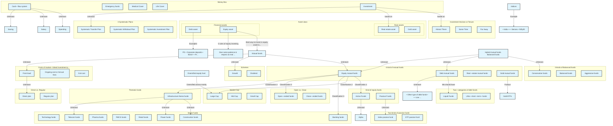

```mermaid
graph TD
    subgraph Sectorfunds ["Sector funds"]
        node_77165dda["Technology funds"]
        node_6c9e0ec4["Banking funds"]
        node_50cc3d26["Pharma funds"]
        node_ec1c7c00["FMCG funds"]
        node_4f8f1f41["Retail funds"]
        node_fa8d72db["Construction funds"]
        node_242732d1["Power funds"]
        node_ec90351c["Telecom funds"]
    end

    subgraph Assetclass ["Asset class"]
        subgraph Realassets ["Real assets"]
            node_475472c2["Real estate asset"]
            node_7243c81f["Gold asset"]
        end

        subgraph Financialassets ["Financial assets"]
            node_6c9f0be0["Debt asset"]
            node_fd1236f4["Equity asset"]
        end

    end

    subgraph 4kindofmutualfunds ["4 kind of mutual funds"]
        node_44cd8bbd["Equity mutual funds"]
        node_815cec39["Debt mutual funds"]
        node_dd9b5aff["Real • estate mutual funds"]
        node_c5e5aaf3["Gold mutual funds"]
    end

    subgraph InvestmentHorizonorTenure ["Investment Horizon or Tenure"]
        node_2f586c3b["Almost There"]
        node_09238194["Some Time"]
        node_eb11a9ce["Far Away"]
    end

    subgraph MoneyBox ["Money Box"]
        node_487139b0["Cash • flow system"]
        node_90a8bcd4["Emergency funds"]
        node_1712ac08["Medical Cover"]
        node_fccb7c48["Life Cover"]
        node_a71c66c6["Investment"]
    end

    subgraph Thematicfunds ["Thematic funds"]
        node_a55cff19["Infrastructure theme funds"]
    end

    subgraph Twokindsofpassivefunds ["Two kinds of passive funds"]
        node_d60b2ccf["Index passive fund"]
        node_012f97cc["ETF passive fund"]
    end

    subgraph 3kindsofBalancedfunds ["3 kinds of Balanced funds"]
        node_e0dde8b5["Conservative funds"]
        node_ed9ff146["Balanced funds"]
        node_a1a492f4["Aggressive funds"]
    end

    subgraph 3SystematicPlans ["3 Systematic Plans"]
        node_a9e93575["Systematic Transfer Plan"]
        node_7a1732e9["Systematic Withdrawl Plan"]
        node_842840e4["Systematic Investment Plan"]
    end

    subgraph Costsofmarketlinkedinvestmentp ["Costs of market • linked investment p..."]
        node_16367967["Front load"]
        node_869230db["Ongoing cost or Annual fees"]
        node_8148cdf1["Exit cost"]
    end

    subgraph Twocategoriesofdebtfunds ["Two • categories of debt funds"]
        node_c6cb7952["Liquid Funds"]
        node_44ac78f1["Ultra • short • term • funds"]
    end

    subgraph MarketCap ["Market Cap"]
        node_b13c60ef["Large Cap"]
        node_2af3f41e["Mid Cap"]
        node_ef9e8a39["Small Cap"]
    end

    subgraph Kindofequityfunds ["Kind of equity funds"]
        node_7ecf83ba["Active Funds"]
        node_e8a1fd4e["Passive Funds"]
    end

    subgraph OpenvsClose ["Open vs. Close"]
        node_94b0bbc4["Open • ended funds"]
        node_c070b041["Close • ended funds"]
    end

    subgraph Schemes ["Schemes"]
        node_568e32bd["Growth"]
        node_69949eee["Dividend"]
    end

    subgraph DirectvsRegular ["Direct vs. Regular"]
        node_9f9985e7["Direct plan"]
        node_f0f9b5b6["Regular plan"]
    end

    node_1195e7b9["Salary"]
    node_fd6ce470["Spending"]
    node_30552b24["Saving"]
    node_23846b82["FD • Corporate deposits • Bond • • Pr..."]
    node_97e97a0d["Give same patience & respect as real ..."]
    node_93642569["• Other type of debt funds • • • Low ..."]
    node_c12e0641["Mutual funds"]
    node_1187abfd["Indices"]
    node_7d085ee0["• India • • • Sensex • Nifty50"]
    node_58633c47["Gold ETFs"]
    node_7e04a7a7["Hybrid mutual funds Balanced funds"]
    node_9f92b8a5["Alpha"]
    node_b7d8692d["Diversified equity fund"]

    node_487139b0 -->|Unknown| node_fd6ce470
    node_487139b0 -->|Unknown| node_1195e7b9
    node_487139b0 -->|Unknown| node_30552b24
    node_a71c66c6 -->|based on| node_2f586c3b
    node_a71c66c6 -->|based on| node_475472c2
    node_6c9f0be0 -->|Examples| node_23846b82
    node_1187abfd -->|Example| node_7d085ee0
    node_fd1236f4 -->|Best way to invest in equity asset is...| node_c12e0641
    node_fd1236f4 -->|5 rules of equity investing| node_97e97a0d
    node_815cec39 -->|We should have| node_c6cb7952
    node_815cec39 -->|Unknown| node_93642569
    node_c5e5aaf3 -->|Product| node_58633c47
    node_44cd8bbd -->|Classification 1| node_7ecf83ba
    node_7ecf83ba -->|Unknown| node_9f92b8a5
    node_e8a1fd4e -->|Unknown| node_d60b2ccf
    node_44cd8bbd -->|Classification 2| node_b13c60ef
    node_44cd8bbd -->|Classification 3| node_6c9e0ec4
    node_44cd8bbd -->|Classification 5| node_94b0bbc4
    node_b7d8692d -->|Diversified across mainly| node_b13c60ef
    node_c12e0641 -->|Unknown| node_44cd8bbd
    node_c12e0641 -->|Unknown| node_568e32bd
    node_7e04a7a7 -->|Unknown| node_e0dde8b5
    node_7e04a7a7 -->|Unknown| node_815cec39
    node_7e04a7a7 -->|Unknown| node_44cd8bbd
    node_a55cff19 -->|Unknown| node_fa8d72db
    node_a55cff19 -->|Unknown| node_242732d1
    node_a55cff19 -->|Unknown| node_ec90351c
    node_44cd8bbd -->|Classification 4| node_a55cff19
    node_c12e0641 -->|Unknown| node_16367967
    node_16367967 -->|Unknown| node_9f9985e7
    node_a71c66c6 -->|Unknown| node_a9e93575

    %% Styling
    classDef hobbit fill:#8B4513,stroke:#333,stroke-width:2px,color:#fff
    classDef wizard fill:#fff,stroke:#333,stroke-width:2px
    classDef orc fill:#654321,stroke:#333,stroke-width:2px,color:#fff
    classDef dwarf fill:#4682B4,stroke:#333,stroke-width:2px,color:#fff
    classDef elf fill:#98FB98,stroke:#333,stroke-width:2px
    classDef men fill:#DEB887,stroke:#333,stroke-width:2px
    classDef creature fill:#DDA0DD,stroke:#333,stroke-width:2px
    classDef group fill:#FFE4B5,stroke:#8B4513,stroke-width:3px,stroke-dasharray: 5 5
    classDef file fill:#E6F3FF,stroke:#4A90E2,stroke-width:2px
    classDef link fill:#FFF2E6,stroke:#FF8C00,stroke-width:2px,stroke-dasharray: 3 3
    classDef default fill:#e1f5fe,stroke:#333,stroke-width:2px
```