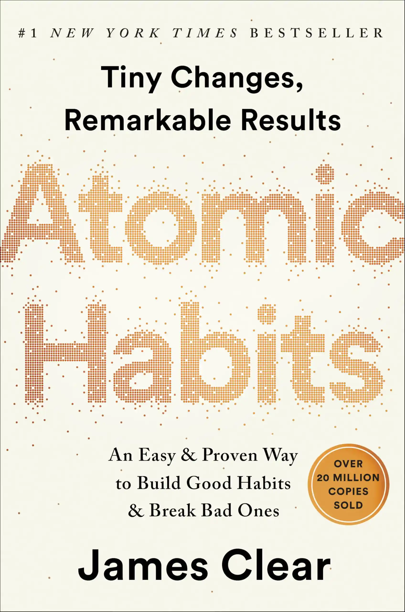
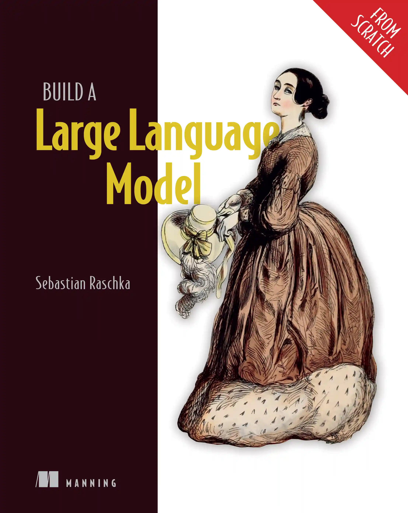
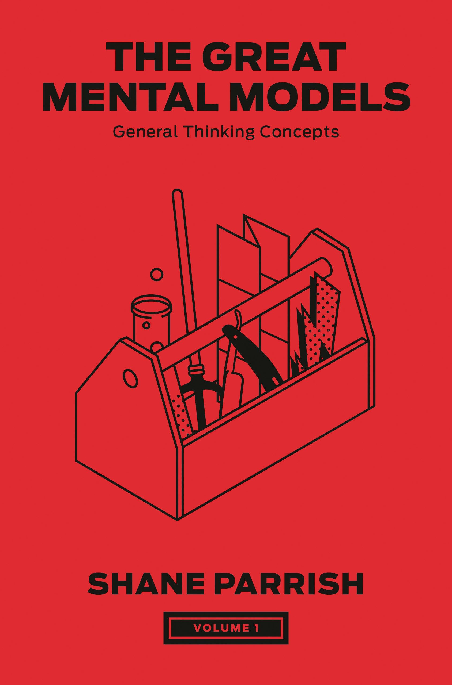
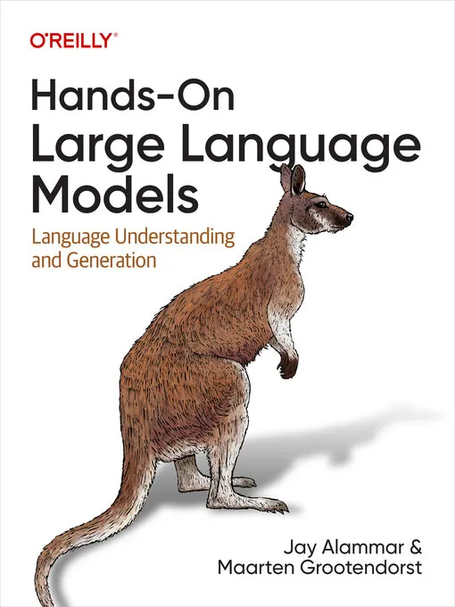
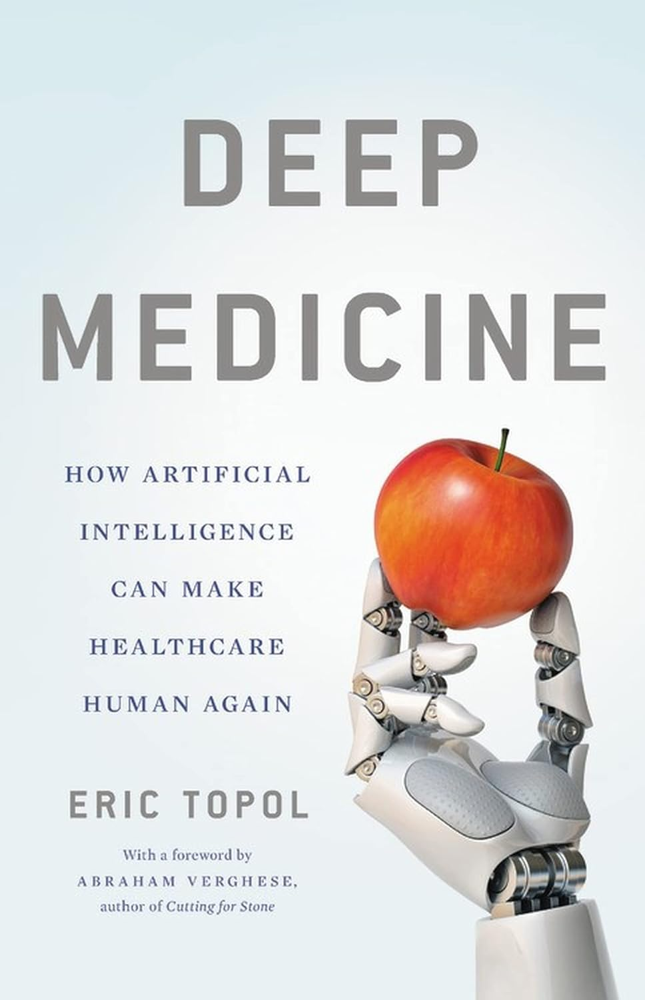
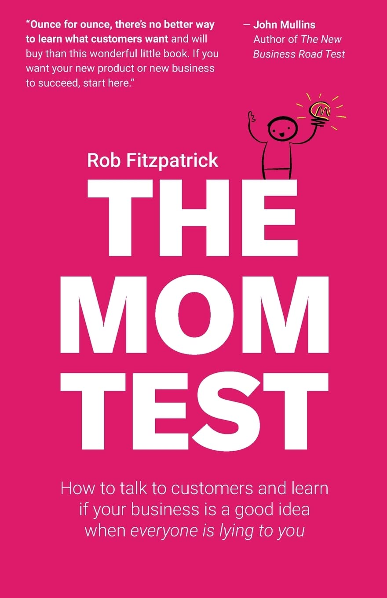
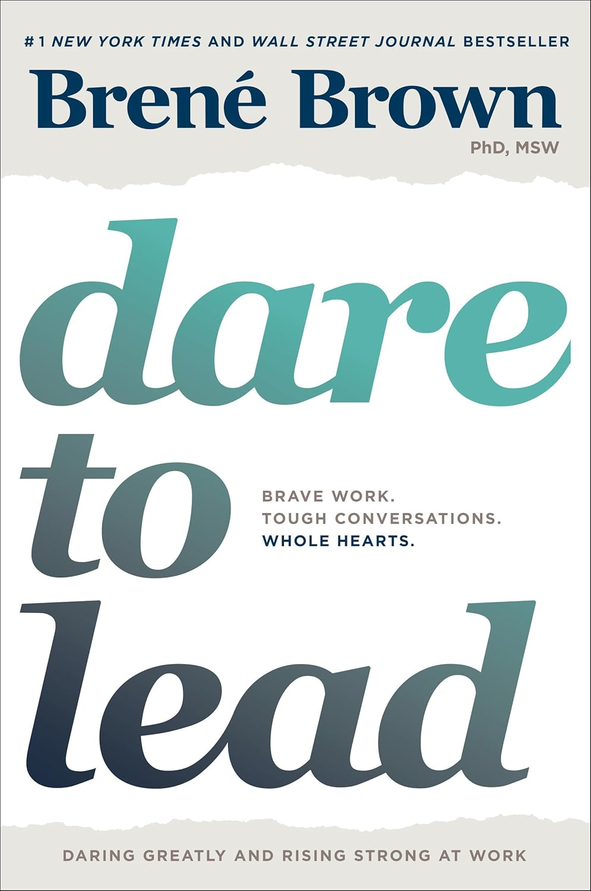

<!-- # My Book Collection -->

Here are the books I've read, currently reading, or plan to read:

  <a href="Atomic Habits.md" class="book-card">
    

    

      
Atomic Habits

      
by James Clear

      
Tiny changes, remarkable results - a guide to building good habits and breaking bad ones through small improvements.

      
#Completed

    

  </a>

  <a href="The Psychology of Money.md" class="book-card">
	

    

      
The Psychology of Money

      
by Morgan Housel

      
Timeless lessons on wealth, greed, and happiness - exploring how psychology affects our financial decisions.

      
#Completed

    

  </a>

 <a href="" class="book-card">
    

    

      
Man's Search for Meaning

      
by Viktor Frankl

      
A book for finding purpose and strength in times of great despair.

      
#Completed

    

  </a>

  <a href="Let's Talk Money.md" class="book-card">
	  

     

      
Let's Talk Money

      
by Monika Halan

      
A no-nonsense guide to personal finance for Indians - practical advice on saving, investing, and wealth building.

      
#Completed

    

  </a>

<a href="Situational Awareness.md" class="book-card">
  

  

    
Situational Awareness

    
by Leopold Aschenbrenner

    
The decade ahead: From GPT-4 to AGI to Superinteligence, and the challenges.

    
#Completed

  

</a>

<a href="The Hobbit.md" class="book-card">
  

  

    
The Hobbit: Or There and Back Again

    
by J.R.R. Tolkein

    
Amazing book on the adeventures of Mr Bilbo Baggins from his simple, boring life to the most adventerous, bravest, riskiest, and badass one including Wizard, Dwarves, Trolls, Elves, Orcs, Wolves, Eagles, Bear Man, Men etc..

    
#Completed

  

</a>

<a href="Trends - Artificial Intelligence - 2025.md" class="book-card">
  

  

    
Trends - Artificial Intelligence

    
by Mary Meeker / Jay Simons / Daegwon Chae / Alexander Krey  Company: Bond

    
Compiles foundational trends with insightful charts/visuals related to AI.

    
#Completed

  

</a>

<a href="Build-a-LLM-from-Scratch.md" class="book-card">
  

  

    
Build a Large Language Model from Scratch

    
by Sebastian Raschka

    
Solid book for learning how to build an LLM from scratch.

    
#InProgress

  

</a>

<a href="Let's Talk Mutual Funds.md" class="book-card">
	

	

    
Let's Talk Mutual Funds

    
by Monika Halan

    
A systematic, smart way to make them work for you.

    
#InProgress

</a>

<a href="TBA: The Great Mental Models" class="book-card">
	

	

    
The Great Mental Models: General Thinking Concepts

    
by Shane Parrish

    
A simple tool that explains the world.

    
#InProgress

</a>

<a href="TBA: Hands-On Large Language Models" class="book-card">
  

  

    
Hands-On Large Language Models

    
by Jay Alammar

    

    
#ToRead

  

</a>

<a href="TBA: Deep Medicine: How Artificial Intelligence Can Make Healthcare Human Again" class="book-card">
  

  

    
Deep Medicine: How Artificial Intelligence Can Make Healthcare Human Again

    
by Eric topol M.D.

    

    
#ToRead

  

</a>

<a href="TBA: The AI Revolution in Medicine: GPT-4 and Beyond" class="book-card">
  

  

    
The AI Revolution in Medicine: GPT-4 and Beyond

    
by Peter Lee, Carey Goldberg, Isaac Kohane

    

    
#ToRead

  

</a>

<a href="TBA: The Mom Test: How to talk to customers & learn if your business is a good idea when everyone is lying to you" class="book-card">
  

  

    
The Mom Test: How to talk to customers & learn if your business is a good idea when everyone is lying to you

    
by Rob Fitzpatrick 

    
<i>Note: Recommended by my book reading club peers.</i>

    
#ToRead

  

</a>

<a href="TBA: If You Live To 100, You Might As Well Be Happy: Lessons for a Long and Joyful Life: The Korean Bestseller" class="book-card">
  

  

    
If You Live To 100, You Might As Well Be Happy: Lessons for a Long and Joyful Life: The Korean Bestseller

    
by Rhee Kun Ho 

    
<i>Note: Recommended by my book reading club peers.</i>

    
#ToRead

  

</a>

<a href="TBA:   
Dare to Lead: Brave Work, Tough Conversations, Whole Hearts" class="book-card">
  

  

    
Dare to Lead: Brave Work, Tough Conversations, Whole Heartsr

    
by Brene Brown 

    
<i>Note: Recommended by senior leader at work.</i>

    
#ToRead

  

</a>
  
<!--
  <a href="Let's Talk Money.md" class="book-card">
    
📚

    

      
Let's Talk Money

      
by Monika Halan

      
A no-nonsense guide to personal finance for Indians - practical advice on saving, investing, and wealth building.

      
#ToRead

    

  </a>
  -->
  
  <!-- Add more books as needed -->

