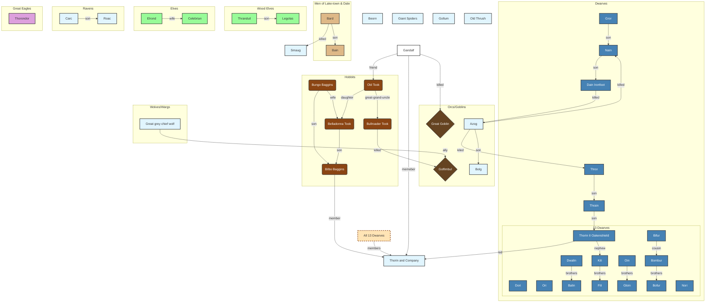

```mermaid
graph TD
    subgraph Dwarves ["Dwarves"]
        node_04b067d0["Thrain"]
        node_c1f81eeb["Gror"]
        node_2f826672["Dain Ironfoot"]
        node_4cfa9fbd["Nain"]
        node_e71b03e4["Thror"]
        subgraph 13Dwarves ["13 Dwarves"]
            node_cb4970c6["Dori"]
            node_ca79fc6e["Ori"]
            node_24690537["Balin"]
            node_907142ec["Dwalin"]
            node_cd75569f["Thorin II Oakenshield"]
            node_162f066a["Bombur"]
            node_c3ba21cb["Bofur"]
            node_98d5f550["Oin"]
            node_703c633b["Gloin"]
            node_6ab7f420["Kili"]
            node_6e3392ed["Fili"]
            node_1b120933["Nori"]
            node_85fcc850["Bifur"]
        end

    end

    subgraph Hobbits ["Hobbits"]
        node_701c3c08("Bullroader Took")
        node_979f8380("Bungo Baggins")
        node_fe3caf9a("Bilbo Baggins")
        node_993ba173("Belladonna Took")
        node_761d0dd9("Old Took")
    end

    subgraph OrcsGoblins ["Orcs/Goblins"]
        node_5715c502{"Golfimbul"}
        node_e3046ce4{"Great Goblin"}
        node_c9b6c923["Azog"]
        node_607772ba["Bolg"]
    end

    subgraph MenofLaketownDale ["Men of Lake-town & Dale"]
        node_ee646d1e["Bard"]
        node_c661c23e["Bain"]
    end

    subgraph WoodElves ["Wood Elves"]
        node_00acef57["Thranduil"]
        node_68bdfb86["Legolas"]
    end

    subgraph Elves ["Elves"]
        node_2f176ecd["Elrond"]
        node_be48dd01["Celebrian"]
    end

    subgraph Ravens ["Ravens"]
        node_c16938c8["Carc"]
        node_cd0e956d["Roac"]
    end

    subgraph WolvesWargs ["Wolves/Wargs"]
        node_fd5f2ef4["Great grey chief wolf"]
    end

    subgraph GreatEagles ["Great Eagles"]
        node_2052c335["Thorondor"]
    end

    node_1d8c1f64["Gandalf"]
    node_b3cab28a["Thorin and Company"]
    node_d9396c50["Smaug"]
    node_f8ecdb25["Beorn"]
    node_f579abdd["Giant Spiders"]
    node_b956ef54["Gollum"]
    node_5c3ff81c["Old Thrush"]

    node_979f8380 -->|son| node_fe3caf9a
    node_993ba173 -->|son| node_fe3caf9a
    node_761d0dd9 -->|daughter| node_993ba173
    node_979f8380 -->|wife| node_993ba173
    node_761d0dd9 -->|great-grand-uncle| node_701c3c08
    node_1d8c1f64 -->|friend| node_761d0dd9
    node_701c3c08 -->|killed| node_5715c502
    group_b821e3b3["All 13 Dwarves"]
    group_b821e3b3 -->|members| node_b3cab28a
    node_cd75569f -->|led| node_b3cab28a
    node_1d8c1f64 -->|memeber| node_b3cab28a
    node_fe3caf9a -->|member| node_b3cab28a
    node_e71b03e4 -->|son| node_04b067d0
    node_04b067d0 -->|son| node_cd75569f
    node_1d8c1f64 -->|killed| node_e3046ce4
    node_fd5f2ef4 -->|ally| node_5715c502
    node_c9b6c923 -->|kiled| node_e71b03e4
    node_c9b6c923 -->|son| node_607772ba
    node_00acef57 -->|son| node_68bdfb86
    node_c1f81eeb -->|son| node_4cfa9fbd
    node_4cfa9fbd -->|son| node_2f826672
    node_c9b6c923 -->|killed| node_4cfa9fbd
    node_2f826672 -->|killed| node_c9b6c923
    node_ee646d1e -->|killed| node_d9396c50
    node_ee646d1e -->|son| node_c661c23e
    node_2f176ecd -->|wife| node_be48dd01
    node_6ab7f420 -->|brothers| node_6e3392ed
    node_c16938c8 -->|son| node_cd0e956d
    node_907142ec -->|brothers| node_24690537
    node_98d5f550 -->|brothers| node_703c633b
    node_162f066a -->|brothers| node_c3ba21cb
    node_85fcc850 -->|cousin| node_162f066a
    node_cd75569f -->|nephew| node_6ab7f420

    %% Styling
    classDef hobbit fill:#8B4513,stroke:#333,stroke-width:2px,color:#fff
    classDef wizard fill:#fff,stroke:#333,stroke-width:2px
    classDef orc fill:#654321,stroke:#333,stroke-width:2px,color:#fff
    classDef dwarf fill:#4682B4,stroke:#333,stroke-width:2px,color:#fff
    classDef elf fill:#98FB98,stroke:#333,stroke-width:2px
    classDef men fill:#DEB887,stroke:#333,stroke-width:2px
    classDef creature fill:#DDA0DD,stroke:#333,stroke-width:2px
    classDef group fill:#FFE4B5,stroke:#8B4513,stroke-width:3px,stroke-dasharray: 5 5
    classDef default fill:#e1f5fe,stroke:#333,stroke-width:2px
    class node_1d8c1f64 wizard
    class node_04b067d0 dwarf
    class node_c1f81eeb dwarf
    class node_2f826672 dwarf
    class node_4cfa9fbd dwarf
    class node_e71b03e4 dwarf
    class node_cb4970c6 dwarf
    class node_ca79fc6e dwarf
    class node_24690537 dwarf
    class node_907142ec dwarf
    class node_cd75569f dwarf
    class node_162f066a dwarf
    class node_c3ba21cb dwarf
    class node_98d5f550 dwarf
    class node_703c633b dwarf
    class node_6ab7f420 dwarf
    class node_6e3392ed dwarf
    class node_1b120933 dwarf
    class node_85fcc850 dwarf
    class node_701c3c08 hobbit
    class node_979f8380 hobbit
    class node_fe3caf9a hobbit
    class node_993ba173 hobbit
    class node_761d0dd9 hobbit
    class node_5715c502 orc
    class node_e3046ce4 orc
    class node_ee646d1e men
    class node_c661c23e men
    class node_00acef57 elf
    class node_68bdfb86 elf
    class node_2f176ecd elf
    class node_be48dd01 elf
    class node_2052c335 creature
    class group_b821e3b3 group
```