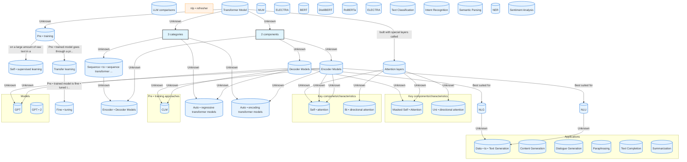

```mermaid
graph TD
    subgraph Applications ["Applications"]
        node_ab3bf55d[("Data • to • Text Generation")]
        node_a424b782[("Content Generation")]
        node_6cebc38b[("Dialogue Generation")]
        node_88b5a807[("Paraphrasing")]
        node_d043a1da[("Text Completion")]
        node_e8fd03cd[("Summarization")]
    end

    subgraph Keycomponentscharacteristics ["Key components/characteristics"]
        node_b6782f44[("Masked Self • Attention")]
        node_c6db5588[("Uni • directional attention")]
    end

    subgraph Keycomponetscharacteristics ["Key componets/characteristics"]
        node_b5cf1acf[("Self • attention")]
        node_e41b1b53[("Bi • directional attention")]
    end

    subgraph Pretrainingapproaches ["Pre • training approaches"]
        node_82cdb116[("CLM")]
    end

    subgraph Models ["Models"]
        node_da6fc0ac[("GPT")]
        node_063f6400[("GPT • 2")]
    end

    node_d6697f74[("LLM comparisons")]
    node_adecd0fd["nlp • refresher"]
    node_ac97c719[("Transformer Model")]
    node_8a180c03[("MLM")]
    node_9402eb77["2 components"]
    node_fc54dbf9["3 categories"]
    node_82e5b723[("ELECTRA")]
    node_9d733c4b[("Pre • training")]
    node_fc41f3a6[("Self • supervised learning")]
    node_845fd10c[("Transfer learning")]
    node_ad3b5bde[("Fine • tuning")]
    node_adf34b84[("BERT")]
    node_b3ab442a[("DistilBERT")]
    node_e2c3577a[("RoBERTa")]
    node_f7f6ac55[("Encoder • Decoder Models")]
    node_b4c86d7a[("ELECTRA")]
    node_a2a08fba[("NLG")]
    node_c924a588[("Text Classification")]
    node_8aab3d45[("Intent Recognition")]
    node_842df387[("Attention layers")]
    node_ad878641[("Encoder Models")]
    node_8ad6a91b[("Decoder Models")]
    node_f609cc10[("NLU")]
    node_ef048e6e[("Auto • regressive transformer models")]
    node_ef324a2e[("Auto • encoding transformer models")]
    node_eac28f9f[("Semantic Parsing")]
    node_1afbfce3[("NER")]
    node_ad8af900[("Sentiment Analysis")]
    node_c0db9c93[("Sequence • to • sequence transformer ...")]

    node_845fd10c -->|Pre • trained model is fine • tuned i...| node_ad3b5bde
    node_ac97c719 -->|Unknown| node_fc54dbf9
    node_ac97c719 -->|Unknown| node_9402eb77
    node_fc54dbf9 -->|Unknown| node_ef048e6e
    node_fc54dbf9 -->|Unknown| node_ef324a2e
    node_fc54dbf9 -->|Unknown| node_c0db9c93
    node_9402eb77 -->|Unknown| node_8ad6a91b
    node_9402eb77 -->|Unknown| node_ad878641
    node_ac97c719 -->|Unknown| node_9d733c4b
    node_9d733c4b -->|on a large amount of raw text in a| node_fc41f3a6
    node_9d733c4b -->|Pre • trained model goes through a pr...| node_845fd10c
    node_ac97c719 -->|built with special layers called| node_842df387
    node_842df387 -->|Unknown| node_b5cf1acf
    node_842df387 -->|Unknown| node_e41b1b53
    node_ad878641 -->|Unknown| node_da6fc0ac
    node_ad878641 -->|Unknown| node_82cdb116
    node_ad878641 -->|Best suited for| node_f609cc10
    node_8ad6a91b -->|Unknown| node_b6782f44
    node_8ad6a91b -->|Unknown| node_da6fc0ac
    node_8ad6a91b -->|Best suited for| node_a2a08fba
    node_8ad6a91b -->|Unknown| node_82cdb116
    node_a2a08fba -->|Unknown| node_ab3bf55d
    node_ad878641 -->|Unknown| node_ef324a2e
    node_c0db9c93 -->|Unknown| node_f7f6ac55
    node_8ad6a91b -->|Unknown| node_ef048e6e
    node_842df387 -->|Unknown| node_b6782f44
    node_842df387 -->|Unknown| node_c6db5588
    node_ad878641 -->|Unknown| node_b5cf1acf
    node_9402eb77 -->|Unknown| node_f7f6ac55
    node_ad878641 -->|Unknown| node_b5cf1acf
    node_f609cc10 -->|Unknown| node_ab3bf55d

    %% Styling
    classDef hobbit fill:#8B4513,stroke:#333,stroke-width:2px,color:#fff
    classDef wizard fill:#fff,stroke:#333,stroke-width:2px
    classDef orc fill:#654321,stroke:#333,stroke-width:2px,color:#fff
    classDef dwarf fill:#4682B4,stroke:#333,stroke-width:2px,color:#fff
    classDef elf fill:#98FB98,stroke:#333,stroke-width:2px
    classDef men fill:#DEB887,stroke:#333,stroke-width:2px
    classDef creature fill:#DDA0DD,stroke:#333,stroke-width:2px
    classDef group fill:#FFE4B5,stroke:#8B4513,stroke-width:3px,stroke-dasharray: 5 5
    classDef file fill:#E6F3FF,stroke:#4A90E2,stroke-width:2px
    classDef link fill:#FFF2E6,stroke:#FF8C00,stroke-width:2px,stroke-dasharray: 3 3
    classDef default fill:#e1f5fe,stroke:#333,stroke-width:2px
    class node_d6697f74 file
    class node_adecd0fd link
    class node_ac97c719 file
    class node_8a180c03 file
    class node_82e5b723 file
    class node_9d733c4b file
    class node_fc41f3a6 file
    class node_845fd10c file
    class node_ad3b5bde file
    class node_adf34b84 file
    class node_b3ab442a file
    class node_e2c3577a file
    class node_f7f6ac55 file
    class node_b4c86d7a file
    class node_a2a08fba file
    class node_c924a588 file
    class node_8aab3d45 file
    class node_842df387 file
    class node_ad878641 file
    class node_8ad6a91b file
    class node_f609cc10 file
    class node_ef048e6e file
    class node_ef324a2e file
    class node_eac28f9f file
    class node_1afbfce3 file
    class node_ad8af900 file
    class node_c0db9c93 file
    class node_ab3bf55d file
    class node_a424b782 file
    class node_6cebc38b file
    class node_88b5a807 file
    class node_d043a1da file
    class node_e8fd03cd file
    class node_b6782f44 file
    class node_c6db5588 file
    class node_b5cf1acf file
    class node_e41b1b53 file
    class node_82cdb116 file
    class node_da6fc0ac file
    class node_063f6400 file
```