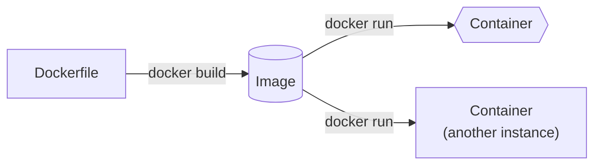
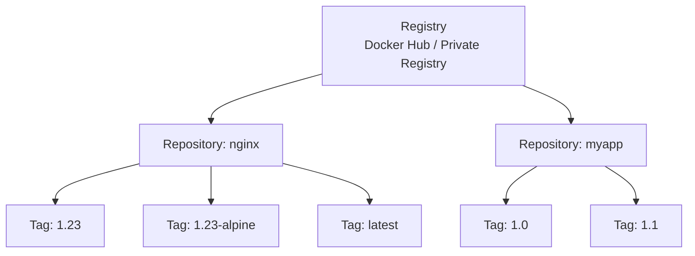
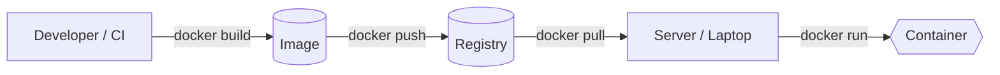
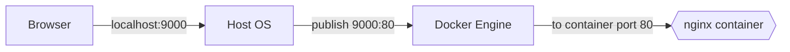
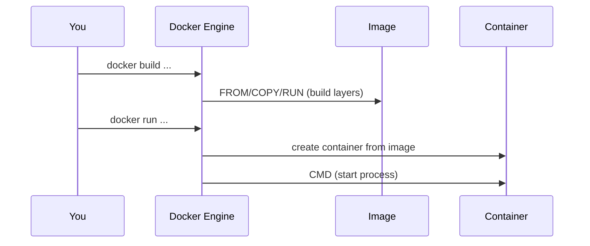
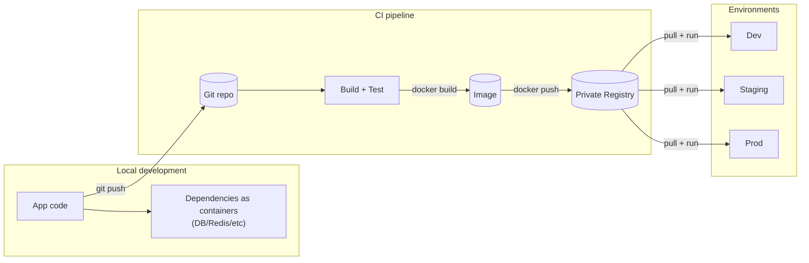
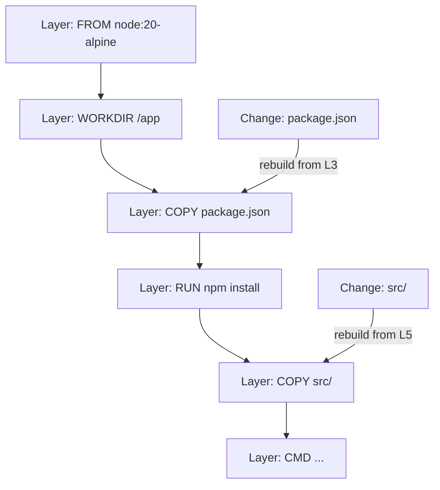

---
tags:
  - Programming
  - softwareengineering
  - DevOps
  - machinelearning
---
## Docker (First Principles + Hands-on)

This note is a cohesive “why → how → do it” walkthrough, based on the crash course I watched ([YouTube video](https://www.youtube.com/watch?v=pg19Z8LL06w)) and my hands-on custom docker image project ([`prasanth-ntu/docker-demo`](https://github.com/prasanth-ntu/docker-demo)).

> [!TIP] **Mental model:** Docker packages the *environment (config and dependencies)* with the code, so “run” becomes a predictable, repeatable operation irrespective of the device and OS.

## Key concepts at a glance (diagrams)

### Image → Container (build → run)



### Registry → Repository → Tag



### Build → Push → Pull → Run (distribution loop)



# Docker Architecture: End-to-End
<iframe src="https://prasanth.io/static/pages/Docker%20Architecture.html" width="100%" height="600" frameborder="0" allowfullscreen></iframe>
<a href="https://prasanth.io/static/pages/Spark%20Architecture.html" target="_blank" rel="noopener noreferrer"><b>Open in new tab</b></a> (*Note: Best viewed in desktop or landscape view)*

## Why Docker exists (What problem does it solve)?

Software doesn’t “run” from source code alone. It runs from **code + runtime + OS libraries + configuration + dependent services** (Postgres/Redis/etc).  
“Works on my machine” happens when those hidden assumptions differ across laptops and servers (versions, configs, OS differences).

Docker’s core move is simple:

> [!TIP] Instead of shipping *code + instructions*, ship *code + environment*.

## What Docker really virtualizes (VMs vs containers)

First principles: an OS has two “layers”:

- **Kernel**: talks to hardware (CPU, memory, disk).
- **User space**: programs + libraries that run on top of the kernel.

Docker vs VMs differs mainly in **what gets virtualized**: the whole OS, or just the application user space.
### Virtual Machines (VMs)
- Virtualize **kernel + user space** (a whole OS)
- Heavier (GBs), slower start (often minutes)
- Strong isolation; can run different OS kernels (Linux VM on Windows host, etc.)
### Docker containers
- Virtualize **user space** (process + filesystem + libs)
- Reuse the **host kernel**
- Lighter (MBs), faster start (often seconds or less)

> [!NOTE] On macOS/Windows, Docker Desktop runs a lightweight Linux VM under the hood so Linux containers can still run — that’s why it “just works” locally.

## The 4 core nouns: Image, Container, Registry, Repository

### 1) Image = the package
An **image** is the immutable artifact you build or download: app code + runtime + OS user-space bits + config.
### 2) Container = a running instance
A **container** is a running (or stopped) instance of an image — like “a process with a filesystem snapshot”.

Analogy:
- **Image**: blueprint / recipe / “frozen meal”  
- **Container**: built house / cooked dish / “hot meal”
### 3) Registry = the image warehouse
A **registry** is a service that stores images and lets you pull/push them.

- **Public registry**: Docker Hub is the default public registry most people start with.
- **Private registry**: companies store internal images in private registries (cloud provider registries, self-hosted, or private Docker Hub repos).
Registries exist because images are large and versioned, and need standardized distribution (pull/push), caching, and access control across laptops, CI, and servers.
### 4) Repository = a folder inside a registry
A **repository** is a named collection of related images (usually one app/service).

Think:
- **Registry**: the warehouse
- **Repository**: a shelf (one product line)
- **Tags**: labels on boxes (versions)

## Tags and versioning (why `latest` is usually a trap)

Images are referred to as:
`name:tag`  
Examples:
- `nginx:1.23`
- `node:20-alpine`

### What `latest` actually means
`latest` is just a tag — not “the newest stable thing” by magical guarantee.

> [!TIP] **Best practice:** pin explicit tags (or digests) in production and CI.

## Hands-on Lab 1: Run a container (nginx) and *actually* reach it

This mirrors the flow from the crash course: pull → run → port-bind → inspect logs.

### Step 1 — Pull an image (optional, `docker run` can auto-pull)

```bash
docker pull nginx:1.23
docker images
```
This downloads the image locally. At this point, nothing is running yet — you’ve only stored the artifact.

### Step 2 — Run a container

```bash
docker run nginx:1.23
```

You’ll see logs because your terminal is “attached” to the container process.

### Step 3 — Detached mode (get your terminal back)

```bash
docker run -d nginx:1.23
docker ps
```

### Step 4 — Port binding (make it reachable from your laptop)

Core idea:

> [!TIP] Containers live behind Docker’s networking boundary. Port-binding is you punching a controlled hole from host → container.



Bind host port `9000` to container port `80`:

```bash
docker run -d -p 9000:80 nginx:1.23
docker ps
```

Now open: `http://localhost:9000`
Why this works: `localhost` is your host machine. The container’s port `80` is private unless you publish/bind it to a host port.

### Step 5 — Logs, stop/start, and the “where did my container go?” moment

```bash
docker logs <container_id_or_name>
docker stop <container_id_or_name>
docker ps
docker ps -a
```

- `docker ps` shows **running** containers.
- `docker ps -a` shows **all** containers (including stopped ones).

Restart an existing container (no new container is created):

```bash
docker start <container_id_or_name>
```

### Step 6 — Name containers (humans > IDs)

```bash
docker run -d --name web-app -p 9000:80 nginx:1.23
docker logs web-app
```

## Hands-on Lab 2: Build our own image (my `docker-demo` workflow)

My demo repo is the canonical “smallest useful Dockerfile” exercise: a Node app with `src/server.js` and `package.json`, packaged into an image and run as a container ([repo](https://github.com/prasanth-ntu/docker-demo)).

### Think like Docker: what must be true for this app to run?

Requirements:
- **Runtime exists**: `node` is available
- **Dependencies are installed**: `npm install` happened during image build
- **Files are present**: `package.json` and `src/` are copied into the image
- **Working directory is consistent**: pick a stable path (commonly `/app`)

### Minimal Dockerfile (explained by “mapping local steps”)

If your local steps are:

```bash
npm install
node src/server.js
```

Then your Dockerfile should encode the same:

```dockerfile
FROM node:20-alpine

WORKDIR /app

COPY package.json /app/
COPY src /app/

RUN npm install

CMD ["node", "server.js"]
```
Intuition:
- `FROM` selects a base image that already has the runtime installed.
- `WORKDIR` makes paths stable and predictable.
- `RUN` executes at build-time (creates layers).
- `CMD` is the default run-time command when the container starts.



### Build the image

From the directory containing the Dockerfile:

```bash
docker build -t docker-demo-app:1.0 .
docker images
```

### Run it (and bind ports)

If the Node server listens on `3000` inside the container, bind it to `3000` on your host:

```bash
docker run -d --name docker-demo -p 3000:3000 docker-demo-app:1.0
docker ps
docker logs docker-demo
```

Open: `http://localhost:3000`

> [!TIP] **Shortcut:** `docker run` will auto-pull from Docker Hub if the image isn’t local. For your own image, it’s local unless you push to a registry.

## Where Docker fits in the bigger workflow (dev → CI → deploy)

The “big picture” loop:

1. **Dev**: run dependencies (DB/Redis/etc) as containers; keep your laptop clean.
2. **Build/CI**: build a versioned image from your app (`docker build ...`).
3. **Registry**: push to a private repo (`docker push ...`).
4. **Deploy**: servers pull the exact image version and run it (`docker run ...` or an orchestrator).



Net effect: you stop re-implementing “installation + configuration” as a fragile checklist on every machine; the image becomes the executable contract.

## Dockerfile intuition: layers and caching

Each `FROM`, `COPY`, `RUN` creates an image **layer**.

> [!TIP] Docker caches layers. If a layer doesn’t change, it reuses it.

Practical implication:
- Copy `package.json` first, run `npm install`, then copy the rest — so dependency install is cached unless dependencies change.



## Compose (why it exists)

`docker run ...` is great for 1 container. Real apps are usually **multiple containers**:

- app + database + cache + queue + …

Docker Compose is a “runbook you can execute”:
- defines containers, ports, env vars, volumes, networks
- lets you bring a whole stack up/down predictably

> [!TIP] Think of Compose as “a declarative script for `docker run` commands”.

## Volumes (data that must survive containers)

Example mental model:
- Container filesystem: throwaway
- Volume: durable attachment you can remount to new containers

## Best practices (high signal)

- **Pin versions**: prefer `postgres:16` over `postgres:latest`.
- **Name containers**: it makes logs and scripts sane.
- **Prefer immutable builds**: configure via env vars/volumes, not manual changes inside a running container.
- **Don’t store secrets in images**: inject via env/secret managers.
- **Clean up**: stopped containers and unused images accumulate.

## Mini command cheat sheet (the 20% you’ll use 80% of the time)

```bash
# Images
docker images
docker pull nginx:1.23

# Containers
docker ps
docker ps -a
docker run -d --name mynginx -p 9000:80 nginx:1.23
docker logs mynginx
docker stop mynginx
docker start mynginx

# Build your own image
docker build -t myapp:1.0 .
docker run -d -p 3000:3000 myapp:1.0
```

## Mental Model Cheat Sheet

- **The Difference:** `venv` organizes the **Bookshelf** (Python libraries), but Docker builds the **Entire Apartment** (OS tools, system libraries, and settings).
- **The Engine:** Docker is fast because it shares the **Host Kernel** while isolating the **User Space**.
- **The Lifecycle:**
	- **Dockerfile:** The Recipe
	- **Image:** The Frozen Meal (Blueprint)
	- **Container:** The Hot Meal (Running Instance)
- **The Manager:** `docker-compose` is the **Waiter/Tray** coordinating multiple dishes (services), ports, and volumes.

## Appendix: Self-check Q&A (Socratic prompts)

- **What does it mean for software to “run”?**  
	- Code + runtime + OS libs + config + dependent services.
- **Why does “works on my machine” happen?**  
	- Environment drift: different versions, configs, OS behavior.
- **If an image is immutable, what is “running”?**  
	- A container is the running (or stopped) instance of an image.
- **Why do registries exist?**  
	- Distribution + caching + access control for large, versioned artifacts.
- **Why can’t I access a container port directly via `localhost`?**  
	- Container networking is isolated; you must publish/bind ports from host → container.
- **Why do we use `CMD` instead of `RUN node ...`?**  
	- `RUN` happens at build-time; `CMD` is the default runtime command.
- **If containers are disposable, where does persistent data go?**  
	- Volumes (or external managed services).