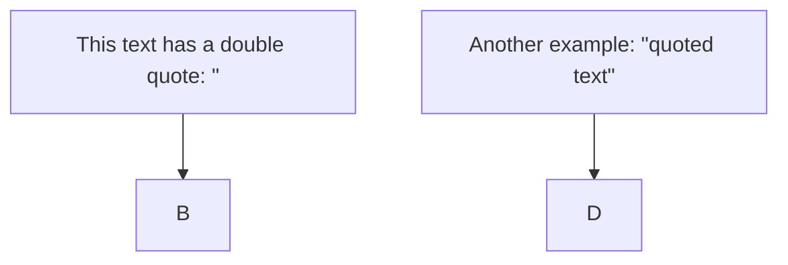
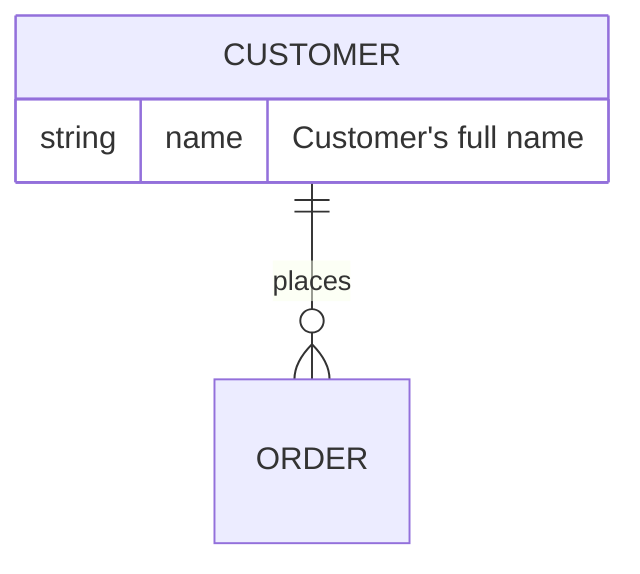

---
tags:
  - datascience
  - Documentation
  - AI
  - machinelearning
---
# Tips

## Add double quotes within text
To add double quotes within text in a Mermaid diagram, you can use HTML entity codes (`&quot;`).



## ER diagram



## Control spacing and padding
Add the `%%{init...}%%` block above the `graph`
- `nodeSpacing`: Controls the horizontal space **between** nodes.
- `rankSpacing`: Controls the vertical space **between** rows of nodes.
- `padding`: Controls the internal space **inside** each node, between the text and the border.

Example
```
%%{init: {
  "flowchart": {
    "nodeSpacing": 20,
    "rankSpacing": 35,
    "padding": 2
  }
}}%%
```