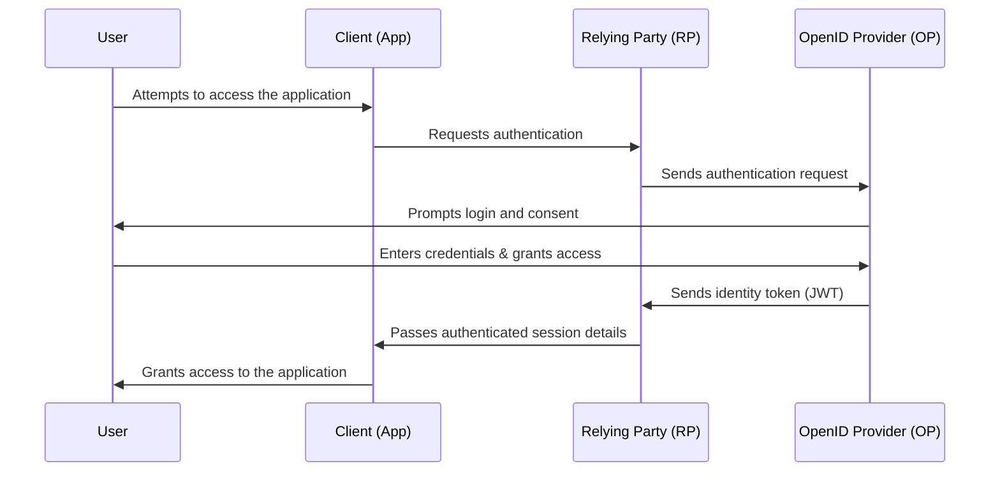
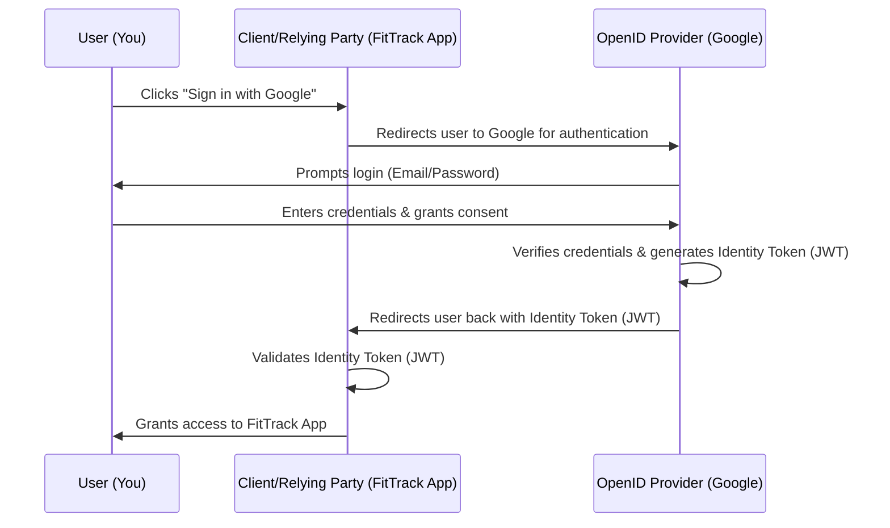

---
tags:
  - SoftwareEngineering
  - Authentication
  - Protocol
  - Token
---
Extract from [Microsoft Website](https://www.microsoft.com/en-us/security/business/security-101/what-is-openid-connect-oidc#:~:text=OpenID%20Connect%20(OIDC)%20is%20an,in%20to%20access%20digital%20services.):

> OpenID Connect (OIDC) is an authenticator protocol that is an extension of [open authorization (OAuth) 2.0](https://www.microsoft.com/en-us/security/business/security-101/what-is-oauth) to standardize the process for authenticating and authorizing users when sign in to access digital services. OIDC provides [authentication](https://www.microsoft.com/en-us/security/business/security-101/what-is-authentication), which means verifying that users are who they say they are. OAuth 2.0 authorizes which systems those users are allowed to access. OAuth 2.0 is typically used to enable two unrelated applications to share information without compromising user data. For example, many people use their email or social media accounts to sign in to a third-party site rather than creating a new username and password. OIDC is also used to provide single sign-on. Organizations can use a secure [identity and access management (IAM)](https://www.microsoft.com/en-us/security/business/security-101/what-is-identity-access-management-iam) system like [Microsoft Entra ID (formerly Azure Active Directory](https://www.microsoft.com/en-us/security/business/identity-access/azure-active-directory)) as the primary authenticator of identities and then use OIDC to pass that authentication to other apps. This way users only need to sign in once with one username and password to access multiple apps.

# Key components of OIDC

## Explanation:
•	**User**: The person trying to access an application.
•	**Client (App)**: The website or app requesting authentication.
•	**Relying Party (RP)**: The application that trusts an OpenID Provider (OP) for authentication.
•	**OpenID Provider (OP)**: The identity provider that authenticates users and issues identity tokens.
•	**Identity Token**: A token containing user identity information (e.g., JWT).
**•	Authentication Process:**
1.	User attempts to access the app.
2.	The client app redirects the user to the relying party.
3.	The relying party requests authentication from the OpenID Provider.
4.	The OpenID Provider prompts the user for login and consent.
5.	After successful authentication, the OpenID Provider issues an identity token.
6.	The relying party verifies the identity token and grants access.
7.	The client app then allows the user to interact with the application.

## Example: 
### OIDC as a Hotel Check-In Process 🏨
1.	**User (You, the Guest):**
	•	You arrive at a hotel (the application you want to access).
	•	The hotel needs to verify your identity before letting you in.
2.	**Client (Hotel Reception Desk):**
	•	The receptionist (client app) asks for an official ID to confirm who you are.
	•	But the receptionist doesn’t verify the ID themselves—they rely on an official entity.
3.	**Relying Party (Hotel’s Internal System):**
	•	The hotel has a policy: Instead of verifying guests directly, they rely on passports issued by the government (trusted identity providers).
	•	So, the receptionist redirects you to get your identity verified.
4.	**OpenID Provider (Government Passport Office):**
	•	You go to the passport office (OpenID Provider), which already knows who you are.
	•	The officer checks your credentials (like username/password) and verifies you.
	•	If valid, they give you a passport (Identity Token) as proof of authentication.
5.	**Identity Token (Passport/ID Card):**
	•	The passport contains key details about you, like your name, nationality, and when it was issued.
	•	It proves that a trusted entity (the government/OpenID Provider) has verified you.
6.	**Accessing the Hotel (Using the Identity Token):**
	•	You return to the hotel reception and show your passport (identity token).
	•	The receptionist trusts it because it’s issued by an official authority.
	•	They verify the passport and grant you access to your hotel room (application).

Scenario: Logging into an App Using Google Login

Imagine you want to sign up for FitTrack, a new fitness tracking app, but you don’t want to create a new account. Instead, you choose “Sign in with Google”.

### 🔹 Step-by-Step Breakdown of OIDC

**1️⃣ User Initiates Login**
	•	You open FitTrack and click “Sign in with Google.”

**2️⃣ FitTrack (Client) Redirects to Google (OP)**
	•	FitTrack redirects you to Google’s authentication page.

**3️⃣ Google (OP) Prompts Login & Consent**
	•	Google asks for your email & password (if not logged in).
	•	Google asks: “Do you allow FitTrack to access your profile?”

**4️⃣ User Authenticates with Google (OP)**
	•	You enter credentials, and Google verifies them.

**5️⃣ Google Issues Identity Token (JWT)**
	•	Google generates a JWT (Identity Token) with:
	•	Your Google ID
	•	Your email
	•	Authentication metadata

**6️⃣ Google Redirects Back to FitTrack with the Token**
	•	The JWT is sent to FitTrack as part of the redirect URL.

**7️⃣ FitTrack (Relying Party) Validates the Token**
	•	FitTrack verifies the token’s signature & claims to confirm authenticity.

**8️⃣ User Gains Access to FitTrack**
	•	FitTrack creates a session and logs you in.

#### How this diagram represents both the general and real-world flow
| **OIDC Component**       | **Mermaid Diagram Representation**                                                                  | Comment                                     |
| ------------------------ | --------------------------------------------------------------------------------------------------- | ------------------------------------------- |
| **User**                 | You, trying to login into Fitrack Clicking “Sign in with Google”                                 |                                             |
| **Client (App)**         | FitTrack app (initiates login flow a.k.a. authentication request & receives token)                  |                                             |
| **Relying Party (RP)**   | Also FitTrack (validates identity token from Google and logs you in)                                |                                             |
| **OpenID Provider (OP)** | Google (providing authentication i.e., verified credentials and issues identity token)              | Talks about **authentication + issuance**   |
| **Authentication**       | Google verifies your credentials and issues an authentication result                                |                                             |
| **Identity Token (JWT)** | Google issues a signed JWT containing user identity/details and authentication metadata to FitTrack | Talks about **the token format & contents** |
