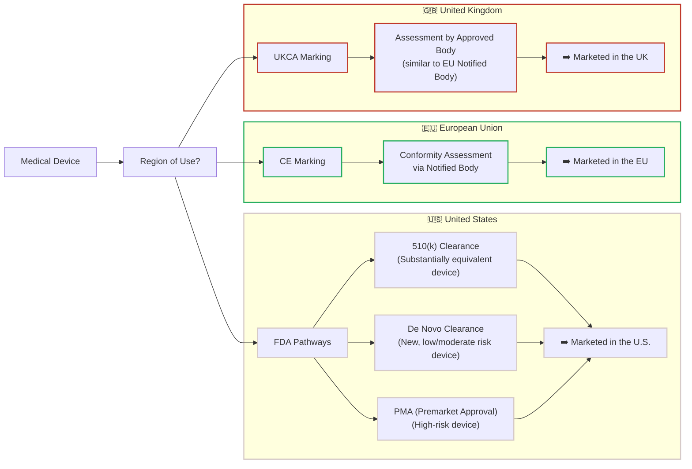

# Medical Regulatory Flow across Different Regions

```mermaid
flowchart LR
    A["Medical Device"] --> B["Region of Use?"]
    B --> FDA["FDA Pathways"]
    B --> CE["CE Marking"]
    B --> UKCA["UKCA Marking"]

    %% United States Swimlane
    subgraph USGroup[🇺🇸 United States]
        direction TB
        %% USNode --> FDA["FDA Pathways"]
        FDA --> FDA1["510(k) Clearance<br/>(Substantially equivalent device)"]
        FDA --> FDA2["De Novo Clearance<br/>(New, low/moderate risk device)"]
        FDA --> FDA3["PMA (Premarket Approval)<br/>(High-risk device)"]
        FDA1 --> USMarket["➡️ Marketed in the U.S."]
        FDA2 --> USMarket
        FDA3 --> USMarket
    end

    %% European Union Swimlane
    subgraph EUGroup[🇪🇺 European Union]
        direction TB
        %% EUNode --> CE["CE Marking"]
        CE --> CE1["Conformity Assessment<br/>via Notified Body"]
        CE1 --> EUMarket["➡️ Marketed in the EU"]
    end

    %% United Kingdom Swimlane
    subgraph UKGroup[🇬🇧 United Kingdom]
        direction TB
        %% UKNode --> UKCA["UKCA Marking"]
        UKCA --> UKCA1["Assessment by Approved Body<br/>(similar to EU Notified Body)"]
        UKCA1 --> UKMarket["➡️ Marketed in the UK"]
    end

     %% Styling

    class USGroup,USMarket,FDA,FDA1,FDA2,FDA3 usStyle
    class EUGroup,EUMarket,CE,CE1 euStyle
    class UKGroup,UKMarket,UKCA,UKCA1 ukStyle

    classDef usStyle stroke:#D6CAC8,stroke-width:2px
    classDef euStyle stroke:#27AE60,stroke-width:2px
    classDef ukStyle stroke:#C0392B,stroke-width:2px
```
