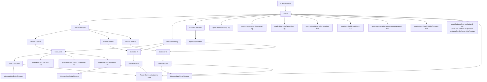

---
tags:
  - machinelearning
  - datascience
  - artificialintelligence
  - DataAnalytics
  - Spark
  - SQL
  - Python
---
# What's Spark?
> [!SUMMARY] Apache Spark™ is a powerful, open-source, multi-language engine designed for large-scale data processing. 

It enables data engineering, data science, and machine learning workloads to be executed efficiently on both single-node machines and distributed clusters. Built for speed and ease of use, Spark simplifies complex data tasks by providing a unified framework for batch processing, real-time streaming, advanced analytics, and machine learning.

At its core, Apache Spark™ is built on an advanced distributed SQL engine, making it highly scalable and capable of handling massive datasets across multiple nodes. Its in-memory processing capabilities significantly accelerate data operations, making it a preferred choice for organizations dealing with big data challenges. With support for programming languages like [[Python Documentation|Python]], Scala, Java, and R, Spark offers flexibility and accessibility to a wide range of developers and data professionals.
## Key Features of Apache Spark
- **Unified Engine**: Combines batch processing, real-time streaming, SQL queries, and machine learning in one platform.
- **Multi-Language Support**: APIs for Python (PySpark), Scala, Java, and R.
- **In-Memory Processing**: Delivers faster performance by caching data in memory.
- **Scalability**: Handles petabytes of data across distributed clusters.
- **Advanced Analytics**: Supports graph processing, machine learning (MLlib), and stream processing (Spark Streaming).
- **Integration**: Seamlessly integrates with popular big data tools like Hadoop, Hive, and cloud platforms.

# PySpark
> [!SUMMARY] PySpark is the Python API for Apache Spark. 

It enables you to perform real-time, large-scale data processing in a distributed environment using Python. It also provides a PySpark shell for interactively analyzing your data.

PySpark combines Python’s learnability and ease of use with the power of Apache Spark to enable processing and analysis of data at any size for everyone familiar with Python.

PySpark supports all of Spark’s features such as Spark SQL, DataFrames, Structured Streaming, Machine Learning (MLlib) and Spark Core.

For more details, refer [PySpark Overview](https://spark.apache.org/docs/latest/api/python/index.html#) from spark official documentation.
## Benefits for Python Data Scientists
| Section                      | Benefits for Python Data Scientists                                                                                                                                                                                                                                                                 |
| ---------------------------- | --------------------------------------------------------------------------------------------------------------------------------------------------------------------------------------------------------------------------------------------------------------------------------------------------- |
| **Spark SQL and DataFrames** | - Enables seamless integration of SQL queries with Python code.  <br>- Provides a high-level API for structured data processing.  <br>- Allows efficient data manipulation using PySpark DataFrames.  <br>- Leverages Spark’s optimized execution engine for performance.                           |
| **Pandas API on Spark**      | - Scales pandas workflows to handle large datasets across distributed clusters.  <br>- No code changes needed to migrate from pandas to Spark.  <br>- Single codebase works for both small (pandas) and large (Spark) datasets.  <br>- Easy to switch between pandas and Spark APIs.                |
| **Structured Streaming**     | - Simplifies real-time data processing with the same API as batch processing.<br>- Handles streaming data incrementally and continuously.<br>- Scalable and fault-tolerant for production-grade streaming applications.                                                                             |
| **Machine Learning (MLlib)** | - Provides scalable machine learning algorithms for large datasets.<br>- High-level APIs for building and tuning ML pipelines.<br>- Integrates with Python for ease of use.<br>- Supports distributed training and evaluation.                                                                      |
| **Spark Core and RDDs**      | - Offers low-level control over distributed data processing.<br>- Useful for custom transformations and actions.<br>- Provides in-memory computing for faster performance.<br>- *Note: DataFrames are recommended over RDDs for most use cases due to higher-level abstractions and optimizations.* |
 **Key Takeaways for Python Data Scientists:**
- **Spark SQL and DataFrames**: Best for structured data processing with SQL and Python integration.
- **Pandas API on Spark**: Ideal for scaling pandas workflows to big data without rewriting code.
- **Structured Streaming**: Perfect for real-time data processing and analytics.
- **MLlib:** Essential for scalable machine learning on large datasets.
- **Spark Core and RDDs**: Useful for advanced users needing low-level control, but DataFrames are preferred for most tasks.
# Spark vs. PySpark
| Feature                 | Apache Spark (Scala/Java)                                | PySpark (Python API)                                                              |
| ----------------------- | -------------------------------------------------------- | --------------------------------------------------------------------------------- |
| **Defintion**           | Distributed computing framework for big data processing. | Python API for Apache Spark, allowing Python integration                          |
| **Language**            | Scala, Java                                              | Python                                                                            |
| **Ease of Use**         | More verbose, requires functional programming knowledge  | More user-friendly, integrates well with Python ecosystem                         |
| **Performance**         | Faster (native execution in JVM)                         | Slightly slower (Python overhead, but still efficient)                            |
| **API Coverage**        | Full API support                                         | Most of Spark’s features are available but some limitations exist                 |
| **Libraries**           | Spark MLlib, GraphX, Streaming                           | PySpark supports Spark MLlib and Streaming, but GraphX is not directly supported  |
| **DataFrame Support**   | Fully supported                                          | Fully supported (with Pandas-like syntax)                                         |
| **Interoperability**    | Native to JVM-based applications                         | Works well with Python libraries and tools like Pandas, NumPy, and SciPy, Jupyter |
| **Learning Curve**      | Steeper (functional programming concepts)                | Easier for Python developers                                                      |
| **Community & Support** | Strong, backed by Databricks and Apache                  | Large Python community, extensive resources available                             |
| **Deployment**          | Standalone, YARN, Kubernetes, Mesos                      | Same as Spark, but requires Python installed on all nodes                         |
| Development Speed       | Slower due to Scala/Java compilation and verbosity.      | Faster prototyping and development due to Python’s interpreted nature.            |
**Key Takeaways:**
- Spark is the core framework, while PySpark is its Python API.
- Use Spark for performance-critical applications in Scala/Java.
- Use PySpark for ease of use and integration with Python ecosystems.
---
# Apache Spark Architecture: End-to-End
<iframe src="https://prasanth.io/static/pages/Spark%20Architecture.html" width="100%" height="600" frameborder="0" allowfullscreen></iframe>
<a href="https://prasanth.io/static/pages/Spark%20Architecture.html" target="_blank" rel="noopener noreferrer"><b>Open in new tab</b></a> (*Note: Best viewed in desktop or landscape view)*


# Important concepts
## Spark configurations Example


## `persist` vs. `cache`
> [!SUMMARY]
> - **`cache`**: Simple, in-memory storage with no customization.
> - **`persist`**: Flexible, allows custom storage levels for optimized performance and fault tolerance.
> - **`StorageLevel`**: Controls how data is stored (memory, disk, replication, etc.).

| **Aspect**      | **`persist`**                                                                                        | **`cache`**                                                               |
| --------------- | ---------------------------------------------------------------------------------------------------- | ------------------------------------------------------------------------- |
| **Definition**  | Allows you to specify a custom storage level for an RDD or DataFrame.                                | A shorthand for `persist` with a default storage level (`MEMORY_ONLY`).   |
| **Flexibility** | Highly flexible. You can choose from multiple storage levels (e.g., `MEMORY_AND_DISK`, `DISK_ONLY`). | Less flexible. Uses a fixed storage level (`MEMORY_ONLY`).                |
| **Use Case**    | Use when you need fine-grained control over how data is stored (e.g., memory, disk, or both).        | Use for quick caching in memory when no specific storage level is needed. |
| **Example**     | `rdd.persist(StorageLevel.MEMORY_AND_DISK)`                                                          | `rdd.cache()`                                                             |
### **What is `StorageLevel`?**
The `StorageLevel` class in PySpark defines how an RDD or DataFrame is stored (e.g., in memory, on disk, or both). It provides control over the following attributes:
1. **`useDisk`**: Whether to store data on disk.
2. **`useMemory`**: Whether to store data in memory.
3. **`useOffHeap`**: Whether to use off-heap memory (outside the JVM heap).
4. **`deserialized`**: Whether the data is stored in deserialized format (not applicable in PySpark, as data is always serialized).
5. **`replication`**: The number of replicas of the data to store across nodes (default is 1).
### **Common `StorageLevel` Options**

| **Storage Level**           | **Description**                                                                                |
| --------------------------- | ---------------------------------------------------------------------------------------------- |
| **`MEMORY_ONLY`**           | Stores RDD/DataFrame in memory only. If memory is insufficient, partitions will be recomputed. |
| **`MEMORY_ONLY_2`**         | Same as `MEMORY_ONLY`, but with 2 replicas for fault tolerance.                                |
| **`MEMORY_AND_DISK`**       | Stores RDD/DataFrame in memory, but spills to disk if memory is insufficient.                  |
| **`MEMORY_AND_DISK_2`**     | Same as `MEMORY_AND_DISK`, but with 2 replicas for fault tolerance.                            |
| **`DISK_ONLY`**             | Stores RDD/DataFrame only on disk.                                                             |
| **`DISK_ONLY_2`**           | Same as `DISK_ONLY`, but with 2 replicas for fault tolerance.                                  |
| **`MEMORY_AND_DISK_DESER`** | Stores data in memory and disk in deserialized format (not applicable in PySpark).             |
For more details, refer [`pyspark.StorageLevel`](https://spark.apache.org/docs/latest/api/python/reference/api/pyspark.StorageLevel.html#pyspark-storagelevel "Permalink to this headline")
### **When to Use `persist` vs `cache`**
1. **Use `cache`**:
    - When you want a quick and easy way to store an RDD or DataFrame in memory.
    - When you don’t need to customize the storage level.
    - Example: `df.cache()`.
2. **Use `persist`**:
    - When you need to optimize storage for specific use cases (e.g., memory constraints, fault tolerance).        
    - When you want to store data on disk or use a combination of memory and disk.
    - Example: `df.persist(StorageLevel.MEMORY_AND_DISK)`.
### **Key Considerations**
- **Memory Usage**: `MEMORY_ONLY` is faster but requires sufficient memory. Use `MEMORY_AND_DISK` if memory is limited.
- **Fault Tolerance**: Higher replication levels (e.g., `MEMORY_ONLY_2`) improve fault tolerance but increase storage overhead.
- **Performance**: Storing data in memory (`MEMORY_ONLY`) is faster than disk (`DISK_ONLY`), but disk storage is more reliable for large datasets.

## User Defined Function (UDF)
**Example: Demonstrates how to convert latitude and longitude to geohash6 in PySpark using UDF**
```python
from pyspark.sql import SparkSession
from pyspark.sql.functions import udf
from pyspark.sql.types import StringType
import geohash

# Create a Spark session
spark = SparkSession.builder \
    .appName("Geohash Conversion") \
    .getOrCreate()

# Create a UDF for geohash conversion
# The precision parameter 6 will give you geohash6
@udf(returnType=StringType())
def to_geohash6(lat, lon):
    if lat is None or lon is None:
        return None
    try:
        # Convert to float in case they are strings
        lat_float = float(lat)
        lon_float = float(lon)
        # Generate geohash with precision 6
        return geohash.encode(lat_float, lon_float, precision=6)
    except:
        return None

# Example: Create a sample dataframe with lat/lon
data = [
    (37.7749, -122.4194, "San Francisco"),
    (40.7128, -74.0060, "New York"),
    (51.5074, -0.1278, "London"),
    (None, -122.4194, "Invalid"),
    (37.7749, None, "Invalid")
]

df = spark.createDataFrame(data, ["latitude", "longitude", "location"])

# Apply the UDF to convert lat/lon to geohash6
df_with_geohash = df.withColumn("geohash6", to_geohash6(df["latitude"], df["longitude"]))

# Show the result
df_with_geohash.show()

```