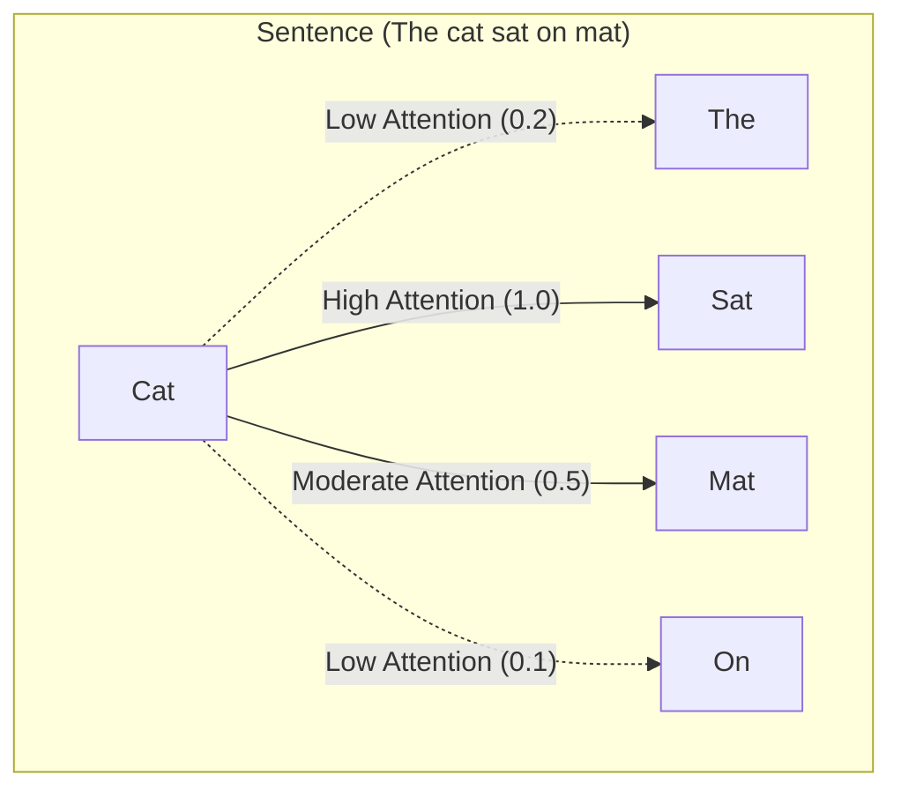
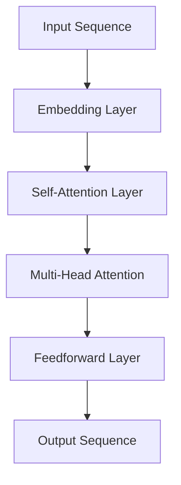
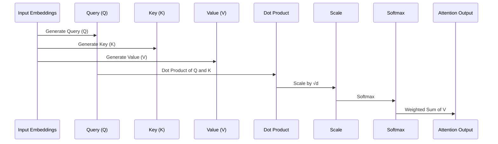
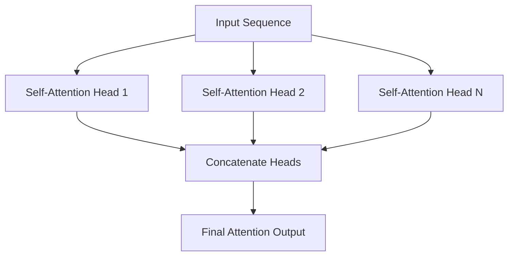

---
tags:
  - DataScience
---
> Attention is all you need!

- [From ChatGPT](#From%20ChatGPT)
	- [1. **Purpose of Attention**](#1.%20**Purpose%20of%20Attention**)
	- [2. **How Attention Works**](#2.%20**How%20Attention%20Works**)
	- [3. **Self-Attention (Scaled Dot-Product Attention)**](#3.%20**Self-Attention%20(Scaled%20Dot-Product%20Attention)**)
	- [4. **Multi-Head Attention**](#4.%20**Multi-Head%20Attention**)
	- [5. **Why Attention Layers Are Important**](#5.%20**Why%20Attention%20Layers%20Are%20Important**)
	- [In Summary](#In%20Summary)
- [Mermaid diagrams](#Mermaid%20diagrams)
	- [**Attention Mechanism Overview**](#**Attention%20Mechanism%20Overview**)
	- [Self-Attention Mechanism (Scaled Dot-Product Attention)](#Self-Attention%20Mechanism%20(Scaled%20Dot-Product%20Attention))
	- [Multi-Head Attention](#Multi-Head%20Attention)

A key feature of Transformer models is that they are built with special layers called _attention layers_. This layer will **tell the model to pay specific attention to certain words in the sentence** you passed it (and more or less ignore the others) when dealing with the representation of each word.

To put this into context, consider the task of translating text from English to French. With more complex sentences (and more complex grammar rules), ***the model would need to pay special attention to words that might appear farther away in the sentence*** to properly translate each word.

The same concept applies to any task associated with natural language: <b><i> a word by itself has a meaning, but that meaning is deeply affected by the context</b>, which can be any other word (or words) before or after the word being studied</i>.

## From ChatGPT
An **attention layer** in transformers is a **mechanism that allows the model to focus on specific parts of an input sequence, enabling it to capture dependencies between different parts of the sequence**. This attention mechanism is the core idea behind transformers and is especially useful for handling sequential data in tasks like natural language processing.

Here’s a breakdown of how it works and why it's important:

### 1. **Purpose of Attention**

- In tasks like language translation or text summarization, words in a sentence often relate to one another in complex ways. For instance, the meaning of a word may depend on other words far away in the sentence.
- Traditional models like RNNs and LSTMs struggle with long-range dependencies, as they process sequences sequentially. **Attention allows the model to capture these relationships more flexibly by directly "attending" to any part of the sequence.**

### 2. **How Attention Works**

- In the attention layer, ***each word (or token) in the sequence calculates a score for its relationship to every other word in the sequence***.
- ***These scores determine how much "attention" each word should give to other words in the context of understanding the current word***.
- For example, in the sentence "*The cat sat on mat*", the word "cat" might give higher attention scores to related words like "sat" or "mat" rather than to "The" or "on."

### 3. **Self-Attention (Scaled Dot-Product Attention)**
![[Self-attention]]

####  Bi-directional attention
![[Bi-directional attention]]

#### Self-attention and bi-directional attention
Self-attention and bi-directional attention are closely linked in transformer [[Encoder Models|encoder models]]. Self-attention is the mechanism that lets each word in a sentence focus on every other word, assessing their relationships to form a context-aware representation. Together, they allow the model to build a full-sentence understanding for richer contextual representations.
### 4. **Multi-Head Attention**

- Transformers use multiple attention heads, each learning different aspects of word relationships. These heads run in parallel and are then combined, giving the model richer and more nuanced understanding.

### 5. **Why Attention Layers Are Important**

- **Parallelization**: Unlike RNNs, transformers can process the entire sequence at once, making training faster and more efficient.
- **Long-Range Dependencies**: Attention layers allow the model to capture relationships between distant words, which is critical in understanding context.
- **Versatility**: The attention mechanism adapts well to various tasks, from translation and summarization to image processing.

### In Summary

An attention layer in transformers, especially through **self-attention** and **multi-head attention**, enables the model to "focus" on relevant parts of the sequence, allowing it to understand relationships between words regardless of their distance from each other. This is a major breakthrough in making language models highly effective and efficient for complex tasks.

## Mermaid diagrams
### **Attention Mechanism Overview**

### Self-Attention Mechanism (Scaled Dot-Product Attention)

### Multi-Head Attention
