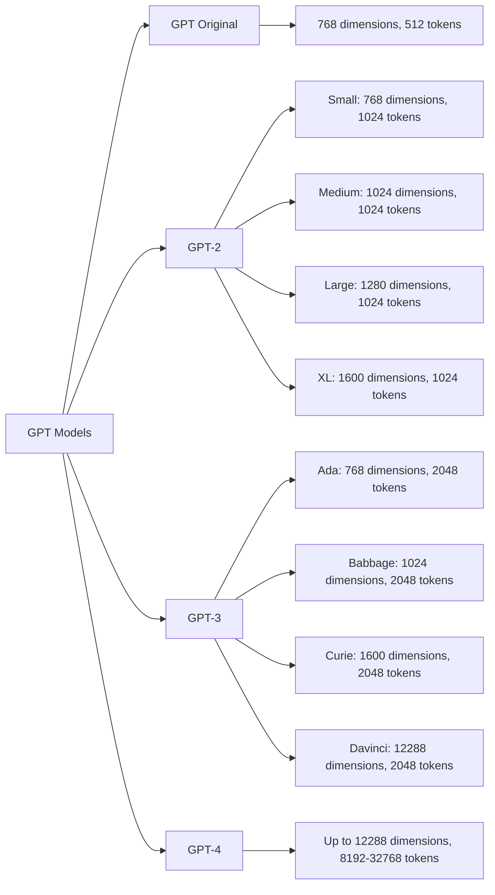

---
tags:
  - DataScience
  - ArtificialIntelligence
  - DeepLearningAI
  - LLM
  - GPU
---
# Compute time, Parameter  count, Embedding Size, Context Window

Given, NVIDIA A100 has a throughput of $312 \text{ TFLOPs}$ for FP16 precision,

| Year |        Model        | Est. Parameter Count | Embedding Size |   Context Window    |             Est. Compute† (in [[FLOPS\|FLOP]]s & TFLOPs)             |                                                  Est. training duration with  $10000\times \text{ A100}$ GPUs                                                  | Est transformer layers |                  Est. Compute Growth                  |               Est. Parameter Growth               |
| :--: | :-----------------: | :------------------: | :------------: | :-----------------: | :---------------------------------------------------------------------: | :------------------------------------------------------------------------------------------------------------------------------------------------------------: | :--------------------: | :---------------------------------------------------: | :-----------------------------------------------: |
| 2018 |      [[GPT-1]]      |         117M         |      768       |     ~512 tokens     |                                                                         |                                                                                                                                                                |                        |                                                       |                                                   |
|      |     GPT-2 Small     |         117M         |      768       |     1024 tokens     |                                                                         |                                                                                                                                                                |                        |                                                       |                                                   |
|      |    GPT-2 Medium     |         345M         |      1024      |     1024 tokens     |                                                                         |                                                                                                                                                                |                        |                                                       |                                                   |
|      |     GPT-2 Large     |         762M         |      1280      |     1024 tokens     |                                                                         |                                                                                                                                                                |                        |                                                       |                                                   |
| 2019 |    [[GPT-2]] XL     |         1.5B         |      1600      |     1024 tokens     |       $4e21 \text{ FLOP}\rightarrow 4 \times 10^9 \text{ TFLOPs}$       |           $\large \frac{4 \times 10^9 \text{ TFLOP}}{10000 \times 312 \text{ TFLOPS}}$  $= 12.8 \times 10^2 \text{ secs}$ $= 0.0147 \text{ days}$           |                        |                                                       |                                                   |
|      |     GPT-3 (Ada)     |        ~350M         |      768       |     2048 tokens     |                                                                         |                                                                                                                                                                |                        |                                                       |                                                   |
|      |   GPT-3 (Babbage)   |        ~1.3B         |      1024      |     2048 tokens     |                                                                         |                                                                                                                                                                |                        |                                                       |                                                   |
|      |    GPT-3 (Curie)    |        ~6.7B         |      1600      |     2048 tokens     |                                                                         |                                                                                                                                                                |                        |                                                       |                                                   |
| 2020 | [[GPT-3]] (Davinci) |         175B         |     12288      |     2048 tokens     |     $3e23 \text{ FLOP} \rightarrow 3 \times 10^{11} \text{ TFLOPs}$     |          $\large \frac{3 \times 10^{11} \text{ TFLOP}}{10000 \times 312 \text{ TFLOPS}}$  $= 9.61 \times 10^4 \text{ secs}$ $= 1.11 \text{ days}$           |           96           |   <b>+ ~2 OOMs</b>   | <b>+ ~2 OOMs</b> |
| 2023 | [[GPT-4]] (Varies)  | ~1-2 trillion params |   Upto 12288   | 8192 - 32768 tokens | $\text{~}4e25 \text{ FLOP} \rightarrow 4 \times 10^{13} \text{ TFLOPs}$ | $\large \frac{4 \times 10^{13} \text{ TFLOP}}{10000 \times 312 \text{ TFLOPS}}$  $= 12.8 \times 10^6 \text{ secs}$ $= 148 \text{ days}$ $(\text{5 months})$ |                        | <b>+ ~1.5-2 OOMs</b> | <b>+ ~1 OOM</b>  |
- \*without factoring in memory bandwidth, latency, power efficiency, etc.
- †Sources: 
	- [Epoch AI](https://epochai.org/data/epochdb/table)
### Visual comparison

# Pre-training dataset and cost
| Year | Model     | Dataset (size)                                                      | Cost (in terms of cloud compute) |
| ---- | --------- | ------------------------------------------------------------------- | -------------------------------- |
| 2018 | [[GPT-1]] |                                                                     |                                  |
| 2019 | [[GPT-2]] |                                                                     |                                  |
| 2020 | [[GPT-3]] | 300 billion tokens† (60% of original data of 499 billion tokens) | ~$4.6 million†                   |
| 2023 | [[GPT-4]] |                                                                     |                                  |
*Sources: 
- †[Build a Large Language Model from Scratch](https://www.amazon.sg/dp/1633437167?ref_=mr_direct_us_sg_sg&showmri)*