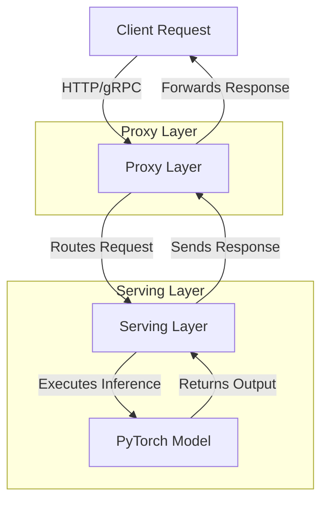

---
tags:
  - DataScience
  - MachineLearning
  - SoftwareEngineering
  - DevOps
  - Infrastructure
  - Cloud
  - MLOps
---
# What Does Model Serving Mean?

Model serving refers to the deployment and operationalization of a trained machine learning (ML) or deep learning (DL) model so it can respond to real-world requests for inference in a production environment. The goal is to make the model available as a service to other applications or systems, typically via APIs (REST, gRPC, etc.).

# Key Features of Model Serving
1.	**Inference**: Running the model on input data to generate predictions or outputs.
2.	**Scalability**: Handling multiple requests simultaneously with consistent performance.
3.	**Latency**: Ensuring low response times for real-time or near-real-time predictions.
4.	**Monitoring**: Tracking model performance, request latency, and error rates.
5.	**Versioning**: Managing different versions of models for rollback or A/B testing.
6.	**Security**: Implementing authentication, authorization, and secure communications.

# Workflow in Model Serving
1.	**Model Training**: A model is trained offline using a dataset.
2.	**Model Packaging**: The trained model is serialized (e.g., using PyTorch’s torch.save or ONNX format) and stored in a model registry or storage.
3.	**Deployment**: The model is deployed to a serving infrastructure (e.g., TorchServe, Triton, FastAPI) capable of handling inference requests.
4.	**Serving**: The model-serving system exposes endpoints for making inference requests and handles incoming traffic while utilizing hardware (e.g., CPUs or GPUs).

---
# Does Model Serving Fall Under DevOps, Infra, Cloud, or a Combination?

> [!tip] Model serving spans across multiple domains and requires a combination of skills and infrastructure.

## 1. DevOps
•	**Relevance**: DevOps practices are essential for automating and monitoring the deployment pipeline of ML models.
•	**Key Responsibilities**:
	•	Continuous integration/continuous deployment (CI/CD) pipelines for ML models.
	•	Infrastructure-as-Code (IaC) to provision serving environments (e.g., using Terraform, Kubernetes).
	•	Monitoring tools like Prometheus, Grafana, or CloudWatch for tracking performance and availability.

## 2. Infrastructure
•	**Relevance**: Model serving requires compute resources (e.g., CPUs, GPUs) and networking infrastructure to operate efficiently.
•	**Key Responsibilities**:
	•	Setting up on-premises or cloud infrastructure for hosting models.
	•	Managing resource allocation, scaling, and failover mechanisms.
	•	Ensuring low-latency networking for API calls.

## 3. Cloud
•	**Relevance**: Cloud platforms simplify model serving with managed services and scalable infrastructure.
•	**Key Responsibilities**:
	•	Using managed services like AWS SageMaker, Google AI Platform, or Azure ML for serving models.
	•	Leveraging auto-scaling, storage (e.g., S3 buckets), and container orchestration (e.g., Kubernetes on EKS/GKE/AKS).

## Combination
•	**Practical Overlap**:
	•	Model serving often sits at the intersection of these domains.
	•	A MLOps engineer typically bridges these areas, combining ML expertise with DevOps and cloud skills.

| Domain | Role in Model Serving                                |
| ------ | ---------------------------------------------------- |
| DevOps | Automating deployment, CI/CD, and monitoring.        |
| Infra  | Providing compute/networking resources, scaling.     |
| Cloud  | Using cloud services for scalability and management. |
## Real-World Analogy

Think of model serving as running a restaurant:
	•	DevOps: The kitchen staff and tools ensure smooth preparation and flow (CI/CD, monitoring).
	•	Infrastructure: The dining area and kitchen are your physical resources (hardware and networking).
	•	Cloud: Outsourcing to a managed caterer who can scale up or down as needed (cloud services).

Thus, model serving is a combination of all three, with significant overlap between DevOps, infrastructure, and cloud practices.

---
# Relationship & flow between proxy layer and serving layer in model-serving system
Here’s a **Mermaid diagram** to visualize the relationship and flow between the **proxy layer** and the **serving layer** (*assuming, it's running PyTorch Model*) in a model-serving system:

## Flow in a Model Serving System
1.	**Client Request → Proxy Layer**: Client sends a request (e.g., REST or gRPC) to the proxy layer.
2.	**Proxy Layer → Serving Layer**: Proxy layer routes the request to an appropriate serving instance, possibly adding metadata or preprocessing.
3.	**Serving Layer → Model Inference**: Serving layer executes the model inference (by interacting with the PyTorch model) and returns predictions.
4.	**Response → Proxy Layer → Client**: Proxy layer forwards the model’s output back to the client.

> [!summary] <i>By separating the responsibilities of the proxy and serving layers, you can design scalable, maintainable, and efficient model-serving systems</i>.

---

In the context of serving a PyTorch model, proxy layer and serving layer serve distinct purposes in the architecture of a model-serving system. Here’s an explanation of both:
## 1. Proxy Layer

> [!summary] The proxy layer acts as a <i>middleware between the client (user or application) and the actual serving infrastructure</i>. 

Its primary functions include:
•	**Routing**: It determines which model-serving instance should handle the incoming request, especially in multi-model or distributed setups.
•	**Load Balancing**: Distributes incoming traffic across multiple instances of the serving layer to ensure efficient resource utilization.
•	**Authentication and Authorization**: Verifies the identity of the client and ensures they have access to the requested model or API.
•	**Protocol Translation**: Converts client requests (e.g., HTTP or gRPC) into a format understood by the serving layer.
•	**Request Preprocessing**: Performs lightweight operations like logging, validation, or attaching metadata before forwarding requests.

**Example**: If you’re using Kubernetes, an Ingress Controller or API Gateway (like NGINX or Envoy) often serves as a proxy layer.
## 2. Serving Layer

> [!summary] The serving layer is responsible for <i>model inference</i>—the actual computation and processing of the client’s request using the PyTorch model. 

Its primary functions include:
•	**Model Loading and Management:** Loads PyTorch models from storage (e.g., a model registry) into memory and ensures they are ready for inference.
**•	Inference Execution:** Runs the model on the input data provided by the client and returns the predictions or outputs.
•	**Hardware Utilization:** Utilizes appropriate compute resources (CPU, GPU, or TPU) to serve the model efficiently.
•	**Batching and Optimization:** Combines multiple incoming requests into a batch for efficient processing (if supported by the model) and applies optimizations like TorchScript or ONNX for faster inference.
•	**Scalability**: Scales horizontally to handle increasing loads.

Example: A PyTorch model served using TorchServe, Triton Inference Server, or a custom Flask/FastAPI-based serving application forms part of the serving layer.
## Key Differences

This table highlights the complementary nature of these two layers, each optimized for their specific responsibilities in the ML serving architecture.

| Feature               | Proxy Layer                                                                                                                       | Serving Layer                                                                                                                                                                                                                                                                                                                                                                                     |
| --------------------- | --------------------------------------------------------------------------------------------------------------------------------- | ------------------------------------------------------------------------------------------------------------------------------------------------------------------------------------------------------------------------------------------------------------------------------------------------------------------------------------------------------------------------------------------------- |
| **Role**              | Handles client-facing tasks and request routing.                                                                                  | Executes model inference an                                                                                                                                                                                                                                                                                                                                                                       |
| **Resources**         | Light                                                                                                                             | Heavy                                                                                                                                                                                                                                                                                                                                                                                             |
| **Hardware**          | CPU only                                                                                                                          | GPU enabled                                                                                                                                                                                                                                                                                                                                                                                       |
| **Features**          | - Request timeout control - Logging - Shadow testing - Request routing                                                   | - Model versioning - Batching opt - Worked management - PyTorch serving config                                                                                                                                                                                                                                                                                                           |
| **Focus**             | Network, request routing, security, and preprocessing.                                                                            | Model inference, compute optimization, and scaling.                                                                                                                                                                                                                                                                                                                                               |
| **Interaction**       | Interfaces with the client and passes requests to the serving layer.                                                              | Directly interacts with the model and compute resources.                                                                                                                                                                                                                                                                                                                                          |
| **Tools/ Frameworks** | NGINX, Envoy, API Gateway, Kong, custom proxy implementatinos.                                                                    | TorchServe, Triton, FastAPI, Flask, custom servers.                                                                                                                                                                                                                                                                                                                                               |
| **Position**          | Frontend/Gateway                                                                                                                  | Backend/Compute                                                                                                                                                                                                                                                                                                                                                                                   |
| **Container Image**   | Proxy image: - Lightweight, general-purpose - Contains networking & routing tools - Focused on HTTP request handling  | Usual ML framework specific image: - Custom-built for specific model requirements - Contains &nbsp;&nbsp;&nbsp;   - PyTorch serving runtime &nbsp;&nbsp;&nbsp;   - Model artifacts & weights &nbsp;&nbsp;&nbsp;   - Model-specific dependencies &nbsp;&nbsp;&nbsp;   - GPU drivers and CUDA if needed - Built from ML framework base images - Unique per model deployment |

---