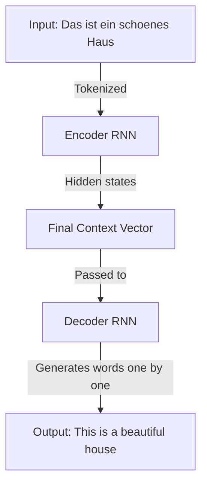
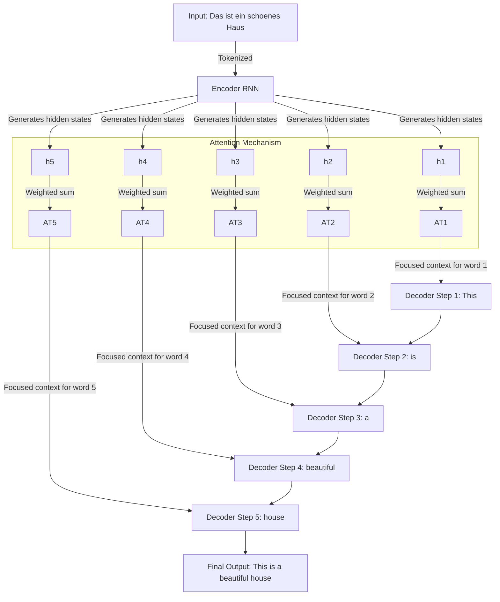

---
tags:
  - MachineLearning
  - DataScience
  - LLM
  - ArtificialIntelligence
  - GAI
  - Translation
---
> [!TODO] Note to self: Need to revisit this topic after gaining better understanding on "context vector"
# RNN without vs. with Attention
## RNN without Attention (Basic Seq2Seq Model)
A simple RNN-based **sequence-to-sequence (Seq2Seq)** model consists of:
-  **Encoder**: Reads the input sequence (German sentence) and compresses it into a single fixed-length vector (context vector).
- **Decoder**: Takes this fixed vector and generates the output sequence (English translation).
### Example Translation:
- German: 👉 _“Das ist ein schönes Haus.”_
- English (Expected Output): 👉 _“This is a beautiful house.”_

### Step-by-Step Process (Without Attention)
1. **Encoding:**
	- The encoder processes each word of the input sentence using an RNN (e.g., LSTM or GRU).
	- After processing all words, it outputs a **context vector** (a single fixed-length hidden state).
	
	**Example**:
	```
	Input: ["Das", "ist", "ein", "schönes", "Haus"]
	Encoder RNN hidden states: h1 → h2 → h3 → h4 → h5
	Final context vector = h5
	```
2. **Decoding**
	- The decoder starts with the context vector, and generates the output sequence **once word at a time**.
	- <span style="color:red">It does so without looking back at the individual encoder states</span> - it only has access to the single final context vector, `h5`
	
	**Example**:
	```
	Decoder RNN starts with context vector h5
	Generates: ["This"] → ["is"] → ["a"] → ["beautiful"] → ["house"]
	```
### Limitations of RNN Without Attention
•	<span style="color:red">The <b>fixed-length context vector</b> forces the model to <b>compress all information into a single vector</b>, which makes translation difficult, especially for <b>long sentences</b></span>.
•	<span style="color:red">If the sentence is long, <b>earlier words might be forgotten</b> by the time the decoder starts generating words.</span>

---
## RNN with Attention (Seq2Seq + Attention)
To overcome the limitations, **Attention** allows the decoder to dynamically focus on different parts of the input sentence **at each decoding step**.
### Key Difference:
<span style="color:red">Instead of relying only on a single fixed context vector</span>, <span style="color:green">the decoder attends to different encoder states using a set of learned weights</span>.
### Step-by-Step Process (With Attention)
1.	**Encoding** (Same as Before)
	•	The encoder processes each input word and generates a **sequence of hidden states**, rather than a single context vector.
	
	Example
```
	Input: ["Das", "ist", "ein", "schönes", "Haus"]
	Encoder RNN hidden states: h1, h2, h3, h4, h5
```

2.	**Decoding with Attention:**
	•	Instead of using just one context vector, at each decoding step, the decoder **assigns weights** to different encoder hidden states based on their relevance.
	
	**Example** (for generating “*beautiful*”):
	•	The decoder generates an **attention score** for each encoder state.
	•	The **weighted sum** of these encoder states becomes the context vector.
```
	Attention scores for "beautiful":
	(Das: 0.1, ist: 0.1, ein: 0.2, schönes: 0.5, Haus: 0.1)
	Weighted context vector = (0.1*h1 + 0.1*h2 + 0.2*h3 + 0.5*h4 + 0.1*h5)
```

3. **Final Output with Attention:**
```
	Decoder generates:
	"This" → "is" → "a" → (focuses on "schönes") "beautiful" → (focuses on "Haus") "house"
```
## Comparison: RNN Without vs. With Attention

| Feature                       | RNN Without Attention              | RNN With Attention                                               |
| ----------------------------- | ---------------------------------- | ---------------------------------------------------------------- |
| Context Vector                | Single fixed-length vector         | Dynamically weighted sum of encoder states                       |
| Performance on long sentences | Struggles, loses early information | Better, selectively focuses on important words                   |
| Accuracy                      | Lower forlong sentences            | Higher, better word alignment                                    |
| Interpretability              | Hard to understand decisions       | Can visualize attention weights to see which words were focus on |
## Comparison: Mermaid diagrams
### Seq2Seq Without Attention


### Seq2Seq With Attention


## Conclusion
•	**Without attention**, the model must encode the entire sentence into a single vector, which can cause loss of information.
•	**With attention**, the model can selectively focus on the relevant parts of the input sentence at each decoding step, leading to better translations, especially for long sentences.