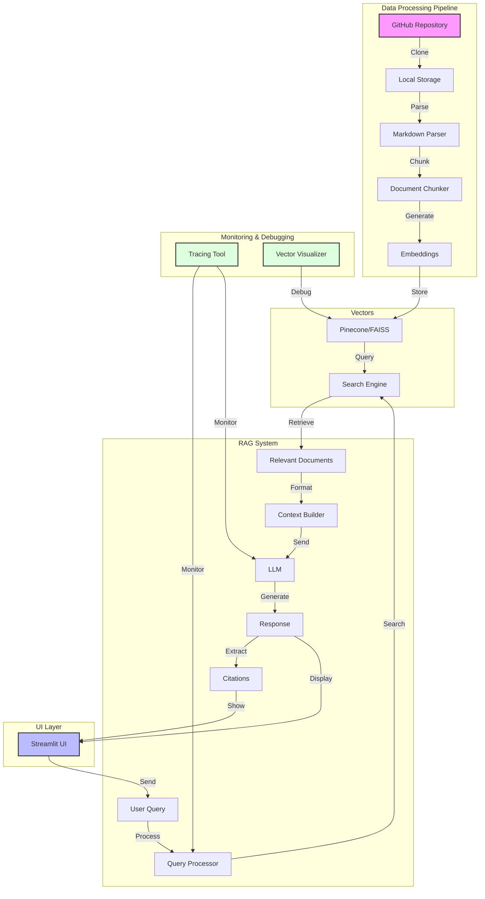

---
tags:
  - softwareengineering
  - Projects
  - Hacks
  - OpenSource
  - Chatbot
  - GAI
  - LLM
  - Agents
---
🤖 Personal Chatbot connected to my Personal Blog.

**Useful links**
- [Source code](https://github.com/prasanth-ntu/personal-chatbot)

