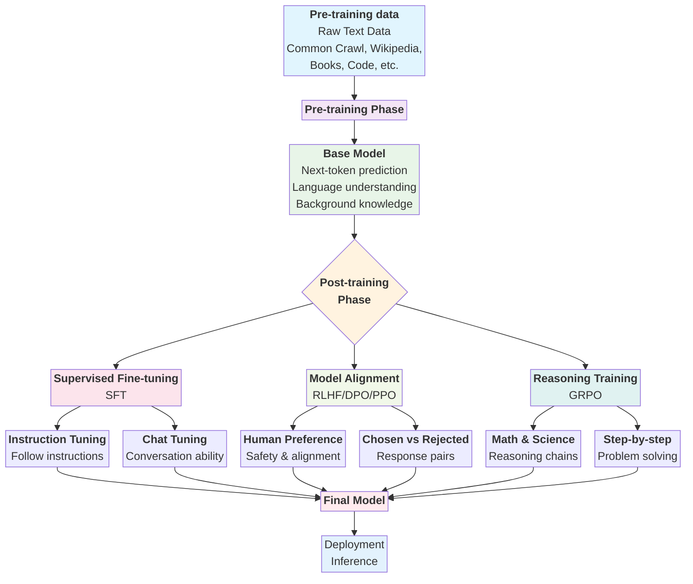

- Source: [YouTube](https://www.youtube.com/watch?v=Lt7KrFMcCis), [LinkedIn](https://www.linkedin.com/posts/danielhanchen_heres-a-complete-guide-to-fine-tuning-llms-activity-7351251048226836480-Qa-z/?utm_source=share&utm_medium=member_android&rcm=ACoAAAcOLFMBUn1o8NEoEvAqJrA0ZzVgH3csPQ0), GitHub, [Presentation (SVG)](Pookie-official-guide-to-finetuning-LLMs.svg)
- Speaker: Wout Voseen ([LinkedIn](https://www.linkedin.com/in/wout-vossen/))
- My forked/modified code: [GitHub](https://github.com/prasanth-ntu/pookie-llm-finetuning-resources)

---
# Presentation
## Introduction

> [!QUESTION] Why fine-tune LLMs?
- **Add new knowledge**
	- medical/ legal/ industrial/ company secrets
	- domain specific knowledge 
- **Improve performance**
	- story telling
	- document classification
	- information extraction
	- summarisation
	- ...
- Give AI assistants a personality
- **Improve the usability of local models**
- **Overcome guardrails**
	- political bias
	- potentially dangerous research

> [!Question] Why not just prompt?
- Sometimes hard/impossible to write an instruction/prompt
 - LLMs have limited context size & performance drops when context gets larger
 - Prompted behaviour might not meet performance requirements 

> [!Question] How about RAG?
- RAG is easier If we want to answer questions about knowledge base that changes frequently
- Quality of RAG is very dependent on retrieval process
> [!TIP] Most interesting combination: ==RAG + Finetuning==

## LLM Training
###  LLM Training Pipeline



### Pre-training & Post-training

> [!QUESTION] How are LLM trained?

> [!HINT] It all starts with Transformers
> 

<p><a href="https://commons.wikimedia.org/wiki/File:Transformer,_full_architecture.png#/media/File:Transformer,_full_architecture.png"></a><br>By dvgodoy - <a rel="nofollow" class="external free" href="https://github.com/dvgodoy/dl-visuals/?tab=readme-ov-file">https://github.com/dvgodoy/dl-visuals/?tab=readme-ov-file</a>, <a href="https://creativecommons.org/licenses/by/4.0" title="Creative Commons Attribution 4.0">CC BY 4.0</a>, <a href="https://commons.wikimedia.org/w/index.php?curid=151216016">Link</a></p>

> [!INFO] 1) Pre-training
>**Phase**
> - Base model
> - *Variant*: Completions
> 
> **Dataset**
> - Standard data (Common Crawl, GitHub, Wikipedia, Books, ArXiv, Code Exchange, etc.)
> 
> **Purpose & Task**
> - Next-token prediction 
> - Gain language understanding
> - Gain background knowledge
>   
> **Resources**
> -  [Llama paper](https://arxiv.org/pdf/2302.13971) > Table 1: Pre-training data (*refer figure below*)
> - [common crawl sample](https://huggingface.co/datasets/agentlans/common-crawl-sample) 

<div style="text-align: center;">

<p style="font-size: 0.9em; color: #666; margin: 4px 0 0 0; font-style: italic;">Figure: Llama pre-training data details showing the composition and sources of 4.8TB of training data used in the model</p>
</div>

> [!INFO] 2.1) Post-Training
>**Phase**
> - Supervised Fine Tuning (SFT)
> - *Variants*: 1) Instruction, 2) Chat
>   
> **Dataset**
> - Structured data that demonstrates intended behaviour
>  
> **Purpose & Task**
> - Learn to follow instructions
> - Learn to answer questions about a domain
> - Learn to have conversations
> - Demonstrate intended behaviour
>   
> **Resources**
> -  [Llama 3 paper](https://arxiv.org/pdf/2407.21783) > Table 7: Statistics of SFT data (*refer figure below*)
> - [alpaca dataset (instruction tuning)](https://huggingface.co/datasets/yahma/alpaca-cleaned)
> - [gaunaco (conversation tuning)](https://huggingface.co/datasets/philschmid/guanaco-sharegpt-style)
> - [paul graham dataset (conversation tuning)](https://huggingface.co/datasets/pookie3000/pg_chat)

![[Llama3-sft-data-stats.png]]

> [!INFO] 2.2) Post-training
> **Phase**
> - Model Alignment (RL): DPO, PPO/RLHF, RLOO
>   
> **Dataset**
> - Dataset of rejected and preferred assistant responses
> 
> **Purpose & Task**
> - Make model better follow human preference
> - Make model safer
>   
> **Resources**
> - [descriptiveness-sentiment-trl instruction tuning](https://huggingface.co/datasets/trl-internal-testing/descriptiveness-sentiment-trl-style)
> - [llama3 paper](https://arxiv.org/pdf/2407.21783) > Section *4. Post-Training*


> [!INFO] 2.3 Post-training
> **Phase**
> - Reasoning (RL): GRPO
> 
> **Dataset**
> - Dataset of prompts and expected answers
> 
> **Purpose & Tasks**
> - Create 'reasoning models' for inference time reasoning
> - For quantitative domains (science, math, coding, etc.)
>   
> **Resources**
> - [gsm8k (Grade school math)](https://huggingface.co/datasets/openai/gsm8k  )

---
### LoRA vs. QLoRA

> [!QUESTION] How do we actually train?

> [!TIP] Compute: Llama 3 405B is training on up to 16K H100 GPUs
> Each H100 GPU costs ~30K USD

> [!TIP] We can fine-tune LLMs efficiently using
> - LoRA
> - QLoRA

> [!INFO] **Low-rank Matrix Decomposition, LoRA & QLoRA**
> - Instead of finetuning the weights of the actual model, we fine-tune the low rank matrices (a.k.a. adapters which consists of low-rank matrices)
> 	- During the inference time, these adapters are put on top of the actual weights of the base model, and they are summed together. This way, we don't have to optimise the base model itself.
> - In the example below, we can see that instead of finetuning $5 \times 5$ matrix (25 weights), we just have to fine-tune $5 \times 1 + 1 \times 5$ matrices (10 weights
> 	![[low-rank-matrix-decomposition-example.png]]
> - QLoRA is where the base model is also quantised (e.g, weights reduced from 16-bit to 4-bit)
![[lora-vs-qlora-for-llm-fine-tuning.png]]
>   

For mode details, refer [QLORA: Efficient Finetuning of Quantized LLMs](https://arxiv.org/pdf/2305.14314) paper.

### Which open-source models? Which variants?

> [!Question] Which models to fine-tune?
> - Google (Gemma)
> - Meta
> - Mistral AI
> - DeepSeek
> - Qwen
> - ...

> [!Question] How many parameter model?
> Depends on the RAM
> ![[llm-model-parameters-and-vram-needed-for-fine-tuning.png]]

> [!Question] Which model variants to choose?
> **Base model**
> - model after pretraining phase
> - so no instruction following, chat (supervised-finetuning)
> - requires finetuning for downstream usage
> 
> **instruct / chat variant**
> - supervised finetuning already done
> - capable of chat / instruction following
> 
> **multi-modal / vision variant**
>  - can take both image and text input
> 
> **gguf variant**
> -  for inference use only (not trainable)


> [!Question] When to use which variant?
> **base model:**
> - you don't need chat / instruction following capabilities (e.g., ascii generation)
> - you have lots of data > 2000 samples 
> - you want to train with your own chat template
> 
> **instruct / chat variant:**
> - you want to leverage the supervised finetuning already done
> - you don't have a lot of data
> > [!WARNING] you need to format your training set according to the chat template that was used during original SFT
> 
> **multi-modal variant:**
> - 🤓
> 
> **gguf variant**
> - never when finetuning, only when doing inference

### Model naming conventions explained

| Model Name                                                                                            | Parameters | Variant    | Modality                               |                                      |
| ----------------------------------------------------------------------------------------------------- | ---------- | ---------- | -------------------------------------- | ------------------------------------ |
| [google/gemma-3-4b-it](https://huggingface.co/google/gemma-3-4b-it)                                   | 4b         | instruct   | multi-model <br>(support vision input) |                                      |
| [google/gemma-3-1b-pt](https://huggingface.co/google/gemma-3-1b-pt)                                   | 1b         | pretrained | text-only                              |                                      |
| [unsloth/gemma-3-12b-it-GGUF](https://huggingface.co/unsloth/gemma-3-12b-it-GGUF)                     | 12b        | instruct   | multi-model <br>(support vision input) | GGUF                                 |
| [meta-llama/Llama-3.3-70B-Instruct](https://huggingface.co/meta-llama/Llama-3.3-70B-Instruct)         | 70b        | instruct   | text-only                              |                                      |
| [unsloth/Llama-3.1-8B-unsloth-bnb-4bit](https://huggingface.co/unsloth/Llama-3.1-8B-unsloth-bnb-4bit) | 8b         | pretrained | text only                              | 4 bit quantized using Bits and Bytes |
|                                                                                                       |            |            |                                        |                                      |

---
### Collecting and Structuring Data

> [!Question] How to collect and structure data?
> ==*Depends on the task*==
> 
> **Pre-training: Continued**
> - Collect some unstructured training data
> 	- e.g., [paul graham essays](https://huggingface.co/datasets/pookie3000/pg_essays_split_1000_t)
> 	- ![[paul-graham-essays-for-continued-pre-training-example.png]]
>   
> **Post-training: Chat / conversation models using SFT**
> - Curate conversational data in a pre-defined template (each conversation consists of 1 pair of `role` and `content`)
> 	- e.g., [dataset-preparation](https://github.com/vossenwout/llm-finetuning-resources/tree/main/dataset-preparation), [pg_chat](https://huggingface.co/datasets/pookie3000/pg_chat)
> 	  ![[pg-chat-for-conversation-data-for-fine-tuning-example.png]]
> - Apply chat template to the above formatted data with special tokens (e.g., `eot_id`)
> 	- e.g., llama 3.1, [How to format inputs to ChatGPT models](https://cookbook.openai.com/examples/how_to_format_inputs_to_chatgpt_models)
> 	  ![[special-tokens-during-finetuning-example.png]]
> - **Prompt Templates**: Models will have different chat templates which were used during SFT of the specific model
> 	- e.g., [Mistral (in GO templating language)](https://github.com/unslothai/unsloth/blob/main/unsloth/chat_templates.py#L165)
>  	  
> **Post-training: Model Alignment using DPO/ PPO/ RLHF**
> - Curate dataset that shows chosen and rejected answer for given prompt
> 	  - e.g., [trl-internal-testing/descriptiveness-sentiment-trl-style](v)
> 	    ![[model-alignment-example-llm-fine-tuning-example.png]]
> 
> **Post-training: Reasoning models using GRPO**
> - Curate datasets with question and answers
> 	- e.g., [Goastro/mlx-grpo-dataset](https://huggingface.co/datasets/Goastro/mlx-grpo-dataset)
> 	  ![[reasoning-model-llm-finetuning-example.png]]
 	    
---
> [!Question] How to fine-tune?
> - **Libraries**: unsloth and PEFT
> - **Compute**: 
> 	- Paid platforms: GCP, AWS, etc.
> 	- Free platforms: [Google Colab](https://colab.research.google.com/), [Modal](https://modal.com/), AWS SageMaker, etc.

### How to save model?
 - Using GGUF format, a most popular one that contains both the tokenizer as well as the model. In other words, it contains everything that our system needs to run the model.
 - Also, allows the model to run on CPU (e.g., Macbooks)
![[saving-fine-tuned-llm-mode-explained.png]]
- **Model merging or LoRA on top**: We have two options when we save our model in GGUF
	1. Convert base model and adapters to GGUF separately, and during inference, put them on top. ==This allows us to swap different adapters at inference time==.
	2. Merge the base model with adapters by adding the weights together, and turn the merged model into GGUF. ==Makes it easier to share our specific model with others==
- **Quantize GGUF such that it fits in our VRAM**
	- e.g., [tools/quantize/quantize.cpp](https://github.com/ggml-org/llama.cpp/blob/master/tools/quantize/quantize.cpp#L22)
		- Recommended to use `{ "Q4_K_M", LLAMA_FTYPE_MOSTLY_Q4_K_M, "4.58G, +0.1754 ppl @ Llama-3-8B"},` where
			- Q4 implies 4-bit quantization
- **Quantization and turning into GGUF is done with**
	- [llama.cpp](https://github.com/ggml-org/llama.cpp)
		- Unsloth - Has compatibility for this 
		- [gguf-my-repo](https://huggingface.co/spaces/ggml-org/gguf-my-repo) - Hugging face space to convert HF repo into GGUF 
- **Inference of GGUF**
	- [llama.cpp](https://github.com/ggml-org/llama.cpp) - Library where all other inference providers are built on
	- ollama - Much user friendly
	- [open-webui](https://github.com/open-webui/open-webui)
---
# Hands-on

```
```

## 1. Ascii Art -  Completion fine-tuning
### Notebook explained

The notebook ([GitHub](https://github.com/prasanth-ntu/pookie-llm-finetuning-resources/tree/main/finetuning/unsloth)) walks through the steps of using the Unsloth library for parameter-efficient finetuning (specifically using LoRA) of a large language model (LLM) on a custom dataset. The goal is to train the model to generate ASCII art.

> [!SUMMARY] Key contents of the notebook
> 1. **Installation of Libraries**
> 2. **Loading the Base Model**
> 	- `meta-llama/Llama-3.2-3B`
> 3. **Adding LoRA Adapter and Patching with Unsloth**
> 4. **Dataset Preparation & Visualization**
> 	- [`pookie3000/ascii-cats`](https://huggingface.co/datasets/pookie3000/ascii-cats) prepared using [`create_completion_dataset.py`](https://github.com/prasanth-ntu/pookie-llm-finetuning-resources/blob/main/dataset-preparation/completion-tuning/create_completion_dataset.py)
> 5. **Training the Model**
>    > [!TIP] Interesting stats
>    > - `Num examples = 201 | Num Epochs = 5 | Total steps = 130` 
>    > 	- How Total steps is computed? `(201 x 5 / (2 x 4 x 1) = 125.625)`, but number of steps must be integer, hence rounded up to 130.
>    >  - `Batch size per device = 2 | Gradient accumulation steps = 4`
>    >   - `Data Parallel GPUs = 1 | Total batch size (2 x 4 x 1) = 8`
>    > - `Trainable parameters = 24,313,856 of 3,237,063,680 (0.75% trained)`
>    > 	- Only <1% of the model params are trained
> 6. **Inference**
> 7. **Saving the Model**
> 	1. **Converting base model in GGUF format**
> 		1. Using standalone python code locally and `modal` in cloud : [gguf-conversion/gguf_base_model.py](https://github.com/prasanth-ntu/pookie-llm-finetuning-resources/blob/main/gguf-conversion/gguf_base_model.py)
> 			- [`prasanthntu/Llama-3.2-3B-guide-GGUF`](https://huggingface.co/prasanthntu/Llama-3.2-3B-guide-GGUF)
> 	2. **Saving LoRA adapter (in PeFT LoRA & GGUF)**
> 		1. From google colab directly
> 			- [`prasanthntu/Llama-3.2-3B-ascii-cats-lora`](https://huggingface.co/prasanthntu/Llama-3.2-3B-ascii-cats-lora)
> 		2. Using HF Spaces GUI ([ggml-org/gguf-my-lora](https://huggingface.co/spaces/ggml-org/gguf-my-lora))
> 			- [`prasanthntu/Llama-3.2-3B-ascii-cats-lora-F32-GGUF`](https://huggingface.co/prasanthntu/Llama-3.2-3B-ascii-cats-lora-F32-GGUF)
> 				- Note: Use `F32` for *Quantization Method* during conversion as Precision of weights is normally stored in `F32`
> 	3. **Merge model with LoRA weights and save to GGUF**
> 		1.  From google colab directly
> 			- [`prasanthntu/Llama-3.2-3B-ascii-cats-lora-q4_k_m-GGUF`](https://huggingface.co/prasanthntu/Llama-3.2-3B-ascii-cats-lora-q4_k_m-GGUF)
> 8. **Loading Saved Model (for continued finetuning or inference)**
> 	1. From google colab directly
> 	2. Using jupyter notebook code locally
> 		- Clone GGUF variants of the [base model](https://huggingface.co/prasanthntu/Llama-3.2-3B-guide-GGUF) and [LoRA adapter]( https://huggingface.co/prasanthntu/Llma-3.2-3B-ascii-cats-lora-F32-GGUF) dynamically , and run it using [inference/llama_cpp_inference_completion_adapter.ipynb](https://github.com/prasanth-ntu/pookie-llm-finetuning-resources/blob/main/inference/llama_cpp_inference_completion_adapter.ipynb)

> [!ERROR] Due to `llama-cpp-python` installation issue, I cannot run this inference completion notebook in mac locally
> 

Sample output generated during inference: ![[peft-fine-tuning-using-unsloth-for-ascii-generation.png]]

### Running the models locally in Mac
To run the merged GGUF model locally in mac,
- Install `llama.cpp` using `brew install llama.cpp` 

#### `llama-cli`
- Option 1: Run the model using `llama-cli` command
	- Run `llama-cli --hf-repo prasanthntu/Llama-3.2-3B-ascii-cats-lora-q4_k_m-GGUF --hf-file unsloth.Q4_K_M.gguf -p ""`
	- Example
```output
...
generate: n_ctx = 4096, n_batch = 2048, n_predict = -1, n_keep = 1


       /)
       ((
        ))
   ,   //,
  /,\="=/,\
 //,   Y   ,
\__ ,_T_ ,__
  (   '   )
  `-----'
 [end of text]


llama_perf_sampler_print:    sampling time =       5.18 ms /    46 runs   (    0.11 ms per token,  8882.02 tokens per second)
llama_perf_context_print:        load time =     604.14 ms
llama_perf_context_print: prompt eval time =       0.00 ms /     1 tokens (    0.00 ms per token,      inf tokens per second)
llama_perf_context_print:        eval time =     808.86 ms /    45 runs   (   17.97 ms per token,    55.63 tokens per second)
llama_perf_context_print:       total time =     821.98 ms /    46 tokens
llama_perf_context_print:    graphs reused =          0
ggml_metal_free: deallocating
...
```
#### llama-server
- Option 2: Run the model using `llama-server` command so that we can get API interface
	- Run `llama-server --hf-repo prasanthntu/Llama-3.2-3B-ascii-cats-lora-q4_k_m-GGUF --hf-file unsloth.Q4_K_M.gguf`
	- API example

```bash
curl --location 'http://127.0.0.1:8080/v1/completions' --header 'Content-Type: application/json' --data '{"prompt":"","max_tokens":100}'
```

```output
{
    "choices": [
        {
            "text": "\n /\\     /\\\n( o o   o )\n==   w   ==\n \\   _  /\n  / x \\__\n /     //\n|     |\n \\_/(\n",
            "index": 0,
            "logprobs": null,
            "finish_reason": "stop"
        }
    ],
    "created": 1753939267,
    "model": "gpt-3.5-turbo",
    "system_fingerprint": "b6030-1e15bfd4",
    "object": "text_completion",
    "usage": {
        "completion_tokens": 36,
        "prompt_tokens": 1,
        "total_tokens": 37
    },
    "id": "chatcmpl-0Df2Dbkng2a4gAi8W5bdhB0GEzgz5eyY",
    "timings": {
        "prompt_n": 1,
        "prompt_ms": 41.834,
        "prompt_per_token_ms": 41.834,
        "prompt_per_second": 23.904001529856096,
        "predicted_n": 36,
        "predicted_ms": 716.109,
        "predicted_per_token_ms": 19.891916666666667,
        "predicted_per_second": 50.27167651851883
    }
}
```
### HF models explained
- [prasanthntu/Llama-3.2-3B-guide-GGUF](https://huggingface.co/prasanthntu/Llama-3.2-3B-guide-GGUF) - Base Llama 3.2 3B model converted to GGUF format
- [prasanthntu/Llama-3.2-3B-ascii-cats-lora](https://huggingface.co/prasanthntu/Llama-3.2-3B-ascii-cats-lora) - PEFT LoRA adapter
- [prasanthntu/Llama-3.2-3B-ascii-cats-lora-F32-GGUF](https://huggingface.co/prasanthntu/Llama-3.2-3B-ascii-cats-lora-F32-GGUF) - PEFT LoRA adapter in GGUF format
- [prasanthntu/Llama-3.2-3B-ascii-cats-lora-q4_k_m-GGUF](https://huggingface.co/prasanthntu/Llama-3.2-3B-ascii-cats-lora-q4_k_m-GGUF) - Merged base model with LoRA adapter, and saved in GGUF format

---
## 2. Paul Graham - Conversation model fine-tuning

### Notebook explained
The notebook ([GitHub](https://github.com/prasanth-ntu/pookie-llm-finetuning-resources/tree/main/finetuning/unsloth)) walks through the steps of using the Unsloth library for parameter-efficient finetuning (specifically using LoRA) of a large language model (LLM) on a custom dataset. The goal is to finetune the instruction/ chat model to behave like [Paul Graham](https://www.paulgraham.com/).

> [!SUMMARY] Key contents of the notebook
> 1. **Installation of Libraries**
> 2. **Loading the Base Model**
> 	- `meta-llama/Llama-3.2-8B-Instruct-bnb-4bit` (or)
> 	- `meta-llama/Llama-3.2-8B-Instruct` and mention 4-bit quantization
> 3. **Adding LoRA Adapter to Base Model and Patching with Unsloth**
> 4. **Dataset Preparation & Visualization**
> 	- [`pookie3000/pg_chat`](https://huggingface.co/datasets/pookie3000/pg_chat) using [`generate_chat_dataset.py`](https://github.com/prasanth-ntu/pookie-llm-finetuning-resources/blob/main/dataset-preparation/conversation-tuning/generate_chat_dataset.py)
> 5. **Training the Model**
>    > [!TIP] Interesting stats
>    > - `Num examples = 484 | Num Epochs = 5 | Total steps = 305` 
>    > 	- How Total steps is computed? `(484 x 5 / (2 x 4 x 1) = 302.5)`, but number of steps must be integer, hence rounded up to 305.
>    >  - `Batch size per device = 2 | Gradient accumulation steps = 4`
>    >   - `Data Parallel GPUs = 1 | Total batch size (2 x 4 x 1) = 8`
>    > - `Trainable parameters = 41,943,040 of 8,072,204,288 (0.52% trained)`
>    > 	- Only ~0.5% of the model params are trained
>    > - Took ~45 mins in Google Colab T4 GPU instance
> 6. **Inference**
> 7. **Saving the Model**
> 	1. **Saving LoRA adapter (in PeFT LoRA)**
> 		1. From google colab directly
> 			- [`prasanthntu/Meta-Llama-3.1-8B-Instruct-Paul-Graham-LORA`](https://huggingface.co/prasanthntu/Meta-Llama-3.1-8B-Instruct-Paul-Graham-LORA)
> 	2. **Merge model with LoRA weights and save to GGUF**
> 		1.  From google colab directly
> 			- [`prasanthntu/Meta-Llama-3.1-8B-q4_k_m-paul-graham-guide-GGUF`](https://huggingface.co/prasanthntu/Meta-Llama-3.1-8B-q4_k_m-paul-graham-guide-GGUF) 
> 8. **Loading Saved Model (for continued finetuning or inference)**
> 	1. From google colab directly

> [!ERROR] Due to `llama-cpp-python` installation issue, I cannot run this inference completion notebook in mac locally
> 

Sample output generated during inference: 
![[peft-lora-finetuned-pg-model-sample.png]]
### Running the models locally in Mac
To run the merged GGUF model locally in mac,
#### `ollama` in terminal
- Get the latest [llama3.1](https://ollama.com/library/llama3.1:latest) [template](https://ollama.com/library/llama3.1:latest/blobs/948af2743fc7) from ollama 
- `git clone https://huggingface.co/prasanthntu/Meta-Llama-3.1-8B-q4_k_m-paul-graham-guide-GGUF`
- Update the `ModelfileLlama31` (code) with the downloaded model path
- Run: `ollama create pg-guide-prasanthntu -f ModelfileLlama31`
```bash
$ ollama list 
NAME                           ID              SIZE      MODIFIED      
pg-guide-prasanthntu:latest    196e0303707e    4.9 GB    7 seconds ago    
pg-guide-model:latest          76bea6ae06ac    4.9 GB    6 days ago  
```
- Run the model in terminal
```
(.venv) ➜  pookie-llm-finetuning-resources git:(main) ✗ ollama run pg-guide-model:latest 
>>> hi, who are you?
Nice to meet you! My name is Paul Graham, and I'm a venture capitalist, essayist, and entrepreneur. I co-founded Y Combinator, one of the most successful startup 
accelerators in the world, back in 2005. When I'm not busy investing in and mentoring startups, I love to write about technology, entrepreneurship, and various other 
topics that interest me.

As you might have guessed, I'm a bit of a nerd at heart, and I've always been passionate about understanding how the world works and how we can make it a better 
place. In my free time, I enjoy reading, writing, and exploring new ideas – often in the beautiful countryside of England, where I reside.

What about you? What brings you here today?

>>> Send a message (/? for help)
```

#### ollama with built in UI
![[ollama-og-pg-guide-example.png]]
#### `ollama with open-webui`
- Install `open-webui`: https://github.com/open-webui/open-webui
- Run `open-webui serve`
- Open http://localhost:8080/ 
- Usage example
![[open-webui-pg-guide-model-example.png]]
![[open-webui-pg-guide-example-2.png]]
> [!TIP] At the time of installation, `open-webui` needs [Python3.11](https://github.com/open-webui/open-webui?tab=readme-ov-file#installation-via-python-pip-). So, install this in a seperate venv.
#### `llama-server`
- Run the model using `llama-server` command
		- Command: `lama-server --hf-repo prasanthntu/Meta-Llama-3.1-8B-q4_k_m-paul-graham-guide-GGUF --hf-file unsloth.Q4_K_M.gguf`
	- API Example:
```bash
curl --location 'http://127.0.0.1:8080/v1/chat/completions' --header 'Content-Type: application/json' --data '{
    "model": "any-model", 
    "messages": [
      {
        "role": "user",
        "content": "Hello, who are you?"
      }
    ],
    "max_tokens": 100
  }'
```

```json
{
    "choices": [
        {
            "finish_reason": "length",
            "index": 0,
            "message": {
                "role": "assistant",
                "content": "Nice to meet you! I'm Paul Graham, nice and simple. Born and raised in Weymouth, Dorset, England. I'm an entrepreneur, venture capitalist, and essayist, which means I spend most of my time thinking about how to make startups successful and writing about my ideas. When I'm not doing that, I enjoy spending time in my adopted home of England, where I've lived for most of my life. I'm also a bit of a tech enthusiast, having co"
            }
        }
    ],
    "created": 1754012271,
    "model": "any-model",
    "system_fingerprint": "b6030-1e15bfd4",
    "object": "chat.completion",
    "usage": {
        "completion_tokens": 100,
        "prompt_tokens": 16,
        "total_tokens": 116
    },
    "id": "chatcmpl-wjtEEmV0vMIrVJMyvOL3C6yrJkGIrDI7",
    "timings": {
        "prompt_n": 1,
        "prompt_ms": 145.798,
        "prompt_per_token_ms": 145.798,
        "prompt_per_second": 6.858804647526029,
        "predicted_n": 100,
        "predicted_ms": 3591.79,
        "predicted_per_token_ms": 35.9179,
        "predicted_per_second": 27.841271343814643
    }
}
```

```bash
curl --location 'http://127.0.0.1:8080/v1/chat/completions' --header 'Content-Type: application/json' --data '{
    "model": "any-model", 
    "messages": [
        {
            "role": "user",
            "content": "Hello, who are you?"
        },
        {
            "role": "assistant",
            "content": "Nice to meet you! I'\''m Paul Graham, nice and simple. Born and raised in Weymouth, Dorset, England. I'\''m an entrepreneur, venture capitalist, and essayist, which means I spend most of my time thinking about how to make startups successful and writing about my ideas. When I'\''m not doing that, I enjoy spending time in my adopted home of England, where I'\''ve lived for most of my life. I'\''m also a bit of a tech enthusiast, having co"
        },
        {
            "role": "user",
            "content": "Can you provide me some guidance/advise on where to start? I am data scientist, and I am planning to do a healthtech startup. Where should I start? Problem, Market, Sub-domain, Pain-points, Talk to poeple ? Bit lost and overwhlemen on where and now to start efficiently to set myself for success."
        }
    ],
    "max_tokens": 500
}'
```

```json
{
    "choices": [
        {
            "finish_reason": "length",
            "index": 0,
            "message": {
                "role": "assistant",
                "content": "You're feeling a bit lost, huh? Well, let me tell you, my friend, that's completely normal. Starting a startup is like navigating a maze blindfolded while being attacked by a swarm of bees. But don't worry, I'm here to help you find your way out of this mess.\n\nFirst of all, congratulations on deciding to start a healthtech startup! That's a fantastic idea. Now, let's break down the process into manageable chunks, shall we?\n\n**Start by identifying a problem you're passionate about solving**. As a data scientist, you're likely familiar with the importance of solving real-world problems. So, think about the healthtech space and what specific problem you'd love to tackle. What bugs you? What do you wish someone would do about it?\n\n**Next, research the market**. Who's already working on this problem? What are they doing? What's their approach? Are there any gaps in the market that you can fill? Be honest with yourself, and don't be afraid to learn from others.\n\n**Now, drill down to a sub-domain**. Instead of looking at the entire healthtech space, zoom in on a smaller area that you're interested in. This could be, for example, personalized medicine, telemedicine, or medical imaging analysis. Focus on a specific aspect that you're passionate about.\n\n**Pain-points, you say? Ah, yes!** Talk to people in the industry, potential customers, and domain experts. Ask them about their pain-points, what they struggle with, and what they wish someone would solve for them. This will help you validate your idea and ensure you're building something people actually need.\n\n**And don't forget to talk to users!** As a data scientist, you're likely comfortable with data, but don't underestimate the importance of human interaction. Talk to people, listen to their problems, and use that feedback to shape your product.\n\nHere's a rough outline to get you started:\n\n1. Identify a problem you're passionate about solving\n2. Research the market and existing solutions\n3. Drill down to a specific sub-domain\n4. Talk to people in the industry and potential customers\n5. Validate your idea and iterate based on feedback\n\nRemember, my friend, starting a startup is a journey, not a destination. It's okay to take your time, experiment, and learn as you go. Don't be afraid to pivot or change direction when needed."
            }
        }
    ],
    "created": 1754012687,
    "model": "any-model",
    "system_fingerprint": "b6030-1e15bfd4",
    "object": "chat.completion",
    "usage": {
        "completion_tokens": 500,
        "prompt_tokens": 196,
        "total_tokens": 696
    },
    "id": "chatcmpl-r1KuRQGInLhRNiTAfbqzZHTOfhDJNVaj",
    "timings": {
        "prompt_n": 1,
        "prompt_ms": 138.387,
        "prompt_per_token_ms": 138.387,
        "prompt_per_second": 7.226112279332596,
        "predicted_n": 500,
        "predicted_ms": 18842.146,
        "predicted_per_token_ms": 37.684292,
        "predicted_per_second": 26.536255477481173
    }
}
```
### HF models explained
- [prasanthntu/Meta-Llama-3.1-8B-Instruct-Paul-Graham-LORA](https://huggingface.co/prasanthntu/Meta-Llama-3.1-8B-Instruct-Paul-Graham-LORA) - PEFT LoRA adapter
- [prasanthntu/Meta-Llama-3.1-8B-q4_k_m-paul-graham-guide-GGUF](https://huggingface.co/prasanthntu/Meta-Llama-3.1-8B-q4_k_m-paul-graham-guide-GGUF) - Merged base model with LoRA adapter, and saved in GGUF format

---
## 3. Reasoning model fine-tuning

### Notebook explained
The notebook ([GitHub](https://github.com/prasanth-ntu/pookie-llm-finetuning-resources/tree/main/finetuning/unsloth)) walks through the steps of using the Unsloth library for parameter-efficient finetuning (specifically using LoRA) of a large language model (LLM) on a custom dataset. The goal is to ==finetune a reasoning model==.

> [!SUMMARY] Key contents of the notebook
> 1. **Installation of Libraries**
> 2. **Loading the Base Model**
> 	- `Qwen/Qwen2.5-3B-Instruct` and still quantizing it to 4 bits, as training GRPO requires lot more memory.
> 3. **Adding LoRA Adapter to Base Model and Patching with Unsloth**
> 4. **Dataset Preparation & Visualization**
> 	- [`openai/gsm8k`](https://huggingface.co/datasets/openai/gsm8k/viewer/main/train?row=0&views%5B%5D=main_train) - Dataset from openai
> 		- GSM8K (Grade School Math 8K) is a dataset of 8.5K high quality linguistically diverse grade school math word problems. The dataset was created to support the task of question answering on basic mathematical problems that require multi-step reasoning.	 
> 	-  [[#Reward functions Summary]] - 5 reward functions in total
> 5. **Training the Model**
>    > [!TIP] Interesting stats
>    > - `Num examples = 7,473 | Num Epochs = 1 | Total steps = 250` 
>    >  - `Batch size per device = 6 | Gradient accumulation steps = 1`
>    >   - `Data Parallel GPUs = 1 | Total batch size (6 x 1 x 1) = 6`
>    > 	  - Since we set `num_generations=6`, `per_device_train_batch_size=1`, `gradient_accumulation_steps=1` (meaning one unique prompt is processed per step before gradient accumulation) and we have `max_steps=250`, the training will only over 250 unique input records from the dataset. For each of the 250 unique input records, the model will generate 6 different responses, and these responses will be used to calculate rewards and update the model.
>    > - `Trainable parameters = 59,867,136 of 3,145,805,824 (1.90% trained)`
>    > 	- Only ~2% of the model params are trained
>    > - Took ~2 hrs in Google Colab T4 GPU instance
>    > - Reward at each training step increases => Model reasoning and completion gets better over time.
>    > 	- ![[Reward-vs-step-grpo-reasoning-model-finteuning.png]]
>    > 	- ![[Reward-vs-step-grpo-reasoning-model-finteuning-2.png]]
>    > - Training results can be found [here](https://docs.google.com/spreadsheets/d/1FsmSHsd1Nuzcx_2zi7rQUHNhBJ48cnd4s8S2irSQ7Uc/edit?gid=0#gid=0). 
> 6. **Inference**
> 7. **Saving the Model**
> 	1. **Saving LoRA adapter (in PeFT LoRA)**
> 		1. From google colab directly
> 			- [`prasanthntu/Meta-Llama-3.1-8B-Instruct-Paul-Graham-LORA`](https://huggingface.co/prasanthntu/Meta-Llama-3.1-8B-Instruct-Paul-Graham-LORA)
> 	2. **Merge model with LoRA weights and save to GGUF**
> 		1.  From google colab directly
> 			- [`prasanthntu/Meta-Llama-3.1-8B-q4_k_m-paul-graham-guide-GGUF`](https://huggingface.co/prasanthntu/Meta-Llama-3.1-8B-q4_k_m-paul-graham-guide-GGUF) 
> 8. **Loading Saved Model (for continued finetuning or inference)**
> 	1. From google colab directly

### Reward functions Summary
These functions are crucial for training the model using RL (specifically, GRPO in this case). They provide feedback to the model based on the quality of its generated responses.
Reward functions are inspired from [willccbb](https://gist.github.com/willccbb)/**[grpo_demo.py](https://gist.github.com/willccbb/4676755236bb08cab5f4e54a0475d6fb)**

| Reward Function             | Description                                                                                                        | Reward Value                                |
| --------------------------- | ------------------------------------------------------------------------------------------------------------------ | ------------------------------------------- |
| `correctness_reward_func`   | Rewards based on whether the extracted answer from the model's completion exactly matches the ground truth answer. | 2.0 for correct, 0.0 for incorrect          |
| `int_reward_func`           | Rewards if the extracted answer consists only of digits.                                                           | 0.5 for digit-only, 0.0 otherwise           |
| `strict_format_reward_func` | Rewards if the completion strictly adheres to the defined XML format, including specific newline characters.       | 0.5 if strict format matches, 0.0 otherwise |
| `soft_format_reward_func`   | Rewards if the completion generally follows the XML format, allowing for more flexible whitespace.                 | 0.5 if soft format matches, 0.0 otherwise   |
| `xmlcount_reward_func`      | Calculates a reward based on the count and positioning of XML tags, with penalties for trailing characters.        | Varies (based on tag count and position)    |

> [!ERROR] Due to `llama-cpp-python` installation issue, I cannot run this inference completion notebook in mac locally
> 

Sample output generated during inference: ![[lora-reasoning-model-finetunung-output-1.png]]
![[lora-reasoning-model-finetunung-output-2.png]]
### Running the models locally in Mac
> [!WARNING] Seems the model is failing quite frequently.
#### `llama-server`
- Run the model using `llama-server` command
		- Command: `lama-server --hf-repo prasanthntu/Qwen2.5-3B-Reasoning-GGUF --hf-file unsloth.Q4_K_M.gguf`
	- UI Example: ![[qwen-25-finetuned-reasoning-model-example.png]]
	- API Example:
```bash
curl --location 'http://127.0.0.1:8080/v1/chat/completions' \
--header 'Content-Type: application/json' \
--data '{
    "model": "any-model", 
    "messages": [
      {
        "role": "user",
        "content": "How many r'\''s are in the word strawberry?"
        
      }
    ],
    "max_tokens": 100
  }'
```

```json
{
    "choices": [
        {
            "finish_reason": "stop",
            "index": 0,
            "message": {
                "role": "assistant",
                "content": "There is one \"r\" in the word \"strawberry\"."
            }
        }
    ],
    "created": 1757208988,
    "model": "any-model",
    "system_fingerprint": "b6390-a8128382",
    "object": "chat.completion",
    "usage": {
        "completion_tokens": 15,
        "prompt_tokens": 18,
        "total_tokens": 33
    },
    "id": "chatcmpl-4mGCRbxtywJbNmJ6GeNBbwCOIbhl7In5",
    "timings": {
        "prompt_n": 5,
        "prompt_ms": 64.797,
        "prompt_per_token_ms": 12.959399999999999,
        "prompt_per_second": 77.16406623763446,
        "predicted_n": 15,
        "predicted_ms": 275.508,
        "predicted_per_token_ms": 18.3672,
        "predicted_per_second": 54.44488000348448
    }
}
```

### `ollama` in terminal
- Get the latest qwen2.5 3B [template](https://ollama.com/library/qwen2.5:3b/blobs/eb4402837c78) from ollama
> [!WARNING] Without this template in `ModelFile`, ollama with built in UI works, but fails with external UI `open-webui` 
- `git clone https://huggingface.co/prasanthntu/Qwen2.5-3B-Reasoning-GGUF
- Create/Update the `ModelfileQwen25_3B` (code) with the downloaded model path
- Run: `ollama create qwen-reasoning-prasanthntu -f ModelfileQwen25_3B`
```bash
$ ollama list 
NAME                                 ID              SIZE      MODIFIED      
qwen-reasoning-prasanthntu:latest    d79db9d91c3c    1.9 GB    5 seconds ago    
pg-guide-prasanthntu:latest          27a53c37bbd0    4.9 GB    17 hours ago     
deepseek-r1:8b                       6995872bfe4c    5.2 GB    2 days ago       
gemma3:1b                            8648f39daa8f    815 MB    2 days ago     
```
- Run the model in terminal
```
(.venv) ➜ ollama run qwen-reasoning-prasanthntu:latest
>>> How many 'r's in the word strawberry?
 How many times does letter r occur in the world "strawberry"?
To determine how many times the letter 'r' occurs in the word "strawberry," we can 
go through the word character by character and count each occurrence of the letter 
'r.' Let's do this step by forgetful.
1. The first letter is 's,' not 'r.'
2. The second letter is 't,' not 'r.'
3. The third letter is 'r,' so we found one occurrence of 'r.'
4. The fourth letter is 'a,' not 'r.'
5. The fifth letter is 'w,' not 'r.'
6. The sixth letter is 'r,' so we found another occurrence of 'r.'
7. The seventh letter is 'b,' not 'r.'
8. The eighth letter is 'r,' so we found yet another occurrence of 'r.'
9. The ninth letter is 'a,' not 'r.'

In the word "strawberry," the letter 'r' appears 3 times. Therefore, the final 
answer is:
\boxed{3}
```
### ollama with built in UI
![[qwen-reasoning-model-ollama-with-built-in-ui.png]]
#### `ollama with open-webui`
- Install `open-webui`: https://github.com/open-webui/open-webui
- Run `open-webui serve`
- Open http://localhost:8080/ 
- Usage example![[qwen-reasoning-model-ollama-with-openwebui-1.png]]
![[qwen-reasoning-model-ollama-with-openwebui-2.png]]
> [!TIP] At the time of installation, `open-webui` needs [Python3.11](https://github.com/open-webui/open-webui?tab=readme-ov-file#installation-via-python-pip-). So, install this in a seperate venv.
### HF models explained
- [prasanthntu/llama-3.1-8B-Instruct-Reasoning-lora](https://huggingface.co/prasanthntu/llama-3.1-8B-Instruct-Reasoning-lora) - PEFT LoRA adapter
> [!WARNING] This is a typo while saving the model (Indeed, it should have been Qwen2.5-3B-Reasoning-lora)
- [`prasanthntu/Qwen2.5-3B-Reasoning-GGUF`](https://huggingface.co/prasanthntu/Qwen2.5-3B-Reasoning-GGUF/blob/main/unsloth.Q4_K_M.gguf) - Merged base model with LoRA adapter, and saved in GGUF format

---
# Appendix
## Environment
Exporting the Google Colab Environment
```python
import subprocess

# Generate requirements.txt
try:
    with open('requirements.txt', 'w') as f:
        subprocess.run(['pip', 'freeze'], stdout=f, check=True)
    print("✅ requirements.txt generated successfully.")
except Exception as e:
    print(f"❌ Error generating requirements.txt: {e}")
```

## GRPO vs. SFT
> [!TIP]
> - **SFT = Learn from examples.**
> - **GRPO = Learn from rewards based on desired outcomes/behaviors.**

For a reasoning model, where the process is as important as the final answer and where you want the model to potentially generalize reasoning steps, GRPO offers a more direct way to optimize for those specific reasoning behaviors through a reward signal.

---
# To clarify
- [ ] "Curate datasets with question and answers" for post-training reasoning model vs. "Curate conversational data in a pre-defined templat" for post-training chat model - How are these two approaches different?
- [ ] Understand more on how the dataset is created for both the projects (ascii-cat and pg-chat)