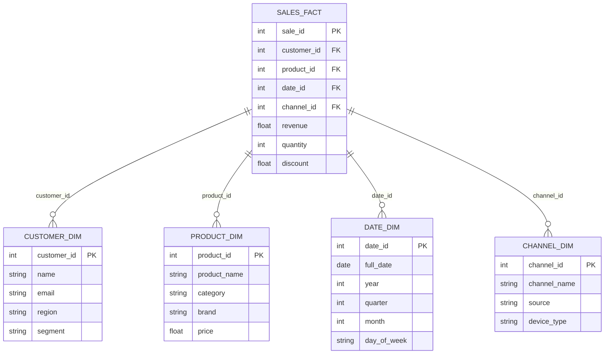
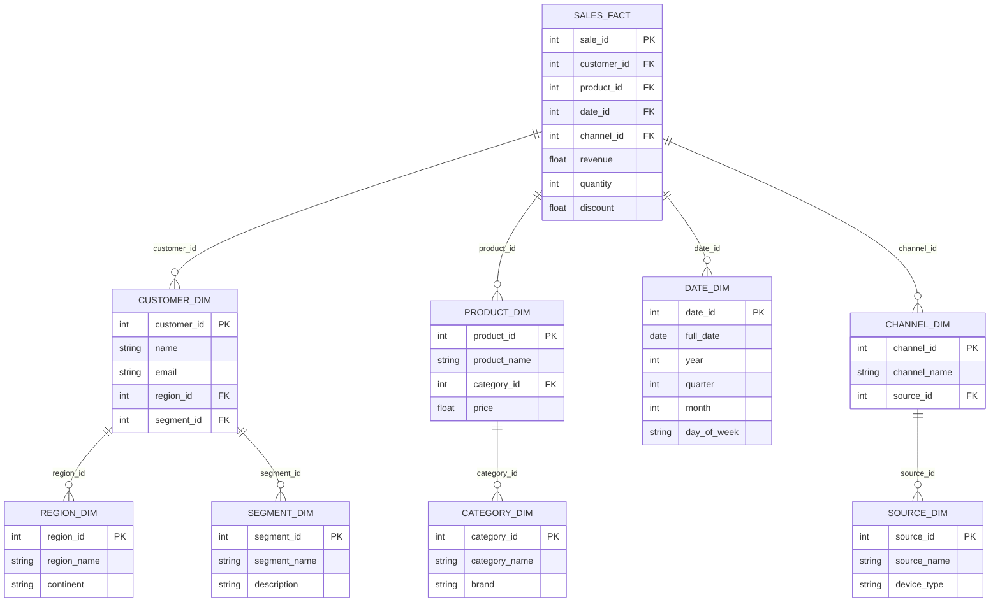

---
tags:
  - machinelearning
  - datascience
  - mlops
  - devops
  - cloud
  - aws
draft: true
---

# AWS Storage
## EBS vs.  Physical Hard Drive vs. S3

**How EBS differs from a physical hard drive:**

A physical hard drive sits inside your physical computer. EBS, on the other hand, is a **network-attached** storage volume that lives on AWS's storage infrastructure, separate from the physical server your EC2 instance runs on. The key differences are:

- **Physical location:** A physical hard drive is literally inside the machine. An EBS volume is on a separate storage server in the same Availability Zone, connected to your EC2 instance over a **high-speed, low-latency network** within AWS's data center. You don't notice the network hop most of the time because AWS's internal network is extremely fast.

- **Persistence & detachability:** If your physical machine dies, the hard drive inside it could die too. With EBS, since the volume is separate from the EC2 instance, if your instance crashes or you terminate it, the EBS volume **persists** — you can detach it and reattach it to a different EC2 instance. Think of it like an external hard drive you can unplug and plug into another computer, except it happens virtually.

- **Snapshots & flexibility:** You can take point-in-time snapshots of an EBS volume (as the page mentions), resize it, or change its performance characteristics — things you can't easily do with a physical drive.

**How is it "attached" to EC2?**

It's not physically plugged in. Instead, when you launch an EC2 instance (or after), you **configure** an EBS volume to attach to that instance through the AWS console, CLI, or API. The EC2 instance then sees it as a block device — just like your operating system sees a hard drive at `/dev/sda1` or similar. You can format it with a file system, mount it to a directory, and read/write files exactly as you would with a local disk.

**So why does EBS has "low latency" if it's still network-based like S3?**

The distinction is the **type** of network communication and the **protocol**:

- **S3** uses HTTP API calls over the broader AWS network — you're making REST requests to retrieve objects. There's overhead in that.
- **EBS** uses a specialized, optimized block storage protocol over AWS's internal data center network within the same Availability Zone. It's designed to behave like a local disk, with latencies typically in the **sub-millisecond to low single-digit millisecond** range.

It's also worth noting that the page mentions **instance stores** as an alternative — these *are* physically attached storage on the actual host server. They're the fastest option, but they're **ephemeral** — when the instance stops or terminates, that data is gone. EBS strikes a balance: near-local performance with the durability and flexibility of being detachable.

> [!Summary] EBS is like a really fast, reliable external drive connected over an ultra-fast private network inside AWS's data center. Your EC2 instance treats it like a local disk, but behind the scenes it's decoupled, which gives you flexibility, persistence, and features like snapshots that a physical drive can't offer.


> [!QUESTION] Why are physical instance stores attached to EC2 are ephemeral? On my normal computer, hard disc are not persistent?

On your personal computer, yes, your hard drive is persistent. You turn off your computer, turn it back on, and all your files are still there. So why would a physically attached drive on EC2 be ephemeral? The answer comes down to **how cloud computing works versus owning your own machine.**

**On your personal computer:**

You own the machine. The hard drive inside it is yours. When you shut it down, nobody touches it. When you turn it back on, you get the same physical machine with the same physical hard drive. The relationship between you and that hardware is permanent.

**On EC2 with instance stores:**

You don't own the physical server — you're **renting** a virtual machine that runs on one of AWS's physical servers in a data center. That physical server has local SSDs/HDDs (the instance store). Here's why it's ephemeral:

- When you **stop** an EC2 instance, AWS doesn't keep that physical server reserved for you. Your virtual machine gets "parked," and when you start it again, AWS might place it on a **completely different physical server**. The old server's local drives? They belong to that old physical host — your data is gone (and AWS wipes it for security so the next customer doesn't see your data).

- When you **terminate** an instance, the same thing happens — the physical host is released back into the pool.

- Even if the physical hardware **fails**, your instance could get moved, and the local storage is lost.

Think of it like a hotel room. You're renting it, and the room has a desk with drawers (the instance store). You can use those drawers while you're staying. But when you check out — or if the hotel moves you to a different room — whatever you left in those drawers is gone. The drawers belong to the room, not to you.

On your personal computer, you **own** the room. You're never getting moved. So the drawers (your hard drive) are always there with your stuff in them.

**That's exactly why EBS exists** — it solves this problem. EBS is like a personal safe deposit box that you can carry from room to room. It's not tied to any one physical server. No matter which physical host your EC2 instance lands on, AWS attaches your EBS volume to it over the network, and your data is there. That's the trade-off: instance stores give you raw speed (physically attached), but EBS gives you persistence and portability at the cost of a tiny bit of latency.

## EBS vs EFS vs FSx

Here's a clear breakdown of the differences between EBS, EFS, and FSx: **Amazon EBS (Elastic Block Store)** is block-level storage that attaches directly to a single EC2 instance, much like plugging an external hard drive into one computer. It provides high-performance, low-latency storage with options for SSD (high IOPS) or HDD (lower cost) volumes. It's ideal for databases, boot volumes, and workloads where one instance needs fast, dedicated storage. A key limitation is that an EBS volume can typically only be attached to one EC2 instance at a time. **Amazon EFS (Elastic File System)** is a shared file system that multiple EC2 instances can access simultaneously over the NFSv4 protocol. It scales automatically — no need to provision capacity in advance. Think of it like a network drive that many machines can read and write to at once. This makes it great for ML workflows where multiple instances need concurrent access to the same datasets, libraries, or models. The trade-off is that it's more expensive than EBS. **Amazon FSx** is a fully managed service for specialized, high-performance file systems — specifically Lustre, NetApp ONTAP, OpenZFS, and Windows File Server. It delivers millions of IOPS with sub-millisecond latency, making it the go-to choice for HPC and ML training workloads that demand extreme throughput. Like EFS, it supports shared access across multiple instances, but it's designed for more demanding performance scenarios and integrates with specific file system ecosystems (e.g., Windows File Server or Lustre for HPC). **In short:**

| Feature      | EBS                                   | EFS                                | FSx                                 |
| ------------ | ------------------------------------- | ---------------------------------- | ----------------------------------- |
| Storage type | Block                                 | File (NFS)                         | File (Lustre, Windows, etc.)        |
| Access       | Single EC2 instance                   | Multiple EC2 instances             | Multiple EC2 instances              |
| Scaling      | Manual (provision volumes)            | Automatic                          | Managed                             |
| Performance  | High IOPS, low latency                | Good, auto-scales                  | Extreme throughput, sub-ms latency  |
| Best for     | Dedicated instance storage, databases | Shared datasets, concurrent access | HPC, ML training, Windows workloads |
| Cost         | Lower                                 | Higher than EBS                    | Varies by file system type          |
The simplest way to remember it: **EBS** is your personal hard drive, **EFS** is a shared network drive, and **FSx** is a high-performance specialized file system for demanding workloads.

> [!QUESTION] Does FSx also works in the principles of network-attached storage, or it works in an entirely different principle?

Amazon FSx does work on network-attached storage (NAS) principles — it's not an entirely different concept. Like EFS, FSx provides file-level storage that multiple compute instances access over a network using standard file system protocols. The key difference is *which* protocols and file systems it supports.

Here's how they compare on that front:

**EFS** uses the **NFSv4** protocol, which is the standard network file system protocol common in Linux/Unix environments. It's straightforward shared file storage over a network.

**FSx** also provides network-accessible file storage, but it supports **multiple specialized file system protocols** depending on the variant you choose. For example, FSx for Lustre uses the Lustre protocol (designed for massively parallel, high-throughput HPC workloads), FSx for Windows File Server uses the **SMB** protocol (the standard for Windows environments), and FSx for NetApp ONTAP supports both NFS and SMB.

So the underlying principle is the same — instances connect to a remote file system over a network and interact with it through standard file system interfaces. The difference is that FSx is built around **high-performance, purpose-built file systems** that are optimized for specific workload types, whereas EFS is a more general-purpose NAS solution.

Think of it this way: EFS is like a reliable, general-purpose shared network drive. FSx is also a network-attached file system, but one that's been tuned and specialized — like choosing between a standard car (EFS) and a race car or off-road vehicle (FSx) depending on the terrain you need to handle. The roads (network) are the same; the vehicles are engineered for different performance profiles.

## Data Access Pattern examples

Here's an example for 3 different data access pattern

**1. Copy and Load**

*Example:* You have a large image dataset (e.g., 500,000 labeled images for a computer vision model) stored in Amazon S3. Before training begins, the entire dataset is copied from S3 to the local Amazon EBS volume attached to your SageMaker training instance. The training job then reads the data directly from the local disk. This works well when the dataset fits on the instance's storage and you want fast, low-latency reads during training — like training a ResNet model on ImageNet where the algorithm needs to make multiple passes (epochs) over the full dataset.

**2. Sequential Streaming**

*Example:* You're training a natural language processing model on a massive 10 TB text corpus stored in S3. Instead of downloading the entire dataset before training starts, the data is streamed in batches directly from S3 to the training instance as needed. For instance, SageMaker Pipe Mode streams data sequentially from S3 to the instance's EBS-backed storage. This is ideal when the dataset is too large to fit on the local disk, or when you want training to start immediately without waiting for a full download — such as training a large language model on terabytes of web-crawled text.

**3. Randomized Access**

*Example:* You're training a reinforcement learning model where the algorithm needs to randomly sample experiences from a large replay buffer, or you're doing distributed training across multiple instances that all need random access to the same dataset. In this case, you mount a shared file system like Amazon FSx for Lustre or Amazon EFS to all training instances. Each instance can randomly read any file at any time from the shared storage. For example, multiple GPU instances training a recommendation model can all simultaneously access different user interaction records from a shared FSx for Lustre file system without needing to duplicate the data on each instance.

# Data Ingestion

## Kinesis vs. Flink vs. S3 or Redshift

![[aws-kinesis-example.png]]

The figure above is actually showing three **separate services** under the Amazon Kinesis umbrella, and each has a distinct role. Here's the breakdown
1. **Kinesis Data Streams (the "entry point")** Think of this as the **intake pipe**. Its job is to capture and ingest massive amounts of real-time data coming from various sources (IoT sensors, clickstreams, logs, etc.) and hold it briefly in a stream. It doesn't _do_ anything with the data — it just receives it and makes it available for downstream consumers to read from. It's the raw data highway. 
2. **Amazon Managed Service for Apache Flink (the "brain")** This is where your confusion likely sits. Flink is a **real-time processing and analytics engine**. It sits _between_ the intake (Kinesis Data Streams) and the output (Firehose/S3). Its role is to **consume the streaming data and do something intelligent with it** — like transformations, aggregations, filtering, feature engineering, or running real-time analytics. For example, if sensor data is flowing in, Flink could compute a running average, detect anomalies, or prepare features for a machine learning model in real time. 
3. **Amazon Data Firehose (the "delivery truck")** You already understand this one. Firehose is the **delivery mechanism** — it takes data and reliably loads it into storage destinations like S3 or Redshift. It's simple and fully managed; you don't write processing logic for it. It just moves data from point A to storage. 

**So the key distinction — Kinesis vs. Flink:**
- **Kinesis Data Streams** = captures and holds the raw streaming data (ingestion)
- **Apache Flink** = processes, transforms, and analyzes that streaming data in real time (computation) 

> [!TIP] An analogy: 
> **Kinesis Data Streams** is like a conveyor belt carrying raw materials into a factory. 
> **Flink** is the factory floor where workers assemble, inspect, and transform those materials. 
> **Firehose** is the shipping dock that sends the finished products to the warehouse (S3). 
> You _can_ use them independently, but in this example they're shown working together as a pipeline: **ingest → process → store**.

> [!QUESTION] Why not use Flink to get data from various sources and then straight away store it in S3? Why do we need two additional services for ingestion and delivery?

That's a really smart question — and it gets at the heart of _why_ AWS designs these as separate services rather than one monolithic tool. 

**Why can't Flink just do everything?** 
Flink is a **processing engine**, not an ingestion or delivery system. It's designed to run complex computations on data — but it needs someone to _feed_ it the data, and someone to _deliver_ the results. Here's why each piece matters: 

**Why Kinesis Data Streams (the ingestion layer)?** 
Flink by itself doesn't know how to connect to thousands of diverse data sources (IoT devices, mobile apps, web servers, logs) and reliably collect data from all of them simultaneously at massive scale. Kinesis Data Streams is purpose-built for that — it handles the messy work of ingesting data from countless producers, buffering it, and making sure nothing is lost even during traffic spikes. It also allows **multiple consumers** to read from the same stream. So Flink might be reading the data for real-time analytics, while simultaneously another service reads the same stream for a different purpose. Without Kinesis Data Streams, you'd have to build all of that ingestion and fan-out logic yourself. 

**Why Firehose (the delivery layer)?** 
Writing data reliably to S3 or Redshift sounds simple, but at scale it involves batching, compression, format conversion, error handling, and retry logic. Firehose handles all of that automatically with zero code. Flink _could_ technically write to S3, but then you'd be burdening your processing engine with delivery concerns — batching files, managing partitions, handling failures — instead of letting it focus on what it does best: computation. 

> [!TIP] **The philosophy: separation of concerns** 
Each service does one thing exceptionally well. By decoupling ingestion, processing, and delivery, you get flexibility — you can swap out or scale any piece independently. 
> - Need to add a new destination? Just configure Firehose. 
> - Need more complex analytics? Upgrade your Flink application. 
> - Need to handle more input sources? Scale Kinesis Data Streams. 
>   
 > You're not locked into a single tightly-coupled system. 

So to directly answer your question: you _could_ try to make Flink do it all, but you'd end up reinventing what Kinesis Data Streams and Firehose already provide out of the box — and your architecture would be more fragile and harder to scale.

## Kinesis vs. Kafka

Another excellent question — this is one of the most common points of confusion in the AWS streaming world. Both Amazon MSK (Managed Streaming for Apache Kafka) and Kinesis Data Streams do indeed handle real-time streaming data, but they come from very different origins and serve slightly different audiences.

**Amazon Kinesis Data Streams — the AWS-native option**

Kinesis is a fully proprietary AWS service. It's designed to be simple to set up and deeply integrated with the AWS ecosystem. You don't manage servers, brokers, or clusters. You just create a stream, pick the number of shards (capacity units), and start pushing data. It works seamlessly with other AWS services like Lambda, Firehose, Flink, and S3. If your entire world lives in AWS and you want the fastest path to getting a streaming pipeline running with minimal operational overhead, Kinesis is the go-to choice.

**Amazon MSK — the open-source Kafka option, managed by AWS**

Apache Kafka is an open-source streaming platform that has been the industry standard for years, long before Kinesis existed. Many organizations already have Kafka expertise, existing Kafka applications, or architectures built around the Kafka ecosystem. Amazon MSK is simply AWS running and managing Kafka clusters for you so you don't have to deal with the infrastructure. But under the hood, it's still real Kafka — you use the same Kafka APIs, the same Kafka client libraries, the same Kafka ecosystem tools.

**So when would you pick one over the other?**

Choose **Kinesis** when you're starting fresh on AWS, want minimal setup, don't need Kafka-specific features, and want the tightest integration with AWS services. It's simpler to operate and you pay per shard/throughput with no cluster management at all.

Choose **MSK (Kafka)** when your team already has Kafka expertise, you have existing Kafka-based applications you want to migrate to AWS, you need Kafka-specific features like log compaction or the rich Kafka Connect ecosystem for integrating with hundreds of external systems, or you want the portability to potentially run the same code on-premises or on another cloud provider since Kafka is open source.

**A simple analogy:** Think of it like choosing between iMessage and WhatsApp. Both let you send messages. iMessage (Kinesis) is tightly integrated into the Apple ecosystem and works beautifully if you're all-in on Apple. WhatsApp (Kafka/MSK) is cross-platform, widely adopted, and works everywhere — but it's a separate system you bring into your environment. Neither is objectively "better" — it depends on your context, existing skills, and whether portability or deep AWS integration matters more to you.


## Kinesis and Flink - Real world example

A **fraud detection model** running on SageMaker that analyzes real-time e-commerce transactions. Let me walk you through what the data actually looks like at each stage.

---

**Stage 1: Raw data arriving into Kinesis Data Streams**

Imagine a customer just made a purchase. The e-commerce application sends a raw event into Kinesis that might look something like this:

```json
{
  "transaction_id": "TXN-98234",
  "user_id": "USR-44521",
  "timestamp": "2026-03-18T19:30:05Z",
  "amount": 1249.99,
  "currency": "USD",
  "card_last_four": "8832",
  "merchant": "ElectroMart",
  "category": "electronics",
  "ip_address": "192.168.45.12",
  "device": "mobile_ios",
  "shipping_country": "US",
  "billing_country": "US"
}
```

This is just raw transactional data — it arrives as-is from the application. Kinesis collects thousands of these per second from the platform. At this point, it's just sitting in the stream, waiting to be read.

**Stage 2: Flink reads the stream and processes/transforms the data**

Now here's where Flink does the heavy lifting. The SageMaker fraud model doesn't want raw transaction data — it wants **engineered features** that are meaningful for prediction. Flink reads from the Kinesis stream and computes things in real time like:

- How many transactions has this user made in the **last 10 minutes**? (velocity check)
- What's the **average transaction amount** for this user over the past 24 hours? (spending pattern)
- Is the shipping country **different** from the billing country? (mismatch flag)
- Has this **IP address** been seen with multiple different user accounts recently? (suspicious behavior)
- How does this transaction amount **compare to the user's typical spending**? (anomaly ratio)

After Flink processes this, the output might look like:

```json
{
  "transaction_id": "TXN-98234",
  "amount": 1249.99,
  "txn_count_last_10min": 4,
  "avg_amount_24hr": 85.50,
  "amount_to_avg_ratio": 14.62,
  "country_mismatch": false,
  "ip_multi_user_flag": true,
  "device_type_encoded": 1,
  "category_encoded": 3,
  "hour_of_day": 19,
  "is_weekend": false
}
```

Notice what happened — Flink turned raw transaction data into a **feature vector**. It computed rolling aggregations (transaction count, average amount), derived ratios, created boolean flags, and encoded categorical values into numbers. This is exactly the format the SageMaker model was trained on.

**Stage 3: Flink sends this to SageMaker for real-time inference**

Flink calls the SageMaker endpoint with that feature vector. SageMaker's fraud model returns something like:

```json
{
  "transaction_id": "TXN-98234",
  "fraud_probability": 0.92,
  "prediction": "FRAUDULENT"
}
```

That 0.92 score is high because — look at the features Flink computed — the user made 4 transactions in 10 minutes, this purchase is nearly **15x** their usual spending, and the IP address was seen with multiple accounts. The raw Kinesis data alone couldn't tell you any of that. It took Flink's real-time computation to surface those patterns.

**Why Flink is essential here**

The critical insight is that features like "number of transactions in the last 10 minutes" or "average spending over 24 hours" require **stateful, windowed computation across multiple events over time**. A single raw transaction record doesn't contain that information. Flink maintains state across the stream, remembers what happened before, and computes these rolling aggregations in real time — that's something neither Kinesis Data Streams nor Firehose can do.

> [!QUESTION] How does Flink access historical data? Internally or externally?

This is a really sharp observation — and it's actually one of the most important things to understand about Flink. The answer is: **Flink can do it both ways**, and in practice it often uses a combination.

**Approach 1: Flink's own internal state (the primary mechanism)**

This is the magic of Flink. Flink is a **stateful** stream processor, meaning it doesn't just look at each event in isolation and forget about it. As every transaction flows through Flink, it continuously maintains an internal state in memory. So when a transaction comes in at 7:30 PM for user USR-44521, Flink doesn't need to go ask anyone — it already *remembers* that this same user had transactions at 7:22 PM, 7:25 PM, and 7:28 PM because it processed those events earlier and kept a running tally.

Concretely, Flink maintains something like a rolling window per user. Every time a transaction for USR-44521 arrives, Flink updates its internal counters: "okay, that's now 4 transactions in the last 10 minutes, and the running total for the last 24 hours is $342, so the average is $85.50." This state is kept in Flink's memory (backed by a state backend like RocksDB for durability), and it's automatically managed — old data outside the window gets expired.

So for the **"last 10 minutes"** or **"last 24 hours"** type computations, Flink is doing this entirely from its own internal state built up from the stream itself. No external call needed.

**Approach 2: Enrichment from an external source (for historical or reference data)**

Now here's where your intuition is also correct. What if the system just started up, or what if you need data from *before* Flink was running — like the user's average spending over the past 6 months? Flink can't compute that from the stream alone because it wasn't processing data back then. In that case, Flink can absolutely reach out to an external database to enrich the event. For example, it could call DynamoDB, Redis, or query a data lake to pull in a user's historical spending profile. This might look like: the event arrives, Flink makes an async call to DynamoDB to fetch the user's historical average, merges that with the real-time features it computed from the stream, and then sends the combined feature vector to SageMaker.

**In practice: a hybrid approach**

Most real-world systems use both. Short-term, fast-moving features (transactions in the last few minutes, recent IP activity) come from Flink's internal state — this is extremely fast, no network call needed. Longer-term or pre-computed features (user's lifetime spending average, account age, risk score from a batch model) get pulled from an external store because that historical context existed before the stream started.

> [!TIP] Think of it this way: Flink has a really good **short-term memory** that it builds in real time from the stream. But for **long-term memory** — things that happened weeks or months ago — it needs to consult an external database, just like how you might remember what you ate for lunch today, but you'd need to check your calendar to recall what you did three months ago.

# Data Extraction

## Data transfer and extraction tools

![[aws-data-transfer-and-extraction-tools.png|627]]

Great choice — fraud detection use case is a perfect use case to tie all these 8 tools eight together. Let me walk through each one with a concrete scenario.

Imagine you're building a real-time fraud detection system for a bank that processes credit card transactions across multiple regions.

**1. AWS CLI** — Your DevOps engineer uses it to script and automate infrastructure setup. For example, running `aws s3 cp` to bulk upload historical transaction CSVs (say, 50 million past transactions) into S3 as your initial training dataset. It's also used to schedule cron jobs that export daily transaction logs from on-premise servers to S3.

**2. AWS SDKs (like boto3)** — Your Python application uses boto3 to programmatically interact with services. For instance, your data pipeline script calls `dynamodb.put_item()` to write flagged transactions into a DynamoDB table, or calls `s3.upload_file()` to push newly generated model artifacts to S3 after retraining.

**3. Amazon S3 Transfer Acceleration** — Your bank operates in Singapore, but the ML training infrastructure is in us-east-1. When uploading large batches of transaction data (say, 500GB of monthly logs) from Singapore to that S3 bucket, Transfer Acceleration uses CloudFront edge locations to speed up the long-distance transfer significantly.

**4. AWS Database Migration Service (DMS)** — The bank's original transaction records live in an on-premise Oracle database. DMS continuously replicates that data into Amazon Aurora in real time. This way your fraud detection system reads from Aurora without touching the production Oracle database, and you get ongoing change data capture (CDC) so new transactions flow in automatically. DMS supports three modes: **full load** (one-time bulk migration), **CDC** (continuous near-real-time replication of ongoing changes, typically seconds to low-minute latency), and **full load + CDC** (initial bulk copy followed by continuous replication). Its core strength is this CDC capability — streaming changes as they happen — rather than scheduled batch extraction.

**5. AWS Lambda** — Every time a new transaction hits a Kinesis stream, a Lambda function fires. It takes that single transaction, runs it against your lightweight fraud scoring model (or calls a SageMaker endpoint), and if the score exceeds a threshold, it writes an alert to an SNS topic which notifies the fraud team. No servers to manage, scales to thousands of transactions per second automatically.

**6. AWS Glue** — Your raw transaction data is messy — different formats from different regional systems, inconsistent column names, missing fields. Glue crawlers discover the schema across all your S3 data sources, and Glue ETL jobs clean, normalize, and join the transaction data with customer profile data and merchant data. The output is a clean, feature-rich Parquet dataset ready for model training.

**7. AWS DataSync** — The bank's compliance team maintains an on-premise NAS with years of archived transaction records needed for training. DataSync efficiently moves terabytes of this historical archive from the on-premise file system to S3 on a scheduled basis, handling encryption, integrity validation, and bandwidth throttling so it doesn't disrupt office network traffic.

**8. AWS Snowball** — For the initial migration, the bank has 80TB of decade-old transaction history sitting in a data center. Uploading that over the internet would take weeks. Instead, AWS ships a Snowball Edge device to the data center, the team loads the data onto it physically, ships it back, and AWS uploads it directly into S3. It's literally moving data by truck.

The way to think about how they fit together: Snowball and DataSync handle the heavy lifting of getting historical data into AWS. DMS keeps the live database in sync. S3 Transfer Acceleration speeds up cross-region uploads. Glue cleans and prepares everything. Lambda handles real-time event processing. And the CLI and SDKs are the tools your team uses to orchestrate and automate all of it.

> [!QUESTION] What is the use case of DMS in this fraud detection example? Why not we directly connect to prod on prem db?

A few reasons why you'd use DMS + Aurora instead of querying the production Oracle DB directly:

1. **Isolate production load** — Fraud detection queries (especially ML feature lookups at high throughput) would compete with the bank's core transaction processing on the same Oracle instance. If your fraud model hammers the DB with reads, it could slow down actual banking operations.

2. **Latency** — The prod DB is on-premise, your ML infrastructure is in AWS. Every inference call reaching back to the on-prem data center adds network latency. Having the data already in Aurora (same AWS region) keeps reads fast.

3. **Access/security boundaries** — Production databases in banks are heavily locked down. Getting direct read access from cloud workloads to an on-prem prod DB means punching holes through firewalls, setting up VPNs, and navigating compliance reviews. DMS gives you a controlled, one-way data flow instead.

4. **Schema/query freedom** — On the Aurora replica, you can add indexes, create materialized views, or reshape data for ML feature serving without touching the production schema.

CDC ensures you still get the data in near-real-time, so you're not sacrificing freshness for these benefits.

### DRY vs. CQRS 
DRY (Don't Repeat Yourself) is a software engineering principle — avoid duplicating logic. But this is data replication, which is a different concern.

In distributed systems, **duplicating data is a standard pattern**, not an anti-pattern. You're trading storage (cheap) for:

- Availability (prod DB goes down, your fraud system still works)
- Performance (reads don't contend with writes)
- Decoupling (teams/systems evolve independently)

This is essentially the **CQRS pattern** (Command Query Responsibility Segregation) — the on-prem Oracle handles writes (commands), the Aurora replica handles reads (queries). Each is optimized for its job.

DRY still applies to your code and logic — you wouldn't want two different CDC pipelines doing the same thing. But having the same data exist in two places for different workloads is just good architecture.

# Data Merging

## Star Schema vs. Snowflake Schema

Both are ways of organizing data in a **data warehouse** for analytical queries. The core idea is the same: a central **fact table** (measurable events) surrounded by **dimension tables** (descriptive attributes). The difference is how much you normalize the dimension tables.

| | Star Schema | Snowflake Schema |
|---|---|---|
| **Dimension tables** | Flat / denormalized | Broken into sub-tables (normalized) |
| **Joins needed** | Fewer | More |
| **Query speed** | Faster reads | Slower reads |
| **Redundancy** | More (repeated strings) | Less |
| **Best for** | Analytics, ML, dashboards | Storage efficiency, data integrity |

### Star Schema

A star schema has a central **fact table** surrounded by **dimension tables**. The fact table contains measurable events (e.g., sales transactions — revenue, quantity, discount), while the dimension tables contain descriptive attributes (e.g., customer info, product details, dates). The fact table sits in the middle with dimension tables radiating outward — looking like a star.

> [!important] Where do dimension tables come from?
> Dimension tables are **not** derived from the fact table. They come from their own source data. During the ETL process (e.g., in AWS Glue), raw data from multiple separate sources — sales data, web data, customer data from S3 and Redshift — gets reorganized into the star schema structure:
> - Customer data → cleaned and flattened into `CUSTOMER_DIM`
> - Sales/transaction data → becomes `SALES_FACT` (only measurable metrics + foreign keys)
> - Descriptive attributes → organized into their respective dimension tables
>
> The ETL step isn't just about cleaning data — it's about **reshaping** it into a structure that makes downstream analysis and ML work much more efficient.

**Why is star schema called "denormalized"?** It *does* have some structure — data is separated into fact and dimension tables rather than dumped into one giant flat table. But the dimension tables themselves are kept **flat**. For example, `CUSTOMER_DIM` stores `region` as a plain text column. If 10,000 customers are in "North America", that string is repeated 10,000 times. A fully normalized design would break `region` out into its own table.



### Snowflake Schema

A snowflake schema takes the star schema and **further normalizes the dimension tables** — breaking them into sub-tables. Instead of storing `region` as a string in `CUSTOMER_DIM`, you'd have a separate `REGION_DIM` table, and `CUSTOMER_DIM` would hold a `region_id` foreign key.

This eliminates redundancy ("North America" is stored once, not 10,000 times) but adds more joins at query time.

Notice how `CUSTOMER_DIM`, `PRODUCT_DIM`, and `CHANNEL_DIM` now branch out into sub-tables — this branching is what gives the snowflake schema its name:



### The Normalization Spectrum

Star and snowflake schemas sit on a spectrum. Neither is "fully normalized" or "fully flat" — they're trade-offs:

```
Fully flat table → Star schema → Snowflake schema → Full 3NF normalization
(one giant table)   (denormalized     (normalized          (every attribute in
                     dimensions)       dimensions)          its own table)

← Faster queries                              Less redundancy →
← Simpler to understand                       More data integrity →
```

In the AWS context, **star schemas are preferred** because the goal is to optimize data for fast analytical queries in tools like Amazon Athena, Amazon Redshift, and for feeding into ML models. The trade-off of some data redundancy is worth the query performance gains.

## Glue, EMR and SageMaker example

**Glue example**
Raw sales, web, and customer data from Amazon S3 and Redshift are combined using AWS Glue, which crawls the sources to infer schemas. A data scientist writes a PySpark ETL script to join, clean, and transform the data into a star schema in Amazon S3 to optimize analysis. AWS Glue runs the Apache Spark ETL job, generating cleaned data that the scientist can analyze in Athena or feed into machine learning models.
![[aws-glue-flow-example.png|678]]

**EMR example**
A retail company uses a scalable Amazon EMR cluster running Spark and Hadoop to combine and process *petabytes* of clickstream, purchase, customer, and inventory data from various sources. Spark performs ETL to create analytics datasets while Apache Hadoop Distributed Copy (DistCp) runs parallel loads into Amazon S3. Spark MLlib then builds a product recommendation model based on the combined data.

The processed datasets are output to Amazon S3 for further analysis. By using the Amazon EMR auto-scaling capabilities, the company can efficiently transform massive amounts of disparate data into business insights.

![[aws-emr-flow-example.png|680]]

**SageMaker Data Wrangler example**
A retail company loaded raw sales data from multiple CSV files into SageMaker Data Wrangler to prepare the data for building a machine learning model to predict customer churn. Using built-in transformations, they combined the CSVs into a single dataset, cleaned invalid values, and created new features like customer lifetime value.

After exploring the data visually and gaining insights, they exported the prepared dataset into their SageMaker Studio notebook. The Data Wrangler transformations provided quick data processing to train a churn prediction model in SageMaker without coding the data prep steps.

![[aws-sagemaker-data-wrangler-flow-example.png|783]]


## Storage Metrics explained
### EBS metrics

> [!Question] Difference between **VolumeReadBytes**, **VolumeReadOps**, **VolumeThroughputPercentage**, and **VolumeQueueLength**

Great question! These are common storage/volume metrics (you'll often see them in AWS CloudWatch for EBS volumes, for example). Let me break each one down intuitively:

- **VolumeReadBytes** — As you said, this is the total number of bytes read from the volume in a given period. Straightforward: "how much data was read."

- **VolumeReadOps** — This is the *number of read operations* (I/O requests) performed on the volume in a given period. Think of it as "how many times did something ask to read from the disk,"  regardless of how much data each read retrieved. For example, 1,000 small reads of 4 KB each and 10 large reads of 400 KB each could transfer the same total bytes, but the read ops would be 1,000 vs. 10. This matters because disks have a limit on how many individual operations they can handle per second (IOPS), independent of size.

- **VolumeThroughputPercentage** — This tells you what percentage of the volume's *maximum available throughput* (MB/s) is currently being used. If your volume can handle up to 250 MB/s and you're currently pushing 125 MB/s, this would show 50%. It's a utilization metric — it answers "how close am I to maxing out the data transfer rate of this volume?" When this approaches 100%, your workload is bottlenecked on bandwidth.

- **VolumeQueueLength** — This is the number of pending I/O requests waiting to be processed by the volume at a given moment. Think of it like a line at a checkout counter: if the disk can't process requests as fast as they're arriving, they queue up. A consistently high queue length means the volume is overwhelmed — requests are piling up faster than they can be served, leading to higher latency. A queue length near zero means the volume is keeping up easily with demand.

**A quick analogy** to tie them together — imagine a library checkout desk:

- **Read Bytes** = total number of pages checked out
- **Read Ops** = total number of books checked out (regardless of page count)
- **Throughput Percentage** = how close the librarian is to their maximum page-scanning speed
- **Queue Length** = how many people are standing in line waiting to check out

### S3 metrics

**BucketSizeBytes** - It's the total storage footprint of everything in the bucket, measured in bytes (and yes, you'd typically think of it in MB, GB, TB, etc.).


**NumberOfObjects — Parquet file parts question:**

Each part file is counted as a **separate object**. S3 has no concept of "this group of files belongs together as one logical dataset." S3 is a flat object store — every key (file path) is its own independent object. So if you have:

```
my-dataset/part-00001.parquet
my-dataset/part-00002.parquet
...
my-dataset/part-00010.parquet
```

That's **10 objects**, not 1. S3 doesn't know or care that they're logically related parts of the same dataset. The "folder" `my-dataset/` is just a prefix in the key name — it's not a real directory.

Similarly, if you did a multipart upload of a single large file, once the upload is *completed*, it becomes **1 object**. But your scenario of 10 separate part files written by something like Spark is genuinely 10 distinct objects.


**PutRequests vs. GetRequests**

**PUT request** = "Put this thing into S3." It's an upload/write operation. Any time you store a new object or overwrite an existing one, that's a PUT. For example, uploading a CSV file to your bucket, or a Spark job writing out those 10 Parquet part files (that would be 10 PUT requests).

**GET request** = "Get this thing from S3." It's a download/read operation. Any time you retrieve an object, that's a GET. For example, reading a file from S3 into a Pandas DataFrame, or downloading a file to your laptop.

**A simple way to remember it:**

- **PUT** = you're *putting* data **into** S3 (writing)
- **GET** = you're *getting* data **out of** S3 (reading)

And just to round out the other common HTTP methods you might encounter with S3:

- **DELETE** = remove an object from the bucket
- **HEAD** = "tell me *about* this object (metadata) but don't send me the actual data" — useful for checking if a file exists or how big it is without downloading it
- **LIST** = "show me what objects are in this bucket/prefix"

The reason these matter from a metrics/cost perspective is that AWS charges you per request. PUT requests are typically more expensive than GET requests, so tracking them separately helps you understand your cost breakdown.


**AllRequests:**

This is broader than just reads and writes. It includes *everything* — GETs (downloading/reading), PUTs (uploading/writing), DELETEs, HEAD requests (checking if an object exists or fetching its metadata like size, last modified date, content type without downloading the actual data), LIST requests (listing objects in a bucket), and so on. Essentially, every single API call made to that bucket counts toward AllRequests.

So: `AllRequests ≥ GetRequests + PutRequests`, because AllRequests also includes DELETEs, HEADs, LISTs, and other operation types that aren't broken out separately in the metrics you listed.

### EFS metrics

**PercentIOLimit** — This is conceptually the same as VolumeThroughputPercentage from EBS. It tells you "how close am I to maxing out the throughput capacity of this file system?" If it's hovering near 100%, your workload is being throttled and you might need to consider switching to a higher performance mode. Same idea, just applied to EFS instead of EBS.

**StorageBytes vs TotalIOBytes**

**StorageBytes** is a *snapshot* metric — it tells you how much data is *sitting* on the file system right now. Think of it like looking at how full your hard drive is at any given moment.

**TotalIOBytes** is a *flow* metric — it tells you how much data *moved* through the file system (reads + writes combined) during a time period. It's like EBS's VolumeReadBytes and VolumeWriteBytes, except EFS combines them into one single metric rather than splitting them out separately.

A nice way to think about the difference: StorageBytes is like the water level in a tank (how much is stored), while TotalIOBytes is like the flow rate through the pipes (how much is moving in and out). You could have a small tank with a ton of water flowing through it, or a massive tank with barely any activity — they measure fundamentally different things.

# Data Transformation
## Flink vs. Lambda vs. Spark on EMR

**Apache Flink can absolutely be used for manipulating and transforming streaming data** — and in fact, it's one of the most powerful options available on AWS for this purpose. AWS offers **Amazon Managed Service for Apache Flink** (formerly Amazon Kinesis Data Analytics) as a fully managed service for running Flink applications.

The [[AWS ML Engineer Associate Learning Plan#1.2 Transform Data|course page you're on focuses on]] **Lambda** and **Spark on Amazon EMR** as two key AWS services for streaming data transformation, but Flink is another important option. Here's how they differ:

**AWS Lambda** is best suited for lightweight, event-driven transformations. It's serverless and works well for tasks like data normalization, filtering, and media transcoding on individual records or small batches. It's simple to set up but has execution time limits (up to 15 minutes) and isn't designed for complex stateful processing.

**Spark Streaming on Amazon EMR** handles large-scale real-time analytics from sources like Kafka or Kinesis. It uses a micro-batch processing model, meaning it collects data into small batches and processes them at intervals (typically sub-second to a few seconds). It's great for anomaly detection, monitoring dashboards, and high-throughput analytics.

**Apache Flink** differs from both in important ways. Unlike Spark's micro-batch approach, Flink processes data as a true stream — record by record — which gives it lower latency. Flink also excels at **stateful stream processing**, meaning it can maintain complex state across events (e.g., tracking session windows, running aggregations over time, or detecting patterns across events). It has built-in support for event-time processing and sophisticated windowing, which makes it ideal for use cases where the order and timing of events matter deeply, such as fraud detection, complex event processing, and real-time ML feature generation.

In short: Lambda is for simple, lightweight transformations; Spark Streaming is for high-throughput batch-oriented analytics on streams; and Flink is for low-latency, stateful, true stream processing where event-time semantics and complex windowing are important

Here's a real-world example for each:

**AWS Lambda — IoT Sensor Data Normalization**
Imagine a smart building company that collects temperature, humidity, and occupancy data from thousands of IoT sensors across different manufacturers. Each manufacturer sends data in a different format and unit (e.g., Celsius vs. Fahrenheit, different JSON schemas). A Lambda function is triggered each time a new record arrives on an Amazon Kinesis stream, normalizes the data into a consistent schema, converts units, and writes the cleaned output to S3 or DynamoDB. It's lightweight, stateless, and perfect because each record can be transformed independently without needing context from other records.

**Spark Streaming on Amazon EMR — E-Commerce Real-Time Analytics Dashboard**
A large online retailer wants to monitor sales performance, trending products, and regional buying patterns in near real-time during a major sales event like Black Friday. Spark Streaming on EMR ingests clickstream and transaction data from Kafka, aggregates it into micro-batches every few seconds, runs analytics like top-selling products by category and revenue by region, and pushes the results to a live dashboard. Spark's strength here is its ability to handle massive throughput and perform complex aggregations and joins across large datasets, even if there's a slight delay of a few seconds.

**Apache Flink — Financial Fraud Detection**
A bank needs to detect fraudulent credit card transactions in real time. This requires tracking each customer's spending patterns over sliding time windows — for example, flagging a card if three transactions occur in different countries within 10 minutes, or if spending suddenly spikes beyond a customer's historical average. Flink is ideal here because it processes each transaction the instant it arrives (true streaming, not micro-batching), maintains stateful information about each customer's recent activity, and supports event-time windowing so that out-of-order events are handled correctly. The difference between catching fraud in milliseconds versus seconds can mean preventing thousands of dollars in losses.

The key takeaway is that the right choice depends on the complexity and latency requirements of your use case: Lambda for simple per-record transformations, Spark for high-throughput analytics with slight delay, and Flink for low-latency stateful processing where timing and event order are critical.

# Data Validation
## Class Imbalance
### Synthetic data generation vs. Data augmentation
Synthetic data generation and data augmentation are definitely interrelated and overlapping — they share the same fundamental goal of expanding a dataset, but they differ in *how* they go about it.

**Where they overlap:** Both techniques create new data points that didn't exist in the original dataset, and both can be used to address class imbalance by generating more examples of underrepresented classes. In practice, the boundary between them can be blurry — for instance, GANs are mentioned under data augmentation (Technique 3), but a GAN generating entirely new minority-class samples could just as easily be considered synthetic data generation (Technique 2).

**Where they differ:** The key distinction the material draws is about the *starting point*:

- **Synthetic data generation** creates new data points "from scratch" algorithmically. SMOTE, for example, interpolates between existing minority samples to produce entirely new points in the feature space.
- **Data augmentation** applies transformations to *existing* data — rotating, flipping, cropping, adding noise — so each new sample is a modified version of a real one, rather than something generated from scratch.

Think of it this way: data augmentation says "take this existing image and rotate it 15 degrees," while synthetic data generation says "create a brand new image that has similar statistical properties to this class."

In reality, the two techniques sit on a spectrum. GANs and diffusion models blur the line because they learn from existing data but produce outputs that can be genuinely novel. That's likely why the material mentions GANs under augmentation — they *augment* a dataset, but the mechanism is closer to synthetic generation. Many practitioners use the terms somewhat interchangeably, and in practice you'd often combine both strategies together to build a robust, balanced training set.

## Data Formatting

### RecordIO-protobuf

RecordIO-protobuf is ==a **binary data format** used in machine learning (ML) workflows, particularly with [Amazon SageMaker](https://docs.aws.amazon.com/sagemaker/latest/dg/cdf-training.html) and Apache Mesos, for efficient handling of large datasets==. It combines the streaming capabilities of the RecordIO format with the compact, structured data representation of Protocol Buffers (Protobuf). 

Key Components

- **RecordIO:** This is a streaming data format that organizes a file as a series of length-prefixed binary records. Each record is preceded by a 4 or 8-byte integer indicating the length of the data that follows. This allows data to be read sequentially without loading the entire file into memory, which is crucial for very large files.
- **Protocol Buffers (Protobuf):** Developed by Google, Protobuf is a language-neutral, platform-neutral, extensible mechanism for serializing structured data in a compact binary format. It is more efficient in size and parsing speed compared to formats like JSON or CSV.
- **Combined Format:** In the RecordIO-wrapped Protobuf format, each individual Protobuf-encoded message is wrapped with a size prefix from RecordIO. 

Advantages in Machine Learning

- **Memory Efficiency:** Data is streamed one record at a time, so massive datasets (e.g., millions of images) do not need to be loaded into memory all at once.
- **Speed:** The binary nature of Protobuf and the length-prefixing of RecordIO significantly reduce data parsing overhead, leading to faster training times, sometimes up to 35% faster.
- **Scalability & Pipe Mode:** Amazon SageMaker algorithms leverage this format with "Pipe Mode" to stream data directly from S3 to the training container, which improves startup times and overall performance.
- **Structure:** Protobuf provides a required schema, ensuring data integrity and allowing data exchange across different programming languages. 

Implementation and Usage

Since there is no single, formal specification of the RecordIO format, implementations may have slight variations (e.g., differences in magic numbers or length encoding). When working with this format, you generally need specific libraries or SDKs: 

- **Amazon SageMaker Python SDK:** Provides helper functions to convert data (like NumPy arrays or images) into the `recordIO-protobuf` format for use with built-in algorithms.
- **Apache Mesos:** Uses its own specific implementation of RecordIO for streaming API responses, supporting `application/json` and `application/x-protobuf` as content types within the stream.
- **Google OR-Tools:** The library contains `RecordReader` and `RecordWriter` classes for reading/writing compressed Protobuf streams to disk in C++.

For a practical guide on converting data to this format within SageMaker, you can refer to examples provided in the AWS documentation or [Packt publications](https://www.packtpub.com/en-PT/product/machine-learning-with-amazon-sagemaker-cookbook-9781800567030/chapter/chapter-4-preparing-processing-and-analyzing-the-data-4/section/converting-csv-data-into-protobuf-recordio-format-ch04lvl1sec48).

**How RecordIO-protobuf looks and is stored:**

The file is typically stored with a `.recordio` extension (or sometimes just as binary files in S3). Unlike a `.csv` file that you can open in a text editor and read, a `.recordio` file is **not human-readable** — if you opened it in a text editor, you'd see garbled characters/gibberish.

**Is it like base64?**

Not exactly. Base64 is a way to encode binary data into ASCII text (so it *can* be represented as readable characters). RecordIO-protobuf is actual raw binary — it's more like how a `.jpg` image or a `.zip` file is stored. The data is encoded using Protocol Buffers (protobuf), which is Google's serialization format that packs data into a compact binary representation.

**How it's structured conceptually:**

Think of it like this — each record in the file is wrapped in a protobuf "envelope" that contains:
- A **label** (the target value, like what you'd put in the first column of a CSV)
- A **features** tensor (the input features, either as a dense vector or a sparse vector)

These are packed sequentially into one file, with each record preceded by a small header that tells SageMaker how many bytes the next record is. So it's like: `[header][record1][header][record2][header][record3]...`

**Why use it over CSV?**

For large datasets, especially image data, it's much more efficient. Binary packing is smaller and faster to read than text. SageMaker can also use "Pipe mode" to stream RecordIO data directly into the training algorithm without downloading the whole dataset first.

**In practice, you rarely write these files by hand.** You typically use the SageMaker Python SDK to convert your data. For example:

```python
import sagemaker
from sagemaker.amazon.common import write_numpy_to_dense_tensor

# Convert numpy arrays to RecordIO-protobuf
write_numpy_to_dense_tensor(buffer, features, labels)
```

So to summarize: CSV is text you can read, RecordIO-protobuf is compact binary you can't read with your eyes - but it carries the same kind of information (labels + features), just packed much more efficiently.


**Protobuf and RecordIO —  each play a distinct role.**

[[Glossary#Protobuf|Protobuf]] handles *how each individual record is encoded* (the serialization part we just discussed).

**RecordIO** handles *how multiple records are packed together into a single file*. It's the **container format**. It wraps each protobuf-serialized record with a small header that says "the next record is X bytes long." This way, SageMaker can efficiently stream through the file, jumping from record to record without needing to scan the entire file.

Think of it like this: Protobuf is how you pack each item into a box. RecordIO is how you line up all those boxes on a conveyor belt with labels saying how big each box is.

Now let me give you a concrete example.

**CSV version** (`data.csv`):

```
1, 5.1, 3.5, 1.4
0, 4.9, 3.0, 1.5
1, 5.8, 2.7, 1.9
```

Here, the first column is the label (1 or 0), and the remaining columns are features. It's all plain text, human-readable.

**RecordIO-protobuf version** (`data.recordio`):

Conceptually, the same data gets transformed into something like this:

```
[Header: 28 bytes] [Record 1: label=1.0, features={5.1, 3.5, 1.4} as binary]
[Header: 28 bytes] [Record 2: label=0.0, features={4.9, 3.0, 1.5} as binary]
[Header: 28 bytes] [Record 3: label=1.0, features={5.8, 2.7, 1.9} as binary]
```

Each record is a protobuf message containing a `label` field and a `features` tensor, serialized into raw bytes. Each record is then wrapped with a RecordIO header that stores the byte length of that record. If you opened this file in a text editor, you'd see something like `\x00\x00\x00\x1c\x08\x01\x12\x10...` — just raw bytes, completely unreadable.

So to summarize the roles: **Protobuf** = how each record is serialized into binary. **RecordIO** = how those serialized records are sequenced together into one streamable file. Together they form the "RecordIO-protobuf" format that SageMaker uses.


# Target Encoding

 > [!Question] Why **target encoding** is the best choice for high-cardinality categorical variables?

**The Problem**

When you have a categorical variable with **high cardinality** — meaning it has many unique values (think zip codes, product IDs, or city names with hundreds or thousands of distinct entries) — most standard encoding techniques run into issues:

**One-Hot Encoding** creates a new binary column for each unique category. If you have 10,000 unique cities, you suddenly have 10,000 new columns. This leads to a massively sparse dataset, the "curse of dimensionality," and is computationally expensive.

**Label/Ordinal Encoding** assigns an integer to each category (e.g., cat=1, dog=2, bird=3). While it's compact, it introduces a false ordinal relationship — the model might interpret "bird" as being "greater than" "cat," which is meaningless for nominal data.

**Why Target Encoding Works Best?**

Target encoding replaces each category with a **statistical summary of the target variable** for that category — most commonly the mean. Here's a simple example:

Imagine you're predicting house prices and you have a "Neighborhood" column with 500 unique neighborhoods. Target encoding would replace each neighborhood name with the **average house price** in that neighborhood.

| Neighborhood | Avg Price (Target Encoded) |
|---|---|
| Downtown | 450,000 |
| Suburbia | 280,000 |
| Lakeside | 520,000 |

This approach has several advantages. It produces just **one column** regardless of how many categories exist, so dimensionality stays low. It preserves **meaningful information** about the relationship between the category and what you're trying to predict. And it works naturally with tree-based and linear models alike.

**The Key Caveat: Overfitting**

Target encoding can cause **target leakage** — you're essentially using the answer (the target) to build a feature. To mitigate this, practitioners use techniques like smoothing (blending the category mean with the global mean, especially for rare categories) and cross-validation-based encoding (computing the target mean using out-of-fold data). SageMaker Data Wrangler handles these considerations when you apply target encoding through its interface.

**In Summary**

For high cardinality + minimal information loss, target encoding strikes the best balance: it keeps dimensionality low (unlike one-hot), preserves predictive signal (unlike label encoding), and scales well to thousands of unique categories.

Would you like me to go deeper into any part of this, such as the smoothing technique or how it compares to other advanced encodings like feature hashing?