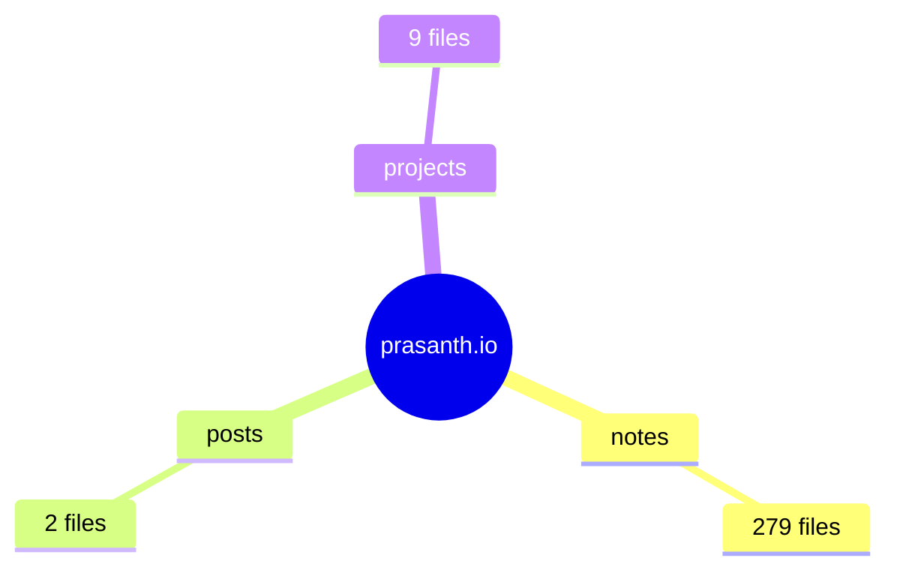

> [!info] Auto-generated
> This page is auto-generated by [`blog_stats.py`](https://github.com/prasanth-ntu/prasanth.io/blob/v4/scripts/blog_stats.py). Do not edit manually.

**Total files:** 292  
**Total characters:** 1,208,333  
**Unique tags:** 51  
**Drafts:** 17

## Directory Tree

```
content/
├── (2 root files)
├── notes/ (279 files + 227 attachments)
├── posts/ (2 files)
└── projects/ (9 files + 7 attachments)
```

## Structure Overview



## Files per Folder

| Folder | Files | % of Total | Characters |
|--------|-------|------------|------------|
| notes | 279 | 95.5% | 1,179,887 |
| projects | 9 | 3.1% | 10,295 |
| root | 2 | 0.7% | 10,249 |
| posts | 2 | 0.7% | 7,902 |

## Tag Distribution (Top 30)

| Tag | Count | % of Files |
|-----|-------|------------|
| `data-science` | 135 | 46.2% |
| `software-engineering` | 84 | 28.8% |
| `machine-learning` | 73 | 25.0% |
| `ai` | 48 | 16.4% |
| `llm` | 42 | 14.4% |
| `tool` | 41 | 14.0% |
| `learning` | 30 | 10.3% |
| `python` | 28 | 9.6% |
| `open-source` | 25 | 8.6% |
| `gen-ai` | 19 | 6.5% |
| `finance` | 19 | 6.5% |
| `book` | 19 | 6.5% |
| `statistics` | 18 | 6.2% |
| `startups` | 18 | 6.2% |
| `misc` | 17 | 5.8% |
| `deep-learning` | 15 | 5.1% |
| `talk` | 14 | 4.8% |
| `documentation` | 11 | 3.8% |
| `course` | 11 | 3.8% |
| `science` | 10 | 3.4% |
| `google` | 9 | 3.1% |
| `ai-agents` | 9 | 3.1% |
| `health` | 9 | 3.1% |
| `project` | 9 | 3.1% |
| `devops` | 9 | 3.1% |
| `self-improvement` | 7 | 2.4% |
| `gpu` | 7 | 2.4% |
| `paper` | 6 | 2.1% |
| `nlp` | 5 | 1.7% |
| `prompting` | 5 | 1.7% |

## Tag Usage Chart

<iframe src="/static/pages/tag-usage-chart.html" width="100%" height="450" frameborder="0" loading="lazy"></iframe>

## Document Size Distribution

| Size Category | Count | % |
|---------------|-------|---|
| Tiny (< 500 chars) | 104 | 35.6% |
| Small (500-2K chars) | 74 | 25.3% |
| Medium (2K-5K chars) | 48 | 16.4% |
| Large (5K-10K chars) | 39 | 13.4% |
| Very Large (> 10K chars) | 27 | 9.2% |

## Quality Audit

**Files without tags:** 27
- `about.md`
- `index.md`
- `notes/Australia.md`
- `notes/Auto-encoding transformer models.md`
- `notes/Auto-regressive transformer models.md`
- `notes/Box Plots.md`
- `notes/Core concepts in OOP, Metaprogramming, and Optimization.md`
- `notes/Data Science Canvas - Mermaid.md`
- `notes/Diagnosis vs. Detection of disease.md`
- `notes/GPT-1.md`
- `notes/Hardware - Explained.md`
- `notes/Malaysia.md`
- `notes/Miscellaneous.md`
- `notes/Page Tree.md`
- `notes/Philosophy.md`
- `notes/Places to visit and explore.md`
- `notes/Presto.md`
- `notes/Regulations and Compliances.md`
- `notes/Singapore.md`
- `notes/Video Quality - Resolution, Bitrate, and Hz.md`
- ... and 7 more

**Files without frontmatter:** 20
- `notes/Australia.md`
- `notes/Auto-encoding transformer models.md`
- `notes/Auto-regressive transformer models.md`
- `notes/Box Plots.md`
- `notes/Core concepts in OOP, Metaprogramming, and Optimization.md`
- `notes/Data Science Canvas - Mermaid.md`
- `notes/Diagnosis vs. Detection of disease.md`
- `notes/GPT-1.md`
- `notes/Hardware - Explained.md`
- `notes/Malaysia.md`
- `notes/Philosophy.md`
- `notes/Places to visit and explore.md`
- `notes/Presto.md`
- `notes/Regulations and Compliances.md`
- `notes/Singapore.md`
- `notes/Video Quality - Resolution, Bitrate, and Hz.md`
- `notes/WhisPer.md`
- `notes/email.md`
- `notes/git.md`
- `notes/zsh.md`

**Draft files:** 17
- `notes/API.md`
- `notes/Creating a Spending Plan to Fit Your Lifestyle!.md`
- `notes/DSSG x Google - 2025-Jul-15.md`
- `notes/DeepLearning.AI - Agent Skills with Anthropic.md`
- `notes/DeepLearning.AI - MCP - Build Rich-Context AI Apps with Anthropic.md`
- `notes/FastAPI.md`
- `notes/LOTR.md`
- `notes/Learning Paradigms.md`
- `notes/Log.md`
- `notes/MCP.md`
- `notes/Makefile.md`
- `notes/Miscellaneous.md`
- `notes/OpenSearch.md`
- `notes/Protein Intake.md`
- `notes/SQLAlchemy ORM for Python.md`
- `notes/Stanford CME295 Transformers & LLMs.md`
- `notes/aws-certification-plan.md`
