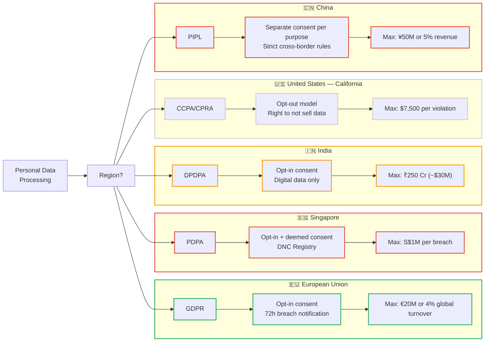
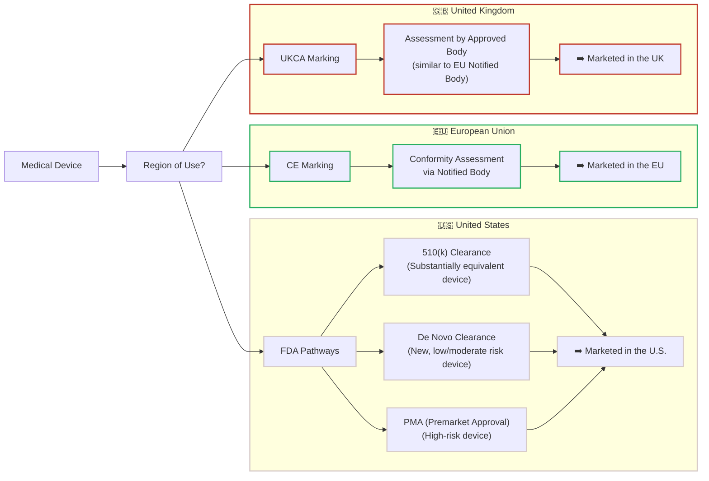

# Data Protection across Different Regions

```mermaid
flowchart LR
    A["Personal Data<br/>Processing"] --> B["Region?"]
    B --> EU["GDPR"]
    B --> SG["PDPA"]
    B --> IN["DPDPA"]
    B --> US["CCPA/CPRA"]
    B --> CN["PIPL"]

    subgraph EUGroup[🇪🇺 European Union]
        direction TB
        EU --> EU1["Opt-in consent<br/>72h breach notification"]
        EU1 --> EU2["Max: €20M or 4% global turnover"]
    end

    subgraph SGGroup[🇸🇬 Singapore]
        direction TB
        SG --> SG1["Opt-in + deemed consent<br/>DNC Registry"]
        SG1 --> SG2["Max: S$1M per breach"]
    end

    subgraph INGroup[🇮🇳 India]
        direction TB
        IN --> IN1["Opt-in consent<br/>Digital data only"]
        IN1 --> IN2["Max: ₹250 Cr (~$30M)"]
    end

    subgraph USGroup[🇺🇸 United States — California]
        direction TB
        US --> US1["Opt-out model<br/>Right to not sell data"]
        US1 --> US2["Max: $7,500 per violation"]
    end

    subgraph CNGroup[🇨🇳 China]
        direction TB
        CN --> CN1["Separate consent per purpose<br/>Strict cross-border rules"]
        CN1 --> CN2["Max: ¥50M or 5% revenue"]
    end

    classDef euStyle stroke:#27AE60,stroke-width:2px
    classDef sgStyle stroke:#E74C3C,stroke-width:2px
    classDef inStyle stroke:#F39C12,stroke-width:2px
    classDef usStyle stroke:#D6CAC8,stroke-width:2px
    classDef cnStyle stroke:#E74C3C,stroke-width:2px

    class EUGroup,EU,EU1,EU2 euStyle
    class SGGroup,SG,SG1,SG2 sgStyle
    class INGroup,IN,IN1,IN2 inStyle
    class USGroup,US,US1,US2 usStyle
    class CNGroup,CN,CN1,CN2 cnStyle
```

# Medical Regulatory Flow across Different Regions

```mermaid
flowchart LR
    A["Medical Device"] --> B["Region of Use?"]
    B --> FDA["FDA Pathways"]
    B --> CE["CE Marking"]
    B --> UKCA["UKCA Marking"]

    %% United States Swimlane
    subgraph USGroup[🇺🇸 United States]
        direction TB
        %% USNode --> FDA["FDA Pathways"]
        FDA --> FDA1["510(k) Clearance<br/>(Substantially equivalent device)"]
        FDA --> FDA2["De Novo Clearance<br/>(New, low/moderate risk device)"]
        FDA --> FDA3["PMA (Premarket Approval)<br/>(High-risk device)"]
        FDA1 --> USMarket["➡️ Marketed in the U.S."]
        FDA2 --> USMarket
        FDA3 --> USMarket
    end

    %% European Union Swimlane
    subgraph EUGroup[🇪🇺 European Union]
        direction TB
        %% EUNode --> CE["CE Marking"]
        CE --> CE1["Conformity Assessment<br/>via Notified Body"]
        CE1 --> EUMarket["➡️ Marketed in the EU"]
    end

    %% United Kingdom Swimlane
    subgraph UKGroup[🇬🇧 United Kingdom]
        direction TB
        %% UKNode --> UKCA["UKCA Marking"]
        UKCA --> UKCA1["Assessment by Approved Body<br/>(similar to EU Notified Body)"]
        UKCA1 --> UKMarket["➡️ Marketed in the UK"]
    end

     %% Styling

    class USGroup,USMarket,FDA,FDA1,FDA2,FDA3 usStyle
    class EUGroup,EUMarket,CE,CE1 euStyle
    class UKGroup,UKMarket,UKCA,UKCA1 ukStyle

    classDef usStyle stroke:#D6CAC8,stroke-width:2px
    classDef euStyle stroke:#27AE60,stroke-width:2px
    classDef ukStyle stroke:#C0392B,stroke-width:2px
```