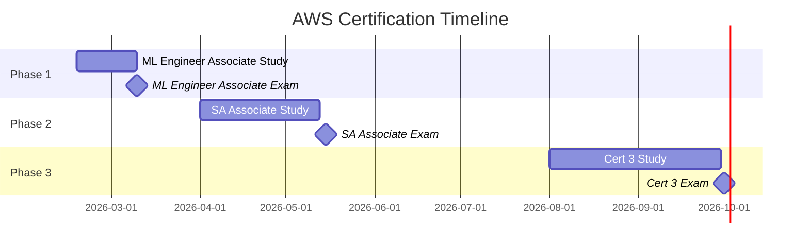

---
tags:
  - aws
  - certification
  - cloud
  - career-development
  - devops
aliases:
  - Knowledge/Tech-Science/AWS Certification Plan
draft: true
---

# AWS Certification Plan

## Goal

Build formal AWS credentials that compound on existing production ML and infrastructure experience. The certification path is designed to:

1. **Validate core identity** as an ML Engineer (Cert 1)
2. **Broaden architectural depth** for senior/staff-level roles (Cert 2)
3. **Specialize further** based on career direction (Cert 3)

The "ML + Architecture" combination is rare and highly valuable — most people have one or the other.

## Certification Sequence

### 1. AWS Certified Machine Learning Engineer - Associate (MLA-C01)

| Detail | Value |
|--------|-------|
| Cost | $150 USD |
| Duration | 130 min, 65 questions |
| Target | Exam by mid-March 2026 |
| Prep needed | 2-3 weeks |

**Why first:** Directly maps to existing skillset — production ML, SageMaker, MLOps, model deployment. This is the *new* cert replacing the retiring ML Specialty (last exam March 31, 2026). Early holders get differentiation value. Study material doubles as interview prep for ML system design questions.

**Key domains:**
- Data preparation for ML (SageMaker Data Wrangler, Feature Store)
- ML model development (SageMaker training, hyperparameter tuning)
- ML model deployment and orchestration (SageMaker Pipelines, endpoints)
- ML solution monitoring and maintenance (Model Monitor, drift detection)

**Study resources:**
- [ ] AWS Skill Builder — ML Engineer Associate exam prep course
- [ ] AWS official practice exam
- [ ] Hands-on: SageMaker Studio notebook exercises
- [ ] Review: SageMaker Pipelines, Model Registry, Endpoints documentation

### 2. AWS Certified Solutions Architect - Associate (SAA-C03)

| Detail | Value |
|--------|-------|
| Cost | $75 USD (50% discount from Cert 1) |
| Duration | 130 min, 65 questions |
| Target | April-May 2026 |
| Prep needed | 4-6 weeks |

**Why second:** Broadens from ML-specific to full architectural knowledge. VPC, IAM, networking, storage, compute, databases, serverless. The most universally respected AWS cert. Reddit consensus: always do SAA before attempting Professional.

**Key domains:**
- Design secure architectures (IAM, VPC, security groups, NACLs)
- Design resilient architectures (multi-AZ, auto-scaling, load balancing)
- Design high-performing architectures (caching, CDN, storage tiers)
- Design cost-optimized architectures (Reserved/Spot instances, S3 tiers)

**Study resources:**
- [ ] Stephane Maarek's SAA-C03 course (Udemy)
- [ ] Tutorial Dojo practice exams (Jon Bonso)
- [ ] AWS Well-Architected Framework whitepaper
- [ ] Hands-on: Build a multi-tier VPC with public/private subnets

### 3. Choose one based on career direction

**Option A: Solutions Architect Professional (SAP-C02)** — for architecture/platform leadership

| Detail | Value |
|--------|-------|
| Cost | $150 USD (50% discount) |
| Prep needed | 2-3 months |
| Target | Q3-Q4 2026 |

Best if: ThoughtWorks consulting path, or any role requiring deep multi-account, hybrid-cloud, migration architecture expertise. One of the hardest cloud certs — validates serious architectural depth.

**Option B: Data Engineer Associate (DEA-C01)** — for data/ML pipeline track

| Detail | Value |
|--------|-------|
| Cost | $75 USD (50% discount) |
| Prep needed | 3-4 weeks |
| Target | Q3-Q4 2026 |

Best if: Standard Chartered AML path, or any role heavy on data pipelines (Glue, Kinesis, Redshift, Athena). Complements ML + Architecture with data engineering depth.

## Cost Breakdown (50% Discount Chain)

| Cert | List Price | Actual Cost | Savings |
|------|-----------|-------------|---------|
| ML Engineer Associate | $150 | $150 | — |
| SA Associate | $150 | $75 | $75 saved |
| Cert 3 (Professional or Data Eng) | $150-$300 | $75-$150 | $75-$150 saved |
| **Total (3 certs)** | **$450-$600** | **$300-$375** | **$150-$225 saved** |

Each passed exam gives a 50% discount voucher for the next exam.

## Why NOT the ML Specialty?

- Last exam date: March 31, 2026 — too tight withquot leave ending March 2 + new baby
- Costs $300 vs $150 for the ML Engineer Associate
- The new ML Engineer Associate is more production-focused (better aligned with actual work)
- ML Specialty won't be renewable after retirement

## Timeline

## Related Notes

- [[Docker]] — Container fundamentals, essential for ML deployment domains
- [[Kubernetes (K8s)]] — Orchestration knowledge, relevant to SageMaker and EKS
- [[Spark]] — Distributed data processing, relevant to Data Engineer cert path
